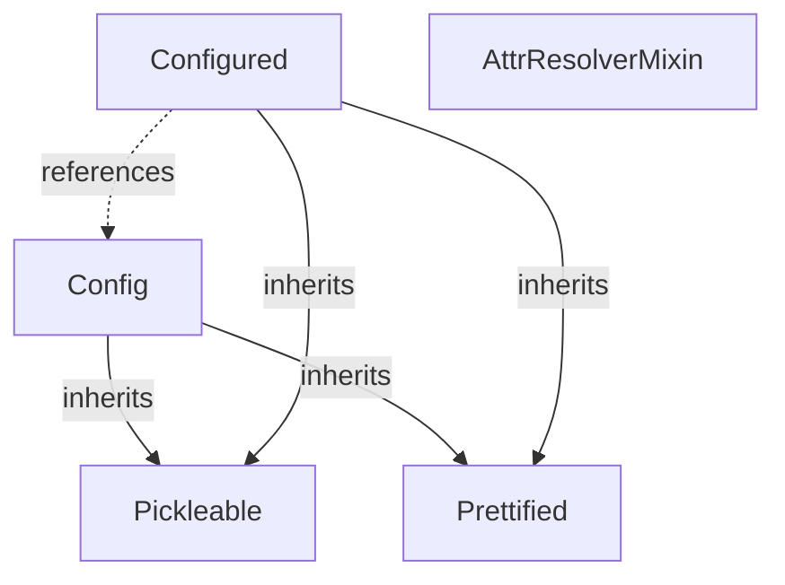
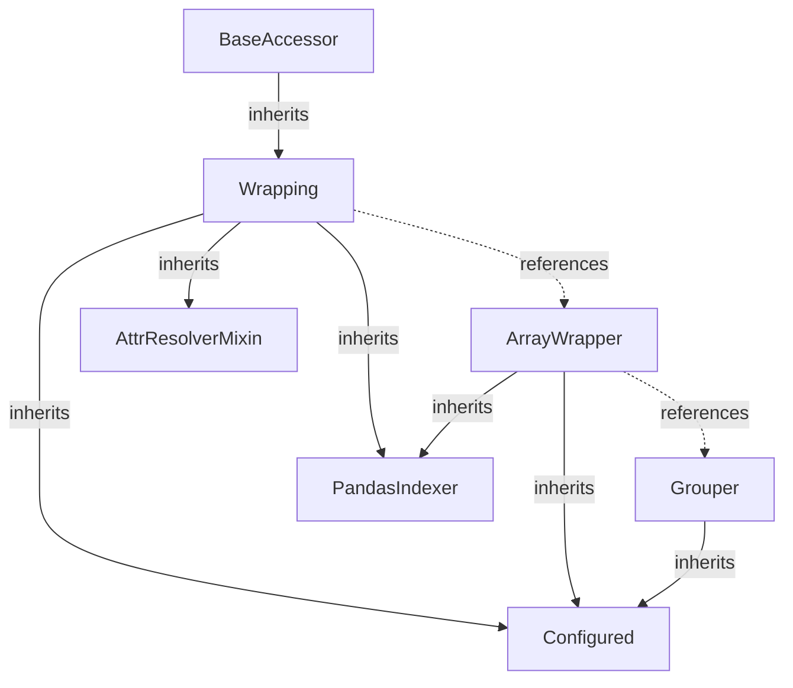
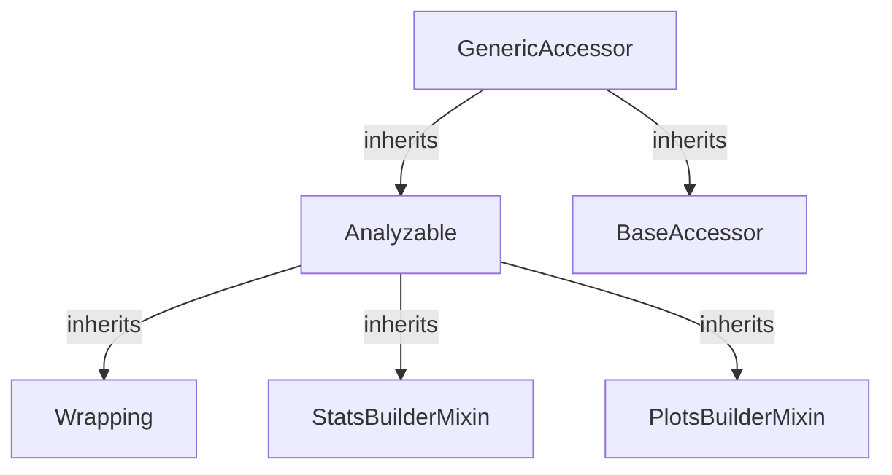
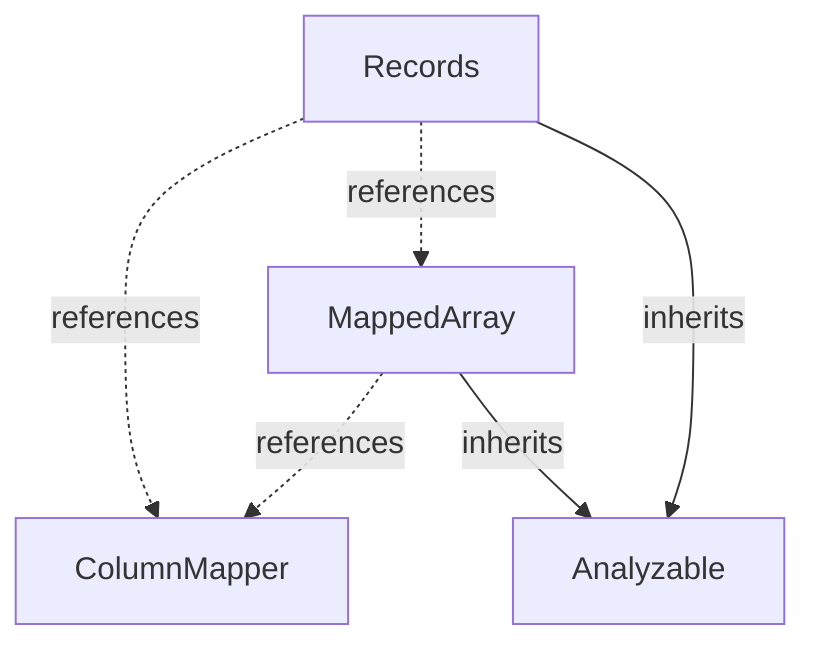

# :material-cube-outline: Building blocks

In the following sections, we will explore some sub-packages, modules, and especially classes that
serve as building blocks for advanced functionalities in VBT, such as
[Portfolio](https://vectorbt.pro/pvt_6d1b3986/api/portfolio/base/#vectorbtpro.portfolio.base.Portfolio). To demonstrate this, we will
gradually build a custom class, `CorrStats`, which enables us to analyze the correlation between two
arrays in the most efficient and flexible way :brain:

## Utilities



(Reload the page if the diagram does not appear.)

VBT uses a modular project structure composed of several subpackages.
Each subpackage is designed for a specific area of analysis.

The [utils](https://vectorbt.pro/pvt_6d1b3986/api/utils/) subpackage provides a set of utilities that power every part of VBT :zap:
These utilities are loosely connected and offer small but powerful reusable code snippets that can
be used independently of other functionality.

!!! info
    The main reason we avoid importing third-party packages and instead implement many utilities
    from scratch is to maintain full control over execution and code quality.

### Formatting

VBT includes its own formatting engine that can pretty-print any Python object.
It is much more advanced than formatting with [JSON](https://en.wikipedia.org/wiki/JSON) because it
recognizes native Python data types and adds intelligent formatting for more structured data types,
such as `np.dtype` and `namedtuple`. In many cases, you can even convert the formatted string back
into a Python object using `eval`.

Let's beautify a nested dictionary using [prettify](https://vectorbt.pro/pvt_6d1b3986/api/utils/formatting/#vectorbtpro.utils.formatting.prettify)
and then convert the string back into an object:

```pycon
>>> from vectorbtpro import *

>>> dct = {'planet' : {'has': {'plants': 'yes', 'animals': 'yes', 'cryptonite': 'no'}, 'name': 'Earth'}}
>>> print(vbt.prettify(dct))
{
    'planet': {
        'has': {
            'plants': 'yes',
            'animals': 'yes',
            'cryptonite': 'no'
        },
        'name': 'Earth'
    }
}

>>> eval(vbt.prettify(dct)) == dct
True
```

!!! hint
    Curious why we used `vbt.prettify` instead of `vbt.utils.formatting.prettify`?
    Any utility that may be useful to the end user can be accessed directly from `vbt`.

    To see which utilities are accessible from the root of the package, visit
    [vectorbtpro/utils/\_\_init\_\_.py](https://github.com/polakowo/vectorbt.pro/blob/main/vectorbtpro/utils/__init__.py)
    or any other subpackage, and look for the objects that are listed in `__all__`.

The [Prettified](https://vectorbt.pro/pvt_6d1b3986/api/utils/pickling/#vectorbtpro.utils.formatting.Prettified) class implements the
abstract method [Prettified.prettify](https://vectorbt.pro/pvt_6d1b3986/api/utils/formatting/#vectorbtpro.utils.formatting.Prettified.prettify),
which can be overridden by a subclass to pretty-print an instance using
[prettify](https://vectorbt.pro/pvt_6d1b3986/api/utils/formatting/#vectorbtpro.utils.formatting.prettify).
Read below to learn how this method can be used to introspect instances of various classes.

### Pickling

Pickling is the process of converting a Python object into a byte stream to store it in a file or database.
The [Pickleable](https://vectorbt.pro/pvt_6d1b3986/api/utils/pickling/#vectorbtpro.utils.pickling.Pickleable) class enables pickling
of objects of any complexity using [Dill](https://dill.readthedocs.io/en/latest/)
(or [pickle](https://docs.python.org/3/library/pickle.html) if Dill is not installed).
Each subclass inherits ready-to-use methods for serializing, deserializing, saving to a file,
and loading from a file. This is especially powerful because it allows us to persist
objects containing any type of data, including instances of [Data](https://vectorbt.pro/pvt_6d1b3986/api/data/base/#vectorbtpro.data.base.Data)
and [Portfolio](https://vectorbt.pro/pvt_6d1b3986/api/portfolio/base/#vectorbtpro.portfolio.base.Portfolio).

### Configuring

VBT relies heavily on automation driven by specifications. The specification for most repetitive
tasks is usually stored in "configs," which serve as settings for specific tasks, data structures,
or even classes. This approach makes most parts of VBT transparent, easily traversable,
and programmatically changeable.

The [Config](https://vectorbt.pro/pvt_6d1b3986/api/utils/config/#vectorbtpro.utils.config.Config) class is like a dictionary on steroids:
it extends Python's `dict` with various configuration features, such as frozen keys,
read-only values, dot notation access to keys, and nested updates. The most notable feature
is the ability to reset a config to its initial state and even create checkpoints, which is
especially useful for settings. In addition, since [Config](https://vectorbt.pro/pvt_6d1b3986/api/utils/config/#vectorbtpro.utils.config.Config)
inherits from [Pickleable](https://vectorbt.pro/pvt_6d1b3986/api/utils/pickling/#vectorbtpro.utils.pickling.Pickleable), we can save any
configuration to disk, and by subclassing [Prettified](https://vectorbt.pro/pvt_6d1b3986/api/utils/pickling/#vectorbtpro.utils.formatting.Prettified)
we can beautify it (this approach is used to generate the API reference):

```pycon
>>> print(vbt.Records.field_config)
Config(
    dtype=None,
    settings={
        'id': {
            'name': 'id',
            'title': 'Id'
        },
        'col': {
            'name': 'col',
            'title': 'Column',
            'mapping': 'columns'
        },
        'idx': {
            'name': 'idx',
            'title': 'Timestamp',
            'mapping': 'index'
        }
    }
)
```

Configs are very common structures in VBT. There are three main types of configs (that either
subclass or partially use [Config](https://vectorbt.pro/pvt_6d1b3986/api/utils/config/#vectorbtpro.utils.config.Config)) used throughout VBT:

1. [ReadonlyConfig](https://vectorbt.pro/pvt_6d1b3986/api/utils/config/#vectorbtpro.utils.config.ReadonlyConfig) is used for configurations
that are not meant to be modified, such as [nb_config](https://vectorbt.pro/pvt_6d1b3986/api/generic/accessors/#vectorbtpro.generic.accessors.nb_config),
which is used to attach a number of Numba-compiled functions to [GenericAccessor](https://vectorbt.pro/pvt_6d1b3986/api/generic/accessors/#vectorbtpro.generic.accessors.GenericAccessor)
only once when importing VBT. Since modifications would have no effect anyway, these configs are locked.
2. [HybridConfig](https://vectorbt.pro/pvt_6d1b3986/api/utils/config/#vectorbtpro.utils.config.HybridConfig) is used for configurations
that are intended to be modified. The best examples are [Portfolio.metrics](https://vectorbt.pro/pvt_6d1b3986/api/portfolio/base/#vectorbtpro.portfolio.base.Portfolio.metrics)
and [Portfolio.subplots](https://vectorbt.pro/pvt_6d1b3986/api/portfolio/base/#vectorbtpro.portfolio.base.Portfolio.subplots),
which list all the metrics and subplots supported by [Portfolio](https://vectorbt.pro/pvt_6d1b3986/api/portfolio/base/#vectorbtpro.portfolio.base.Portfolio).
They can be easily changed and extended, and reset if you make breaking changes.
3. [SettingsConfig](https://vectorbt.pro/pvt_6d1b3986/api/_settings/#vectorbtpro._settings.SettingsConfig) holds the global settings
defined in [_settings](https://vectorbt.pro/pvt_6d1b3986/api/_settings/). It is a custom subclass of [Config](https://vectorbt.pro/pvt_6d1b3986/api/utils/config/#vectorbtpro.utils.config.Config)
that can change Plotly themes and convert any sub-configs of type `dict` to smaller settings
accessible via dot notation (`vbt.settings.portfolio.log` instead of `vbt.settings['portfolio']['log']`).

You can create a config just like a regular `dict`. To provide options for the config, use the `options_`
argument (note the trailing underscore):

```pycon
>>> cfg = vbt.Config(
...     hello="world",
...     options_=dict(readonly=True)
... )
>>> print(cfg)
Config(
    hello='world'
)

>>> cfg["change"] = "something"
TypeError: Config is read-only
```

In addition to the cases above, [Config](https://vectorbt.pro/pvt_6d1b3986/api/utils/config/#vectorbtpro.utils.config.Config)
is also used by the [Configured](https://vectorbt.pro/pvt_6d1b3986/api/utils/config/#vectorbtpro.utils.config.Configured) class,
which is a base class for most core classes in VBT. This read-only class holds a
config of type [Config](https://vectorbt.pro/pvt_6d1b3986/api/utils/config/#vectorbtpro.utils.config.Config) containing all
arguments passed during initialization. Any time you initialize a subclass of
[Configured](https://vectorbt.pro/pvt_6d1b3986/api/utils/config/#vectorbtpro.utils.config.Configured),
all named arguments you pass to the initializer (`__init__`) are stored inside
[Configured.config](https://vectorbt.pro/pvt_6d1b3986/api/utils/config/#vectorbtpro.utils.config.Configured.config).
In this way, the created instance is described and managed entirely by its config:

- You can copy or modify the config and pass it to the class to initialize another instance
  (`new_instance = ConfiguredClass(**old_instance.config)`).
- You can pickle both the class and the config to pickle the entire instance.
- You can compare instances based on their classes and configs.

The main requirement for all of this to work correctly is **immutability**. This brings us to an
important design decision: most classes in VBT to be immutable (read-only), and it is
discouraged to change any attribute unless it is listed in a special variable called `_writeable_attrs`.
There are several reasons why immutability is required:

1. Immutable instances can be easily recreated and manipulated using their configs.
2. Immutable instances are free of side effects and can have cached attributes.
3. Immutable instances can be hashed.

Let's create a custom class that returns some correlation statistics of two arrays.
Specifically, it will compute the Pearson correlation coefficient and its rolling version using Pandas.

```pycon
>>> class CorrStats(vbt.Configured):
...     def __init__(self, obj1, obj2):
...         vbt.Configured.__init__(self, obj1=obj1, obj2=obj2)
...
...         self._obj1 = obj1
...         self._obj2 = obj2
...
...     @property
...     def obj1(self):
...         return self._obj1
...
...     @property
...     def obj2(self):
...         return self._obj2
...
...     def corr(self):
...         if isinstance(self.obj1, pd.Series):
...             return self.obj1.corr(self.obj2)
...         return self.obj1.corrwith(self.obj2)
...
...     def rolling_corr(self, window):
...         return self.obj1.rolling(window).corr(self.obj2)
```

This is how most configured classes in VBT, such as
[Portfolio](https://vectorbt.pro/pvt_6d1b3986/api/portfolio/base/#vectorbtpro.portfolio.base.Portfolio), are designed.
Any argument passed to `CorrStats` is forwarded to
[Configured](https://vectorbt.pro/pvt_6d1b3986/api/utils/config/#vectorbtpro.utils.config.Configured) to create a new config:

```pycon
>>> index = vbt.date_range("2020", periods=5)
>>> df1 = pd.DataFrame({
...     'a': [1, 5, 2, 4, 3],
...     'b': [3, 2, 4, 1, 5]
... }, index=index)
>>> df2 = pd.DataFrame({
...     'a': [1, 2, 3, 4, 5],
...     'b': [5, 4, 3, 2, 1]
... }, index=index)

>>> corrstats = CorrStats(df1, df2)
>>> print(corrstats.config)
Config(
    obj1=<DataFrame object at 0x7fd490461400 of shape (5, 2)>,
    obj2=<DataFrame object at 0x7fd490461240 of shape (5, 2)>
)
```

Access to any attribute is read-only. If you try to set a read-only property or modify the config,
an expected error will be raised:

```pycon
>>> df3 = pd.DataFrame({
...     'a': [3, 2, 1, 5, 4],
...     'b': [4, 5, 1, 2, 3]
... }, index=index)
>>> corrstats.obj1 = df3
AttributeError: can't set attribute

>>> corrstats.config['obj1'] = df3
TypeError: Config is read-only
```

However, it will not (and cannot) throw an error when setting a private attribute (with a leading underscore)
or if any of the attributes are modified in place, which is a common pitfall to avoid.

```pycon
>>> corrstats._obj1 = df3  # (1)!
>>> corrstats.obj1.iloc[:] = df3  # (2)!
```

1. This would work, but at what cost?
2. This would work too, unfortunately.

!!! warning
    VBT assumes that the data in a configured instance always remains the same. If there is a
    change to the data, VBT will not register it, and this can result in erroneous outcomes later.

    The only approved way to change data in an instance is to create a new instance!

To change any data, pass the new value to [Configured.replace](https://vectorbt.pro/pvt_6d1b3986/api/utils/config/#vectorbtpro.utils.config.Configured.replace),
which takes the same arguments as the class, but as keyword-only arguments. These are merged with
the old config and then passed as keyword arguments to the class for instantiation.

```pycon
>>> new_corrstats = corrstats.replace(obj1=df3)
>>> new_corrstats.obj1  # (1)!
            a  b
2020-01-01  3  4
2020-01-02  2  5
2020-01-03  1  1
2020-01-04  5  2
2020-01-05  4  3

>>> new_corrstats.obj2  # (2)!
            a  b
2020-01-01  1  5
2020-01-02  2  4
2020-01-03  3  3
2020-01-04  4  2
2020-01-05  5  1
```

1. `df1` has been replaced with `df3`.
2. `df2` remains unchanged.

Now that all of our data is stored inside a config, we can perform actions on the instance
just as we would on the config itself, such as saving to disk
(thanks to [Pickling](#pickling)):

```pycon
>>> corrstats.save('corrstats')  # (1)!

>>> corrstats = CorrStats.load('corrstats')
```

1. Saves the instance along with both objects.

### Attribute resolution

Attribute resolution is useful for accessing attributes by strings or based on specific logic,
which is implemented by the [AttrResolverMixin](https://vectorbt.pro/pvt_6d1b3986/api/utils/attr_/#vectorbtpro.utils.attr_.AttrResolverMixin).
You can think of it as adding custom logic to the `getattr` operation.
It is used extensively in [StatsBuilderMixin](https://vectorbt.pro/pvt_6d1b3986/api/generic/stats_builder/#vectorbtpro.generic.stats_builder.StatsBuilderMixin)
and [PlotsBuilderMixin](https://vectorbt.pro/pvt_6d1b3986/api/generic/plots_builder/#vectorbtpro.generic.plots_builder.PlotsBuilderMixin)
to execute metrics and subplots as chains of commands. In other classes,
such as [Portfolio](https://vectorbt.pro/pvt_6d1b3986/api/portfolio/base/#vectorbtpro.portfolio.base.Portfolio),
it is used for accessing shortcut properties, caching attribute access, and more.
It works with [deep_getattr](https://vectorbt.pro/pvt_6d1b3986/api/utils/attr_/#vectorbtpro.utils.attr_.deep_getattr),
which accesses a chain of attributes provided as a specification.

Let's compute the minimum of the rolling mean using only Pandas and deep attribute resolution:

```pycon
>>> sr = pd.Series([1, 2, 3, 4, 5])
>>> attr_chain = [('rolling', (3,)), 'mean', 'min']
>>> vbt.deep_getattr(sr, attr_chain)
2.0
```

If any of the above operations were performed on a subclass of [AttrResolverMixin](https://vectorbt.pro/pvt_6d1b3986/api/utils/attr_/#vectorbtpro.utils.attr_.AttrResolverMixin),
they could be easily preprocessed and postprocessed.

### Templating

Templates play an important role in the VBT stem. They allow you to postpone data
resolution until more information becomes available. There are several
templating classes, such as [Rep](https://vectorbt.pro/pvt_6d1b3986/api/utils/template/#vectorbtpro.utils.template.Rep)
for replacing an entire string, and [Sub](https://vectorbt.pro/pvt_6d1b3986/api/utils/template/#vectorbtpro.utils.template.Sub)
for substituting only parts of a string (those starting with `$`).

You can think of templates as callbacks that are executed at some point during execution,
usually after broadcasting or merging keyword arguments. Some functions provide
multiple possible substitution points; in such cases, they may try to substitute
the template multiple times until successful, or match the template with a specific
evaluation id (`eval_id`), if given. The actual evaluation is performed by
[substitute_templates](https://vectorbt.pro/pvt_6d1b3986/api/utils/template/#vectorbtpro.utils.template.substitute_templates).

```pycon
>>> def some_function(*args, **kwargs):
...     context = {}
...     args = vbt.substitute_templates(args, context=context, strict=False)
...     kwargs = vbt.substitute_templates(kwargs, context=context, strict=False)
...     print(args)
...     print(kwargs)
...     
...     context['result'] = 100  # (1)!
...     args = vbt.substitute_templates(args, context=context)
...     kwargs = vbt.substitute_templates(kwargs, context=context)
...     print(args)
...     print(kwargs)

>>> some_function(vbt.Rep('result'), double_result=vbt.RepEval('result * 2'))
(Rep(template='result', context=None, strict=None, eval_id=None),)
{'double_result': RepEval(template='result * 2', context=None, strict=None, eval_id=None)}
(100,)
{'double_result': 200}
```

1. New context

## Base



The [base](https://vectorbt.pro/pvt_6d1b3986/api/base/) subpackage is the non-computational core of VBT.
It offers a variety of modules for working with and converting between Pandas and NumPy objects.
In particular, it provides functions and classes for broadcasting, combining, and wrapping
NumPy arrays, grouping columns, managing [MultiIndex](https://pandas.pydata.org/pandas-docs/stable/user_guide/advanced.html),
and more. These operations are essential for extending Pandas and reproducing some of its
functionality in custom classes.

### Grouping

Since VBT is often used to process multi-column data, where each column (or "line")
represents a separate backtesting instance, being able to group these columns into different
groups is an essential feature.

The [Grouper](https://vectorbt.pro/pvt_6d1b3986/api/base/grouping/#vectorbtpro.base.grouping.base.Grouper) class provides
functionality to validate and build groups from any Pandas Index, especially columns.
It can translate various metadata, such as [GroupBy objects](https://pandas.pydata.org/docs/reference/groupby.html)
and column levels, into special NumPy arrays that can be used by Numba-compiled functions
to aggregate multiple columns of data. This is particularly useful for multi-asset portfolios,
where each group contains one or more assets.

```pycon
>>> columns = pd.MultiIndex.from_tuples([
...     ('BTC-USD', 'group1'),
...     ('ETH-USD', 'group1'),
...     ('ADA-USD', 'group2'),
...     ('SOL-USD', 'group2')
... ], names=['symbol', 'group'])
>>> vbt.Grouper(columns, 'group').get_groups()
array([0, 0, 1, 1])
```

### Indexing

In VBT, the main purpose of indexing is to provide Pandas-style indexing to any custom class
that holds Pandas-like objects, allowing you to select rows, columns, and groups in each object.
This is done by forwarding a Pandas indexing operation to each Pandas-like object and instantiating
the class using them. This can be done easily with [Configured](https://vectorbt.pro/pvt_6d1b3986/api/utils/config/#vectorbtpro.utils.config.Configured).
With this approach, you can index complex classes that contain many Pandas-like objects using
a single command.

The main indexer class, [PandasIndexer](https://vectorbt.pro/pvt_6d1b3986/api/base/indexing/#vectorbtpro.base.indexing.PandasIndexer),
mimics a regular Pandas object by exposing the properties
[PandasIndexer.iloc](https://vectorbt.pro/pvt_6d1b3986/api/base/indexing/#vectorbtpro.base.indexing.PandasIndexer.iloc),
[PandasIndexer.loc](https://vectorbt.pro/pvt_6d1b3986/api/base/indexing/#vectorbtpro.base.indexing.PandasIndexer.loc),
and [PandasIndexer.xs](https://vectorbt.pro/pvt_6d1b3986/api/base/indexing/#vectorbtpro.base.indexing.PandasIndexer.xs).
To use this, simply subclass this class and override
[IndexingBase.indexing_func](https://vectorbt.pro/pvt_6d1b3986/api/base/indexing/#vectorbtpro.base.indexing.IndexingBase.indexing_func),
which should accept `pd_indexing_func`, apply it to each Pandas-like object, and initialize a new instance.

Let's extend our previously created `CorrStats` class with Pandas indexing:

```pycon
>>> class CorrStats(vbt.Configured, vbt.PandasIndexer):
...     def __init__(self, obj1, obj2):
...         vbt.Configured.__init__(self, obj1=obj1, obj2=obj2)
...         vbt.PandasIndexer.__init__(self)
...
...         self._obj1 = obj1
...         self._obj2 = obj2
...
...     def indexing_func(self, pd_indexing_func):  # (1)!
...         return self.replace(
...             obj1=pd_indexing_func(self.obj1),
...             obj2=pd_indexing_func(self.obj2)
...         )
...
...     @property
...     def obj1(self):
...         return self._obj1
...
...     @property
...     def obj2(self):
...         return self._obj2
...
...     def corr(self):
...         if isinstance(self.obj1, pd.Series):
...             return self.obj1.corr(self.obj2)
...         return self.obj1.corrwith(self.obj2)
...
...     def rolling_corr(self, window):
...         return self.obj1.rolling(window).corr(self.obj2)

>>> corrstats = CorrStats(df1, df2)
>>> corrstats.corr()
a    0.3
b   -0.3
dtype: float64

>>> corrstats.loc['2020-01-01':'2020-01-03', 'a'].corr()  # (2)!
0.24019223070763066
```

1. Here, `pd_indexing_func` is simply `lambda x: x.loc[key]`.
2. Running the correlation coefficient on a subset of data.

We just indexed two Pandas objects as a single entity. Yay!

### Wrapping

Remember that VBT specializes in taking a Pandas object, extracting its NumPy array,
processing the array, and converting the results back to a Pandas format?
The last part is handled by the [ArrayWrapper](https://vectorbt.pro/pvt_6d1b3986/api/base/wrapping/#vectorbtpro.base.wrapping.ArrayWrapper)
class, which captures all the necessary metadata, such as the index, columns, and number of dimensions,
and provides methods like [ArrayWrapper.wrap](https://vectorbt.pro/pvt_6d1b3986/api/base/wrapping/#vectorbtpro.base.wrapping.ArrayWrapper.wrap)
to convert a NumPy object back into a Pandas format.

The [ArrayWrapper](https://vectorbt.pro/pvt_6d1b3986/api/base/wrapping/#vectorbtpro.base.wrapping.ArrayWrapper) class integrates
many concepts we discussed earlier to behave like a (supercharged) Pandas object. Notably,
it uses [Grouping](#grouping) to build and manage groups of columns and [Indexing](#indexing)
to select rows, columns, and groups with Pandas-style indexing. Some of the most powerful features
of an array wrapper are 1) the ability to behave like a grouped object, which is not possible with Pandas alone,
and 2) the ability to translate a Pandas indexing operation into a range of integer arrays that can be
used to index NumPy arrays. This allows for indexing without having to hold Pandas objects,
just the wrapper.

You can construct a wrapper in several ways, with the easiest being from a Pandas object:

```pycon
>>> df = pd.DataFrame({
...     'a': range(0, 5),
...     'b': range(5, 10),
...     'c': range(10, 15),
...     'd': range(15, 20)
... }, index=index)
>>> wrapper = vbt.ArrayWrapper.from_obj(df)
>>> print(wrapper)
ArrayWrapper(
    index=<DatetimeIndex object at 0x7ff6d8528d68 of shape (5,)>,
    columns=<Index object at 0x7ff6d857fcc0 of shape (4,)>,
    ndim=2,
    freq=None,
    column_only_select=None,
    group_select=None,
    grouped_ndim=None,
    grouper=Grouper(
        index=<Index object at 0x7ff6d857fcc0 of shape (4,)>,
        group_by=None,
        allow_enable=True,
        allow_disable=True,
        allow_modify=True
    )
)
```

Now, let's create a function that sums all elements in each column using NumPy and
returns a standard Pandas object:

```pycon
>>> def sum_per_column(df):
...     wrapper = vbt.ArrayWrapper.from_obj(df)
...     result = np.sum(df.values, axis=0)
...     return wrapper.wrap_reduced(result)

>>> sum_per_column(df)
a    10
b    35
c    60
d    85
dtype: int64
```

The function above is already 20x faster than Pandas :exploding_head:

```pycon
>>> big_df = pd.DataFrame(np.random.uniform(size=(1000, 1000)))

>>> %timeit big_df.sum()
2.52 ms ± 3.5 µs per loop (mean ± std. dev. of 7 runs, 100 loops each)

>>> %timeit sum_per_column(big_df)
428 µs ± 1.5 µs per loop (mean ± std. dev. of 7 runs, 1000 loops each)
```

Since [ArrayWrapper](https://vectorbt.pro/pvt_6d1b3986/api/base/wrapping/#vectorbtpro.base.wrapping.ArrayWrapper) can manage groups of
columns, let's adapt our function to sum all elements over each group of columns:

```pycon
>>> def sum_per_group(df, group_by):
...     wrapper = vbt.ArrayWrapper.from_obj(df, group_by=group_by)
...     results = []
...     for group_idxs in wrapper.grouper.iter_group_idxs():
...         group_result = np.sum(df.values[:, group_idxs])
...         results.append(group_result)
...     return wrapper.wrap_reduced(results)

>>> sum_per_group(df, False)  # (1)!
a    10
b    35
c    60
d    85
dtype: int64

>>> sum_per_group(df, True)  # (2)!
190

>>> group_by = pd.Index(['group1', 'group1', 'group2', 'group2'])
>>> sum_per_group(df, group_by)  # (3)!
group1     45
group2    145
dtype: int64
```

1. No grouping (one group per column).
2. One group with all columns.
3. Multiple groups with multiple columns.

To avoid creating multiple array wrappers with the same metadata, the
[Wrapping](https://vectorbt.pro/pvt_6d1b3986/api/base/wrapping/#vectorbtpro.base.wrapping.Wrapping) class binds a single
instance of [ArrayWrapper](https://vectorbt.pro/pvt_6d1b3986/api/base/wrapping/#vectorbtpro.base.wrapping.ArrayWrapper)
to manage any number of array-like objects with compatible shapes. Instead of accepting multiple
Pandas objects, it takes an array wrapper and any number of objects and arrays in any format
(preferably NumPy), and wraps them using this wrapper. In addition, any
[Wrapping](https://vectorbt.pro/pvt_6d1b3986/api/base/wrapping/#vectorbtpro.base.wrapping.Wrapping) subclass can use its wrapper
to perform Pandas indexing on any kind of object, including NumPy arrays. This is possible because
[ArrayWrapper](https://vectorbt.pro/pvt_6d1b3986/api/base/wrapping/#vectorbtpro.base.wrapping.ArrayWrapper) can translate
a Pandas indexing operation into universal row, column, and group indices.

Returning to our `CorrStats` class, there are two issues with the current implementation:

1. Both metrics require Pandas objects with exactly the same layouts as inputs.
2. Both metrics are computed using Pandas, which is relatively slow.

Let's upgrade our `CorrStats` class to work on NumPy arrays and with an array wrapper:

```pycon
>>> class CorrStats(vbt.Wrapping):
...     _expected_keys = vbt.Wrapping._expected_keys | {"obj1", "obj2"}  # (1)!
...
...     @classmethod
...     def from_objs(cls, obj1, obj2):  # (2)!
...         (obj1, obj2), wrapper = vbt.broadcast(
...             obj1, obj2, 
...             to_pd=False,
...             return_wrapper=True
...         )
...         return cls(wrapper, obj1, obj2)
...
...     def __init__(self, wrapper, obj1, obj2):
...         vbt.Wrapping.__init__(self, wrapper, obj1=obj1, obj2=obj2)
...
...         self._obj1 = vbt.to_2d_array(obj1)
...         self._obj2 = vbt.to_2d_array(obj2)
...
...     def indexing_func(self, pd_indexing_func, **kwargs):  # (3)!
...         wrapper_meta = self.wrapper.indexing_func_meta(pd_indexing_func, **kwargs)
...         new_wrapper = wrapper_meta["new_wrapper"]
...         row_idxs = wrapper_meta["row_idxs"]
...         col_idxs = wrapper_meta["col_idxs"]
...         return self.replace(
...             wrapper=new_wrapper,
...             obj1=self.obj1[row_idxs, :][:, col_idxs],
...             obj2=self.obj2[row_idxs, :][:, col_idxs]
...         )
...
...     @property
...     def obj1(self):
...         return self._obj1
...
...     @property
...     def obj2(self):
...         return self._obj2
...
...     def corr(self):  # (4)!
...         out = vbt.nb.nancorr_nb(self.obj1, self.obj2)
...         return self.wrapper.wrap_reduced(out)
...
...     def rolling_corr(self, window):
...         out = vbt.nb.rolling_corr_nb(
...             self.obj1, self.obj2, 
...             window, minp=window)
...         return self.wrapper.wrap(out)
```

1. Specify the argument names that are passed to [Wrapping](https://vectorbt.pro/pvt_6d1b3986/api/base/wrapping/#vectorbtpro.base.wrapping.Wrapping)
(or set `_expected_keys=None` to disable).
2. A convenient class method to broadcast objects, create a wrapper, and pass everything to the constructor.
3. The indexing method uses the wrapper to translate `pd_indexing_func` to arrays of selected
rows and columns, applies them to both NumPy arrays, and creates a new `CorrStats` instance.
4. Computation is performed on NumPy arrays, and the result is converted into Pandas.

As you may have noticed, we replaced the superclasses
[Configured](https://vectorbt.pro/pvt_6d1b3986/api/utils/config/#vectorbtpro.utils.config.Configured)
and [PandasIndexer](https://vectorbt.pro/pvt_6d1b3986/api/base/indexing/#vectorbtpro.base.indexing.PandasIndexer)
with the single superclass [Wrapping](https://vectorbt.pro/pvt_6d1b3986/api/base/wrapping/#vectorbtpro.base.wrapping.Wrapping),
which already inherits both. Another change is in the arguments taken by `CorrStats`:
instead of taking two Pandas objects, it now accepts a `wrapper` of type
[ArrayWrapper](https://vectorbt.pro/pvt_6d1b3986/api/base/wrapping/#vectorbtpro.base.wrapping.ArrayWrapper) along with the NumPy
arrays `obj1` and `obj2`. This has several benefits: we keep the Pandas metadata consistent and managed
by a single variable, while all calculations are efficiently performed using only NumPy.
Whenever we need to present results, we can call
[ArrayWrapper.wrap_reduced](https://vectorbt.pro/pvt_6d1b3986/api/base/wrapping/#vectorbtpro.base.wrapping.ArrayWrapper.wrap_reduced)
and [ArrayWrapper.wrap](https://vectorbt.pro/pvt_6d1b3986/api/base/wrapping/#vectorbtpro.base.wrapping.ArrayWrapper.wrap)
to convert them back into Pandas format, as is done inside the `CorrStats.corr`
and `CorrStats.rolling_corr` methods.

Since we do not want to require users (or ourselves) to create an array wrapper manually,
we also implemented the `CorrStats.from_objs` class method, which broadcasts both arrays and
instantiates `CorrStats`. With this, you can provide any array-like objects, and `CorrStats`
will automatically build the wrapper for you. Let's illustrate this by computing the correlation
coefficient for `df1` and `df2`, and then for `df1` and a parameterized `df2`:

```pycon
>>> df1.corrwith(df2)  # (1)!
a    0.3
b   -0.3
dtype: float64

>>> corrstats = CorrStats.from_objs(df1, df2)
>>> corrstats.corr()  # (2)!
a    0.3
b   -0.3
dtype: float64

>>> df2_sh = vbt.pd_acc.concat(
...     df2, df2.vbt.shuffle(seed=42), 
...     keys=['plain', 'shuffled'])
>>> df2_sh 
              plain    shuffled   
               a  b        a  b
2020-01-01     1  5        2  2
2020-01-02     2  4        5  4
2020-01-03     3  3        3  3
2020-01-04     4  2        1  5
2020-01-05     5  1        4  1

>>> df1.corrwith(df2_sh)  # (3)!
ValueError: cannot join with no overlapping index names

>>> corrstats = CorrStats.from_objs(df1, df2_sh)
>>> corrstats.corr()  # (4)!
plain     a    0.3
          b   -0.3
shuffled  a    0.4
          b   -0.9
dtype: float64
```

1. Using Pandas.
2. Using our class.
3. Pandas fails to join due to no overlapping index names.
4. VBT works thanks to smart broadcasting.

Here is why we switched from Pandas to Numba:

```pycon
>>> big_df1 = pd.DataFrame(np.random.uniform(size=(1000, 1000)))
>>> big_df2 = pd.DataFrame(np.random.uniform(size=(1000, 1000)))

>>> %timeit big_df1.rolling(10).corr(big_df2)  # (1)!
271 ms ± 13.2 ms per loop (mean ± std. dev. of 7 runs, 1 loop each)

>>> corrstats = CorrStats.from_objs(big_df1, big_df2)
>>> %timeit corrstats.rolling_corr(10)  # (2)!
12 ms ± 50.5 µs per loop (mean ± std. dev. of 7 runs, 1 loop each)
```

1. Using Pandas.
2. Using our class.

There is also an improvement regarding indexing. Because `obj1` and `obj2` are no longer regular Pandas
objects, we cannot simply apply `pd_indexing_func` to them. Instead, we use the method
[ArrayWrapper.indexing_func_meta](https://vectorbt.pro/pvt_6d1b3986/api/base/wrapping/#vectorbtpro.base.wrapping.ArrayWrapper.indexing_func_meta)
to obtain the rows, columns, and groups that this operation would select. We then apply those arrays
to both NumPy objects. This approach is especially useful because we can now select any data from
the final shape.

```pycon
>>> corrstats = CorrStats.from_objs(df1, df2_sh)
>>> corrstats.loc['2020-01-02':'2020-01-05'].rolling_corr(3)  # (1)!
                         plain            shuffled
                   a         b         a         b
2020-01-02       NaN       NaN       NaN       NaN
2020-01-03       NaN       NaN       NaN       NaN
2020-01-04 -0.327327  0.327327  0.327327 -0.981981
2020-01-05  0.500000 -0.240192 -0.654654 -0.960769
```

1. Compute the rolling correlation coefficient only for 2020-01-02 through 2020-01-05.

!!! note
    Not all classes support indexing on rows. To ensure you can select rows,
    check whether the instance property `column_only_select` is False.

This demonstrates how most high-tier classes in VBT are built. As a general rule:

* For performance, VBT typically follows this process:
Pandas :arrow_right: NumPy/Numba :arrow_right: Pandas. The first stage builds a wrapper
from Pandas objects, and the last stage uses the wrapper to present results to the user.
* Pandas metadata such as shape and index is accessible via the attribute `wrapper`.
For example, `wrapper.ndim` returns the number of dimensions held by the current instance.
* Do not call classes directly. Use class methods, which usually begin with the prefix `from_`.
The constructor `__init__` is most likely reserved for internal use during indexing.
(This is why we use `vbt.MA.run()` instead of `vbt.MA()`.)
* The wrapper enables indexing of any objects that have elements aligned by row or column,
even those with more complex layouts (see [Records](https://vectorbt.pro/pvt_6d1b3986/api/records/base/#vectorbtpro.records.base.Records)).

### Base accessor

This subpackage also provides the [BaseAccessor](https://vectorbt.pro/pvt_6d1b3986/api/base/accessors/#vectorbtpro.base.accessors.BaseAccessor),
which exposes many basic operations to the end user and serves as the superclass for all other accessors.
It inherits from [Wrapping](https://vectorbt.pro/pvt_6d1b3986/api/base/wrapping/#vectorbtpro.base.wrapping.Wrapping), so it supports
everything you can do with a custom `CorrStats` class. Why is it called the "base" accessor?
Because it is the parent class for all other VBT accessors and provides core combining, reshaping,
and indexing features. This includes functions such as [BaseAccessor.to_2d_array](https://vectorbt.pro/pvt_6d1b3986/api/base/accessors/#vectorbtpro.base.accessors.BaseAccessor.to_2d_array),
which converts a Pandas object to a two-dimensional NumPy array.

Accessing the accessor is straightforward:

```pycon
>>> df.vbt
<vectorbtpro.accessors.Vbt_DFAccessor at 0x7fe3c19f7d68>

>>> df.vbt.to_2d_array()
array([[ 0,  5, 10, 15],
       [ 1,  6, 11, 16],
       [ 2,  7, 12, 17],
       [ 3,  8, 13, 18],
       [ 4,  9, 14, 19]])
```

In this example, [Vbt_DFAccessor](https://vectorbt.pro/pvt_6d1b3986/api/accessors/#vectorbtpro.accessors.Vbt_DFAccessor)
is the main accessor for DataFrames, and as you can see from its definition,
[BaseAccessor](https://vectorbt.pro/pvt_6d1b3986/api/base/accessors/#vectorbtpro.base.accessors.BaseAccessor) is one of its superclasses.

Perhaps the most interesting method is [BaseAccessor.combine](https://vectorbt.pro/pvt_6d1b3986/api/base/accessors/#vectorbtpro.base.accessors.BaseAccessor.combine),
which allows you to broadcast and combine the current Pandas object with any number of other
array-like objects using the function `combine_func` (mainly with NumPy).

```pycon
>>> pd.Series([1, 2, 3]).vbt.combine(np.array([[4, 5, 6]]), np.add)
   0  1  2
0  5  6  7
1  6  7  8
2  7  8  9
```

[BaseAccessor](https://vectorbt.pro/pvt_6d1b3986/api/base/accessors/#vectorbtpro.base.accessors.BaseAccessor) also implements a range of
[unary](https://vectorbt.pro/pvt_6d1b3986/api/utils/magic_decorators/#vectorbtpro.utils.magic_decorators.unary_magic_config)
and [binary](https://vectorbt.pro/pvt_6d1b3986/api/utils/magic_decorators/#vectorbtpro.utils.magic_decorators.binary_magic_config) magic
methods using this feature. For example, let's call `BaseAccessor.__add__`, which implements addition:

```pycon
>>> pd.Series([1, 2, 3]) + np.array([[4, 5, 6]])  # (1)!
ValueError: Length of values (1) does not match length of index (3)

>>> pd.Series([1, 2, 3]).vbt + np.array([[4, 5, 6]])  # (2)!
   0  1  2
0  5  6  7
1  6  7  8
2  7  8  9
```

1. Without `.vbt`, Pandas performs the addition.
2. With `.vbt`, VBT performs the addition.

!!! hint
    To learn more about :magic_wand: methods, see [A Guide to Python's Magic Methods](https://rszalski.github.io/magicmethods/).

All of these magic methods were added using class decorators. There are many class decorators
for various tasks in VBT. Usually, they take a config and attach many attributes at once
in an automated way.

## Generic



The [generic](https://vectorbt.pro/pvt_6d1b3986/api/generic/) subpackage serves as the computational core of VBT. It includes modules for
processing and plotting time series and numeric data in a broader sense. Most importantly, it provides an
[arsenal](https://vectorbt.pro/pvt_6d1b3986/api/generic/nb/) of Numba-compiled functions to accelerate and extend Pandas!
These functions power many features of VBT, from indicators to portfolio analysis.
For now, let's focus on classes that could enhance our `CorrStats` class.

### Builder mixins

Builder [mixins](https://en.wikipedia.org/wiki/Mixin) are classes that, when subclassed by another
class, enable building specific functionality from that class's attributes. Two main examples are
[StatsBuilderMixin](https://vectorbt.pro/pvt_6d1b3986/api/generic/stats_builder/#vectorbtpro.generic.stats_builder.StatsBuilderMixin)
and [PlotsBuilderMixin](https://vectorbt.pro/pvt_6d1b3986/api/generic/plots_builder/#vectorbtpro.generic.plots_builder.PlotsBuilderMixin).
The first provides the method [StatsBuilderMixin.stats](https://vectorbt.pro/pvt_6d1b3986/api/generic/stats_builder/#vectorbtpro.generic.stats_builder.StatsBuilderMixin.stats)
to compute various metrics. The second provides the method [PlotsBuilderMixin.plots](https://vectorbt.pro/pvt_6d1b3986/api/generic/plots_builder/#vectorbtpro.generic.plots_builder.PlotsBuilderMixin.plots)
to display different subplots. Nearly every class that can analyze data subclasses both.

### Analyzing

The [Analyzable](https://vectorbt.pro/pvt_6d1b3986/api/generic/analyzable/#vectorbtpro.generic.analyzable.Analyzable) class combines
[Wrapping](https://vectorbt.pro/pvt_6d1b3986/api/base/wrapping/#vectorbtpro.base.wrapping.Wrapping) and the [Builder mixins](#builder-mixins).
It brings together everything mentioned above to build a solid foundation for seamless data
analysis. This is why it is subclassed by many high-level classes, such as
[Portfolio](https://vectorbt.pro/pvt_6d1b3986/api/portfolio/base/#vectorbtpro.portfolio.base.Portfolio)
and [Records](https://vectorbt.pro/pvt_6d1b3986/api/records/base/#vectorbtpro.records.base.Records).

So what are we waiting for? Let's adapt our `CorrStats` class to be analyzable!

```pycon
>>> class CorrStats(vbt.Analyzable):  # (1)!
...     _expected_keys = vbt.Analyzable._expected_keys | {"obj1", "obj2"}
...
...     @classmethod
...     def from_objs(cls, obj1, obj2):
...         (obj1, obj2), wrapper = vbt.broadcast(
...             obj1, obj2, 
...             to_pd=False,
...             return_wrapper=True
...         )
...         return cls(wrapper, obj1, obj2)
...
...     def __init__(self, wrapper, obj1, obj2):
...         vbt.Analyzable.__init__(self, wrapper, obj1=obj1, obj2=obj2)  # (2)!
...
...         self._obj1 = vbt.to_2d_array(obj1)
...         self._obj2 = vbt.to_2d_array(obj2)
...
...     def indexing_func(self, pd_indexing_func, **kwargs):
...         wrapper_meta = self.wrapper.indexing_func_meta(pd_indexing_func, **kwargs)
...         new_wrapper = wrapper_meta["new_wrapper"]
...         row_idxs = wrapper_meta["row_idxs"]
...         col_idxs = wrapper_meta["col_idxs"]
...         return self.replace(
...             wrapper=new_wrapper,
...             obj1=self.obj1[row_idxs, :][:, col_idxs],
...             obj2=self.obj2[row_idxs, :][:, col_idxs]
...         )
...
...     @property
...     def obj1(self):
...         return self._obj1
...
...     @property
...     def obj2(self):
...         return self._obj2
...
...     def corr(self):
...         out = vbt.nb.nancorr_nb(self.obj1, self.obj2)
...         return self.wrapper.wrap_reduced(out)
...
...     def rolling_corr(self, window):
...         out = vbt.nb.rolling_corr_nb(
...             self.obj1, self.obj2, 
...             window, minp=window)
...         return self.wrapper.wrap(out)
...
...     _metrics = vbt.HybridConfig(  # (3)!
...         corr=dict(
...             title='Corr. Coefficient',
...             calc_func='corr'
...         )
...     )
...
...     _subplots = vbt.HybridConfig(  # (4)!
...          rolling_corr=dict(
...              title=vbt.Sub("Rolling Corr. Coefficient (window=$window)"),
...              plot_func=vbt.Sub('rolling_corr($window).vbt.plot'),  # (5)!
...              pass_trace_names=False
...          )
...     )
```

1. Replace `Wrapping` with `Analyzable`.
2. Replace `Wrapping` with `Analyzable`.
3. Define default metrics for [StatsBuilderMixin.stats](https://vectorbt.pro/pvt_6d1b3986/api/generic/stats_builder/#vectorbtpro.generic.stats_builder.StatsBuilderMixin.stats).
4. Define default subplots for [PlotsBuilderMixin.plots](https://vectorbt.pro/pvt_6d1b3986/api/generic/stats_builder/#vectorbtpro.generic.plots_builder.PlotsBuilderMixin.plots).
5. See [Templating](#templating) and [Attribute resolution](#attribute-resolution).

We made a few changes: we replaced `Wrapping` with `Analyzable` and added some metrics and subplots
based on `CorrStats.corr` and `CorrStats.rolling_corr`. That's all! Now we can pass any array-like
objects to `CorrStats.from_objs`, which will return an instance ready to analyze the correlation
between the objects. In particular, you can use `CorrStats.stats` and `CorrStats.plots`:

```pycon
>>> corrstats = CorrStats.from_objs(df1, df2)
>>> corrstats.stats(column='a')  # (1)!
Corr. Coefficient    0.3
Name: a, dtype: object

>>> corrstats['a'].stats()  # (2)!
Corr. Coefficient    0.3
Name: a, dtype: object

>>> corrstats.plots(template_context=dict(window=3)).show()  # (3)!
```

1. Compute metrics for all columns and show only `a`.
2. Compute and show metrics for only `a`.
3. Set the rolling window to 3 and show subplots for all columns.

{: .iimg loading=lazy }
{: .iimg loading=lazy }

There is nothing more satisfying than not having to write boilerplate code.
Thanks to [Analyzable](https://vectorbt.pro/pvt_6d1b3986/api/generic/analyzable/#vectorbtpro.generic.analyzable.Analyzable),
we can focus entirely on analysis while VBT takes care of everything else.

### Generic accessor

You do not have to look far to find a class that inherits from
[Analyzable](https://vectorbt.pro/pvt_6d1b3986/api/generic/analyzable/#vectorbtpro.generic.analyzable.Analyzable):
the [GenericAccessor](https://vectorbt.pro/pvt_6d1b3986/api/generic/accessors/#vectorbtpro.generic.accessors.GenericAccessor)
class extends [BaseAccessor](https://vectorbt.pro/pvt_6d1b3986/api/base/accessors/#vectorbtpro.base.accessors.BaseAccessor)
to provide statistics and plots for any numeric data. It is a one-size-fits-all class
whose goal is to replicate, accelerate, and extend Pandas core functionality.
It implements custom rolling, mapping, reducing, splitting, plotting, and many other
methods, which can be used with any Series or DataFrame.

In short, [GenericAccessor](https://vectorbt.pro/pvt_6d1b3986/api/generic/accessors/#vectorbtpro.generic.accessors.GenericAccessor)
offers the following:

- Wraps many Numba-compiled functions from the [nb](https://vectorbt.pro/pvt_6d1b3986/api/generic/nb/) module and provides them
as methods that mimic some of Pandas' most popular functions. Some have meta versions
(accepting UDFs that take metadata instead of arrays) or can be used on grouped data.
- Wraps many data transformation utilities from [scikit-learn](https://scikit-learn.org/stable/).
- Displays a range of statistics similar to
[pandas.DataFrame.describe](https://pandas.pydata.org/docs/reference/api/pandas.DataFrame.describe.html).
- Wraps widgets from [plotting](https://vectorbt.pro/pvt_6d1b3986/api/generic/plotting/) and provides many custom plotting methods.
Some methods even support interactive controls for analyzing groups of data.
- Extracts basic events as [Records](https://vectorbt.pro/pvt_6d1b3986/api/records/base/#vectorbtpro.records.base.Records), such as drawdowns.

Just like the [Base accessor](#base-accessor), the generic accessor uses
[class decorators](https://vectorbt.pro/pvt_6d1b3986/api/generic/decorators/) and
[configs](https://vectorbt.pro/pvt_6d1b3986/api/generic/accessors/#vectorbtpro.generic.accessors.nb_config)
to attach many Numba-compiled and scikit-learn functions at once.

Usage is similar to `CorrStats`, except you can use the generic accessor directly on Pandas objects,
since it is directly subclassed by [Vbt_DFAccessor](https://vectorbt.pro/pvt_6d1b3986/api/accessors/#vectorbtpro.accessors.Vbt_DFAccessor)!

```pycon
>>> df.vbt.stats(column='a')
Start        2020-01-01 00:00:00
End          2020-01-05 00:00:00
Period           5 days 00:00:00
Count                          5
Mean                         2.0
Std                     1.581139
Min                            0
Median                       2.0
Max                            4
Min Index    2020-01-01 00:00:00
Max Index    2020-01-05 00:00:00
Name: a, dtype: object
```

## Records



Records are [structured arrays](https://numpy.org/doc/stable/user/basics.rec.html), which are NumPy arrays
that can hold different data types, much like a Pandas DataFrame. Records have a major advantage
over DataFrames: they are well supported by Numba, making it possible to generate and use
them efficiently. So, what is the drawback? Records do not have (index) labels, and their API is very
limited. As we [discussed](https://vectorbt.pro/pvt_6d1b3986/documentation/fundamentals/), VBT does not favor heterogeneous data
and instead prefers to work with multiple homogeneous arrays (such as splitting OHLC into O, H, L, and C).
Even so, records play an important role in our ecosystem as containers for event data.

Trading revolves around events: executing trades, combining them into positions, analyzing drawdowns,
and more. Each event is a complex piece of data that needs a container optimized for fast writes
and reads, especially inside Numba-compiled code (but do not use a list of dictionaries, as that is
**very inefficient**). Structured arrays are the data structure we need! Each event is a record that holds
all the necessary information, such as the column and row where it originally occurred.

Because structured arrays can be difficult to analyze, there is a dedicated class for this purpose:
[Records](https://vectorbt.pro/pvt_6d1b3986/api/records/base/#vectorbtpro.records.base.Records)! By subclassing
[Analyzable](https://vectorbt.pro/pvt_6d1b3986/api/generic/analyzable/#vectorbtpro.generic.analyzable.Analyzable), it wraps a structured
NumPy array and provides useful tools for analysis. Every
[Records](https://vectorbt.pro/pvt_6d1b3986/api/records/base/#vectorbtpro.records.base.Records) instance can be indexed like a regular
Pandas object and can compute various metrics and plot graphs.

Let's generate [Drawdowns](https://vectorbt.pro/pvt_6d1b3986/api/generic/drawdowns/#vectorbtpro.generic.drawdowns.Drawdowns) records
for two columns of time series data:

```pycon
>>> dd_df = pd.DataFrame({
...     'a': [10, 11, 12, 11, 12, 13, 12],
...     'b': [14, 13, 12, 11, 12, 13, 14]
... }, index=vbt.date_range("2020", periods=7))
>>> drawdowns = dd_df.vbt.drawdowns
>>> drawdowns.readable
   Drawdown Id Column Start Index Valley Index  End Index  Start Value  \
0            0      a  2020-01-03   2020-01-04 2020-01-05         12.0   
1            1      a  2020-01-06   2020-01-07 2020-01-07         13.0   
2            0      b  2020-01-01   2020-01-04 2020-01-07         14.0   

   Valley Value  End Value     Status  
0          11.0       12.0  Recovered  
1          12.0       12.0     Active  
2          11.0       14.0  Recovered  

>>> drawdowns['b'].readable  # (1)!
   Drawdown Id Column Start Index Valley Index  End Index  Start Value  \
0            0      b  2020-01-01   2020-01-04 2020-01-07         14.0   

   Valley Value  End Value     Status  
0          11.0       14.0  Recovered  
```

1. Select all records of column `b` and display them in a human-readable format.

That's a lot of information! Each field is a standard NumPy array, so where does all this rich
information come from? Surprisingly, the labels of the DataFrames above were automatically
generated from the metadata that
[Drawdowns](https://vectorbt.pro/pvt_6d1b3986/api/generic/drawdowns/#vectorbtpro.generic.drawdowns.Drawdowns) contains.
This metadata is called a "field config," which is a regular
[Config](https://vectorbt.pro/pvt_6d1b3986/api/utils/config/#vectorbtpro.utils.config.Config) describing each field
(for example, [Drawdowns.field_config](https://vectorbt.pro/pvt_6d1b3986/api/generic/drawdowns/#vectorbtpro.generic.drawdowns.Drawdowns.field_config)).
This setup enables automating and enhancing the behavior of each field. The class
[Records](https://vectorbt.pro/pvt_6d1b3986/api/records/base/#vectorbtpro.records.base.Records), which is the base for all record classes,
includes many methods to read and interpret this config.

```pycon
>>> drawdowns.status.values  # (1)!
array([1, 0, 1])

>>> drawdowns.get_apply_mapping_arr('status')  # (2)!
array(['Recovered', 'Active', 'Recovered'], dtype=object)
```

1. Raw data.
2. Data enhanced using the field config.

### Column mapper

Records are one-dimensional structured NumPy arrays. Records from multiple columns are concatenated
into a single array, so we need a way to group them by column or group. For example, we might want to
aggregate values by column. This is not a trivial task because finding which records correspond to a
specific column requires searching through all records, which can be slow if done repeatedly. The
[ColumnMapper](https://vectorbt.pro/pvt_6d1b3986/api/records/col_mapper/#vectorbtpro.records.col_mapper.ColumnMapper) class addresses
this by indexing all columns just once and caching the results
(see [ColumnMapper.col_map](https://vectorbt.pro/pvt_6d1b3986/api/records/col_mapper/#vectorbtpro.records.col_mapper.ColumnMapper.col_map)).
A column mapper provides at least two more advantages: it allows for grouping columns and enables
efficient [Indexing](#indexing).

```pycon
>>> drawdowns.col_mapper.col_map  # (1)!
(array([0, 1, 2]), array([2, 1]))
```

1. An array containing the indices of records ordered by column, and an array with the number of records
per column.

The column map above tells us that column `a` has two records at indices 0 and 1, while column `b` has one
record at index 2.

### Mapped arrays

If [Records](https://vectorbt.pro/pvt_6d1b3986/api/records/base/#vectorbtpro.records.base.Records) is like our own DataFrame for events,
then [MappedArray](https://vectorbt.pro/pvt_6d1b3986/api/records/mapped_array/#vectorbtpro.records.mapped_array.MappedArray) is like our
own Series! Each field in records can be mapped into a *mapped* array. In fact, most calculations happen on
a mapped array. It is similar to [GenericAccessor](https://vectorbt.pro/pvt_6d1b3986/api/generic/accessors/#vectorbtpro.generic.accessors.GenericAccessor),
but it represents data in a completely different way: one-dimensional and clustered, rather than
two-dimensional and column-wise. We can even seemingly convert between both representations.
Why not simply convert a mapped array into a standard Series and do all analyses there?
There are several reasons:

1. Event data is often sparse. If 1,000,000 data points yield only 50 events, it is much faster to analyze
   50 values than to convert them back and manage 9,999,950 NaNs.
2. Multiple events, such as orders, can happen within the same bar, which cannot be efficiently represented
in Pandas.

Let's analyze the drawdown values in `drawdowns`:

```pycon
>>> dd_ma = drawdowns.drawdown
>>> dd_ma
<vectorbtpro.records.mapped_array.MappedArray at 0x7ff6d8514f98>

>>> dd_ma.values  # (1)!
array([-0.08333333, -0.07692308, -0.21428571])

>>> dd_ma.stats(column='a')
Start        2020-01-01 00:00:00
End          2020-01-07 00:00:00
Period           7 days 00:00:00
Count                          2
Mean                   -0.080128
Std                     0.004533
Min                    -0.083333
Median                 -0.080128
Max                    -0.076923
Min Index    2020-01-05 00:00:00
Max Index    2020-01-07 00:00:00
Name: a, dtype: object

>>> dd_ma.to_pd()  # (2)!
                   a         b
2020-01-01       NaN       NaN
2020-01-02       NaN       NaN
2020-01-03       NaN       NaN
2020-01-04       NaN       NaN
2020-01-05 -0.083333       NaN
2020-01-06       NaN       NaN
2020-01-07 -0.076923 -0.214286
```

1. Holds three values: two from `a` and one from `b`.
2. Can be converted into Pandas, but at a cost.

Thanks to [ColumnMapper](https://vectorbt.pro/pvt_6d1b3986/api/records/col_mapper/#vectorbtpro.records.col_mapper.ColumnMapper) and
[Analyzable](https://vectorbt.pro/pvt_6d1b3986/api/generic/analyzable/#vectorbtpro.generic.analyzable.Analyzable), we can select rows
and columns from a mapped array just like from records or any regular Pandas object:

```pycon
>>> dd_ma['b'].values
array([-0.21428571])
```

## Summary

Thank you for following along all the way down here! The classes we just discussed form a solid
foundation for data analysis with VBT. They implement design patterns that you will encounter in
many other places throughout the codebase, making them easy to recognize and extend. In fact, the most
advanced class, [Portfolio](https://vectorbt.pro/pvt_6d1b3986/api/portfolio/base/#vectorbtpro.portfolio.base.Portfolio), is very similar
to our `CorrStats`.

You are now more than ready to use VBT, soldier :star2:

[:material-language-python: Python code](https://vectorbt.pro/pvt_6d1b3986/assets/jupytext/documentation/building-blocks.py.txt){ .md-button target="blank_" }