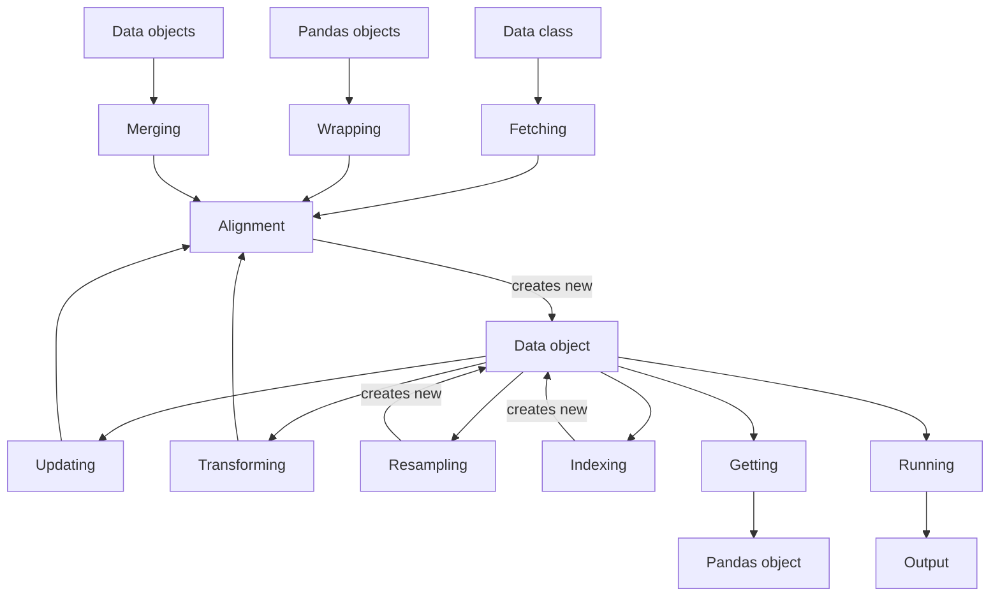

# :material-database: Data

VBT works with Pandas and NumPy arrays, but where do these arrays come from? Obtaining 
financial data manually can be challenging, especially when an exchange provides only a single batch 
of data at a time. In such situations, users need to handle tasks like iterating over time ranges, 
concatenating results, and aligning indexes and columns themselves. This process becomes even more 
complex when working with multiple symbols.

To simplify data retrieval and management, VBT implements the 
[Data](https://vectorbt.pro/pvt_6d1b3986/api/data/base/#vectorbtpro.data.base.Data) class, which streamlines the handling of features 
(such as OHLC) and symbols (such as "BTC-USD"). This is a semi-abstract class, so you need to 
create a subclass and define custom logic in a few places to fully access its advanced features. 
Fortunately, a set of custom data classes is already available, but it is helpful to understand how 
to create your own data class as well.

The following graph illustrates the steps discussed below:



(Reload the page if the diagram does not appear.)

## Fetching

The [Data](https://vectorbt.pro/pvt_6d1b3986/api/data/base/#vectorbtpro.data.base.Data) class defines an abstract class method 
[Data.fetch_symbol](https://vectorbt.pro/pvt_6d1b3986/api/data/base/#vectorbtpro.data.base.Data.fetch_symbol) for generating, loading, 
or fetching data for a single symbol from any data source. You must override and implement this method 
yourself so that it returns a single (Pandas or NumPy) array based on certain parameters, such as the 
start date, end date, and frequency.

Here is a function that retrieves data for any symbol from Yahoo Finance using 
[yfinance](https://github.com/ranaroussi/yfinance):

```pycon
>>> from vectorbtpro import *

>>> def get_yf_symbol(symbol, period="max", start=None, end=None, **kwargs):
...     import yfinance as yf
...     if start is not None:
...         start = vbt.local_datetime(start)  # (1)!
...     if end is not None:
...         end = vbt.local_datetime(end)
...     return yf.Ticker(symbol).history(
...         period=period, 
...         start=start, 
...         end=end, 
...         **kwargs
...     )

>>> get_yf_symbol("BTC-USD", start="2020-01-01", end="2020-01-05")
                                  Open         High          Low        Close  \
Date                                                                            
2019-12-31 00:00:00+00:00  7294.438965  7335.290039  7169.777832  7193.599121   
2020-01-01 00:00:00+00:00  7194.892090  7254.330566  7174.944336  7200.174316   
2020-01-02 00:00:00+00:00  7202.551270  7212.155273  6935.270020  6985.470215   
2020-01-03 00:00:00+00:00  6984.428711  7413.715332  6914.996094  7344.884277   
2020-01-04 00:00:00+00:00  7345.375488  7427.385742  7309.514160  7410.656738   

                                Volume  Dividends  Stock Splits  
Date                                                             
2019-12-31 00:00:00+00:00  21167946112        0.0           0.0  
2020-01-01 00:00:00+00:00  18565664997        0.0           0.0  
2020-01-02 00:00:00+00:00  20802083465        0.0           0.0  
2020-01-03 00:00:00+00:00  28111481032        0.0           0.0  
2020-01-04 00:00:00+00:00  18444271275        0.0           0.0  
```

1. Converts to datetime using [to_datetime](https://vectorbt.pro/pvt_6d1b3986/api/utils/datetime_/#vectorbtpro.utils.datetime_.to_datetime)

!!! info
    Why does the returned data start from `2019-12-31` instead of `2020-01-01`? The start and 
    end dates you provide are in your local timezone and are then converted to UTC. For example, 
    in the Europe/Berlin timezone, depending on the time of year, `2020-01-01` becomes 
    `2019-12-31 22:00:00` UTC, which is the date Yahoo Finance actually receives. To specify 
    a date directly in UTC, append "UTC": `2020-01-01 UTC`, or use a proper 
    [Timestamp](https://pandas.pydata.org/docs/reference/api/pandas.Timestamp.html) instance.

Using the Pandas format is convenient for a single symbol, but what if you want data for multiple 
symbols? Remember, VBT expects you to provide each feature, such as open price or high price, 
as a separate variable. Each variable should have symbols as columns, which means you would need 
to fetch every symbol manually and reorganize their data. This can become especially troublesome 
if the symbols have mismatched indexes or columns.

Fortunately, there is a class method called [Data.pull](https://vectorbt.pro/pvt_6d1b3986/api/data/base/#vectorbtpro.data.base.Data.pull) 
that solves most of these challenges around iterating, fetching, and merging symbols. It accepts one 
or multiple symbols, fetches each using 
[Data.fetch_symbol](https://vectorbt.pro/pvt_6d1b3986/api/data/base/#vectorbtpro.data.base.Data.fetch_symbol), collects the data into 
a dictionary, and passes this dictionary to [Data.from_data](https://vectorbt.pro/pvt_6d1b3986/api/data/base/#vectorbtpro.data.base.Data.from_data) 
for further processing and class instantiation.

Building on the example, let's subclass [Data](https://vectorbt.pro/pvt_6d1b3986/api/data/base/#vectorbtpro.data.base.Data) and 
override the [Data.fetch_symbol](https://vectorbt.pro/pvt_6d1b3986/api/data/base/#vectorbtpro.data.base.Data.fetch_symbol) method 
to call our `get_yf_symbol` function:

```pycon
>>> class YFData(vbt.Data):
...     @classmethod
...     def fetch_symbol(cls, symbol, **kwargs):
...         return get_yf_symbol(symbol, **kwargs)
```

!!! hint
    You can replace `get_yf_symbol` with any function that returns array-like data!

That's it. `YFData` is now a fully functional data class capable of pulling data from Yahoo Finance 
and storing it:

```pycon
>>> yf_data = YFData.pull(
...     ["BTC-USD", "ETH-USD"], 
...     start="2020-01-01", 
...     end="2020-01-05"
... )
```

[=100% "Symbol 2/2"]{: .candystripe .candystripe-animate }

The pulled data is stored in the [Data.data](https://vectorbt.pro/pvt_6d1b3986/api/data/base/#vectorbtpro.data.base.Data.data)
dictionary, with symbols as keys and the values being the Pandas objects returned by 
[Data.fetch_symbol](https://vectorbt.pro/pvt_6d1b3986/api/data/base/#vectorbtpro.data.base.Data.fetch_symbol):

```pycon
>>> yf_data.data["ETH-USD"]
                                 Open        High         Low       Close  \
Date                                                                        
2019-12-31 00:00:00+00:00  132.612274  133.732681  128.798157  129.610855   
2020-01-01 00:00:00+00:00  129.630661  132.835358  129.198288  130.802002   
2020-01-02 00:00:00+00:00  130.820038  130.820038  126.954910  127.410179   
2020-01-03 00:00:00+00:00  127.411263  134.554016  126.490021  134.171707   
2020-01-04 00:00:00+00:00  134.168518  136.052719  133.040558  135.069366   

                                Volume  Dividends  Stock Splits  
Date                                                             
2019-12-31 00:00:00+00:00   8936866397        0.0           0.0  
2020-01-01 00:00:00+00:00   7935230330        0.0           0.0  
2020-01-02 00:00:00+00:00   8032709256        0.0           0.0  
2020-01-03 00:00:00+00:00  10476845358        0.0           0.0  
2020-01-04 00:00:00+00:00   7430904515        0.0           0.0 
```

### Exception handling

If [Data.fetch_symbol](https://vectorbt.pro/pvt_6d1b3986/api/data/base/#vectorbtpro.data.base.Data.fetch_symbol) returns `None` or
an empty Pandas object or NumPy array, the symbol will be skipped entirely.
[Data.pull](https://vectorbt.pro/pvt_6d1b3986/api/data/base/#vectorbtpro.data.base.Data.pull) will also catch any exception raised in 
[Data.fetch_symbol](https://vectorbt.pro/pvt_6d1b3986/api/data/base/#vectorbtpro.data.base.Data.fetch_symbol) and skip the symbol if 
the argument `skip_on_error` is True (it is False by default!). Otherwise, it will abort the procedure.

In general, it is the responsibility of [Data.fetch_symbol](https://vectorbt.pro/pvt_6d1b3986/api/data/base/#vectorbtpro.data.base.Data.fetch_symbol) 
to handle issues. If you have many data points to fetch and the fetcher relies on a loop to concatenate
different batches of data, the best approach is to show the user a warning whenever an exception occurs 
and return the data that has been fetched up to the latest available point in time, similar to how 
this is implemented in [BinanceData](https://vectorbt.pro/pvt_6d1b3986/api/data/custom/binance/#vectorbtpro.data.custom.binance.BinanceData) 
and [CCXTData](https://vectorbt.pro/pvt_6d1b3986/api/data/custom/ccxt/#vectorbtpro.data.custom.ccxt.CCXTData). In such cases, VBT will 
replace missing data points with NaN or drop them entirely, while keeping track of the last index. You can 
wait until your connection is stable and then re-fetch any missing data with 
[Data.update](https://vectorbt.pro/pvt_6d1b3986/api/data/base/#vectorbtpro.data.base.Data.update).

### Custom context

Along with the data, [Data.fetch_symbol](https://vectorbt.pro/pvt_6d1b3986/api/data/base/#vectorbtpro.data.base.Data.fetch_symbol) can 
return a dictionary containing custom keyword arguments that serve as the context for the fetch operation.
This context can later be accessed in the symbol dictionary [Data.returned_kwargs](https://vectorbt.pro/pvt_6d1b3986/api/data/base/#vectorbtpro.data.base.Data.returned_kwargs).
For example, this context may include information on why the fetch failed, the amount of data left 
to fetch, or which rows the fetched data represents when reading from a local file (as done in 
[CSVData](https://vectorbt.pro/pvt_6d1b3986/api/data/custom/csv/#vectorbtpro.data.custom.csv.CSVData) when updating data).

As an example, let's save the current timestamp:

```pycon
>>> class YFData(vbt.Data):
...     @classmethod
...     def fetch_symbol(cls, symbol, **kwargs):
...         returned_kwargs = dict(timestamp=vbt.timestamp())
...         return get_yf_symbol(symbol, **kwargs), returned_kwargs

>>> yf_data = YFData.pull("BTC-USD", start="2020-01-01", end="2020-01-05")
>>> yf_data.returned_kwargs
symbol_dict({'BTC-USD': {'timestamp': Timestamp('2023-08-28 20:08:50.893763')}})
```

!!! info
    [symbol_dict](https://vectorbt.pro/pvt_6d1b3986/api/data/base/#vectorbtpro.data.base.symbol_dict) is a standard dictionary 
    where information is grouped by symbol.

## Alignment

Like most classes that hold data, the [Data](https://vectorbt.pro/pvt_6d1b3986/api/data/base/#vectorbtpro.data.base.Data) class 
inherits from [Analyzable](https://vectorbt.pro/pvt_6d1b3986/documentation/building-blocks/#analyzing), allowing you to perform 
Pandas indexing directly on the class instance to select rows and columns across all Pandas 
objects stored within that instance. Performing a single Pandas indexing operation across multiple 
Pandas objects with different labels is not possible, so what happens if you fetch symbol data from 
different date ranges or with different columns? Whenever [Data.pull](https://vectorbt.pro/pvt_6d1b3986/api/data/base/#vectorbtpro.data.base.Data.pull) 
passes the (unaligned) data dictionary to [Data.from_data](https://vectorbt.pro/pvt_6d1b3986/api/data/base/#vectorbtpro.data.base.Data.from_data), 
it calls [Data.align_data](https://vectorbt.pro/pvt_6d1b3986/api/data/base/#vectorbtpro.data.base.Data.align_data), which does the following:

1. Converts any array-like data into a Pandas object.
2. Removes rows with duplicate indices except for the most recent one.
3. Calls [Data.prepare_tzaware_index](https://vectorbt.pro/pvt_6d1b3986/api/data/base/#vectorbtpro.data.base.Data.prepare_tzaware_index)
to convert each object's index into a timezone-aware index using 
[DataFrame.tz_localize](https://pandas.pydata.org/docs/reference/api/pandas.DataFrame.tz_localize.html) 
and [DataFrame.tz_convert](https://pandas.pydata.org/docs/reference/api/pandas.DataFrame.tz_convert.html).
4. Calls [Data.align_index](https://vectorbt.pro/pvt_6d1b3986/api/data/base/#vectorbtpro.data.base.Data.align_index) to align the index 
labels of all objects based on a specific rule. By default, it creates the union of all indexes, sorts 
the resulting index, and fills missing data points in any object with NaN.
5. Calls [Data.align_columns](https://vectorbt.pro/pvt_6d1b3986/api/data/base/#vectorbtpro.data.base.Data.align_columns) to align column 
labels of all objects using a similar approach to index alignment.
6. Once all objects have the same index and columns, it creates a [wrapper](https://vectorbt.pro/pvt_6d1b3986/documentation/building-blocks/#wrapping).
7. Finally, it passes all the prepared information to the class constructor for instantiation.

Let's walk through this workflow in practice:

```pycon
>>> yf_data = YFData.pull(
...     ["BTC-USD", "ETH-USD"], 
...     start=vbt.symbol_dict({  # (1)!
...         "BTC-USD": "2020-01-01", 
...         "ETH-USD": "2020-01-03"
...     }),
...     end=vbt.symbol_dict({
...         "BTC-USD": "2020-01-03", 
...         "ETH-USD": "2020-01-05"
...     })
... )
UserWarning: Symbols have mismatching index. Setting missing data points to NaN.
```

1. Use [symbol_dict](https://vectorbt.pro/pvt_6d1b3986/api/data/base/#vectorbtpro.data.base.symbol_dict) to specify any argument per symbol.

[=100% "Symbol 2/2"]{: .candystripe .candystripe-animate }

```pycon
>>> yf_data.data["BTC-USD"]
                                  Open         High          Low        Close  \
Date                                                                            
2019-12-31 00:00:00+00:00  7294.438965  7335.290039  7169.777832  7193.599121   
2020-01-01 00:00:00+00:00  7194.892090  7254.330566  7174.944336  7200.174316   
2020-01-02 00:00:00+00:00  7202.551270  7212.155273  6935.270020  6985.470215   
2020-01-03 00:00:00+00:00          NaN          NaN          NaN          NaN   
2020-01-04 00:00:00+00:00          NaN          NaN          NaN          NaN   

                                 Volume  Dividends  Stock Splits  
Date                                                              
2019-12-31 00:00:00+00:00  2.116795e+10        0.0           0.0  
2020-01-01 00:00:00+00:00  1.856566e+10        0.0           0.0  
2020-01-02 00:00:00+00:00  2.080208e+10        0.0           0.0  
2020-01-03 00:00:00+00:00           NaN        NaN           NaN  
2020-01-04 00:00:00+00:00           NaN        NaN           NaN  

>>> yf_data.data["ETH-USD"]
                                 Open        High         Low       Close  \
Date                                                                        
2019-12-31 00:00:00+00:00         NaN         NaN         NaN         NaN   
2020-01-01 00:00:00+00:00         NaN         NaN         NaN         NaN   
2020-01-02 00:00:00+00:00  130.820038  130.820038  126.954910  127.410179   
2020-01-03 00:00:00+00:00  127.411263  134.554016  126.490021  134.171707   
2020-01-04 00:00:00+00:00  134.168518  136.052719  133.040558  135.069366   

                                 Volume  Dividends  Stock Splits  
Date                                                              
2019-12-31 00:00:00+00:00           NaN        NaN           NaN  
2020-01-01 00:00:00+00:00           NaN        NaN           NaN  
2020-01-02 00:00:00+00:00  8.032709e+09        0.0           0.0  
2020-01-03 00:00:00+00:00  1.047685e+10        0.0           0.0  
2020-01-04 00:00:00+00:00  7.430905e+09        0.0           0.0 
```

Notice how we now have the same index and columns across all Pandas objects. You can use this data in 
any VBT function without worrying about indexing errors.

### NaNs

If some rows are present in one symbol and missing in another, VBT will raise a warning 
with the message "Symbols have mismatching index". By default, any missing rows will be replaced with NaN.
To drop these rows or raise an error instead, use the `missing_index` argument:

```pycon
>>> yf_data = YFData.pull(
...     ["BTC-USD", "ETH-USD"], 
...     start=vbt.symbol_dict({
...         "BTC-USD": "2020-01-01", 
...         "ETH-USD": "2020-01-03"
...     }),
...     end=vbt.symbol_dict({
...         "BTC-USD": "2020-01-03", 
...         "ETH-USD": "2020-01-05"
...     }),
...     missing_index="drop"
... )
UserWarning: Symbols have mismatching index. Dropping missing data points.
```

[=100% "Symbol 2/2"]{: .candystripe .candystripe-animate }

```pycon
>>> yf_data.data["BTC-USD"]
                                 Open         High         Low        Close  \
Date                                                                          
2020-01-02 00:00:00+00:00  7202.55127  7212.155273  6935.27002  6985.470215   

                                Volume  Dividends  Stock Splits  
Date                                                             
2020-01-02 00:00:00+00:00  20802083465        0.0           0.0  

>>> yf_data.data["ETH-USD"]
                                 Open        High        Low       Close  \
Date                                                                       
2020-01-02 00:00:00+00:00  130.820038  130.820038  126.95491  127.410179   

                               Volume  Dividends  Stock Splits  
Date                                                            
2020-01-02 00:00:00+00:00  8032709256        0.0           0.0  
```

## Updating

Updating is a standard fetching operation used to update existing data points or 
add new ones. It requires specifying the first timestamp or row index of the update and 
assumes that the data points before this timestamp or row index have not changed.

Similarly to [Data.fetch_symbol](https://vectorbt.pro/pvt_6d1b3986/api/data/base/#vectorbtpro.data.base.Data.fetch_symbol), updating 
must be implemented manually by overriding the [Data.update_symbol](https://vectorbt.pro/pvt_6d1b3986/api/data/base/#vectorbtpro.data.base.Data.update_symbol) 
method. Unlike the fetcher, the updater is an **instance** method and can access data fetched earlier. 
For example, it can access the keyword arguments originally passed to the fetcher, which are available in 
the symbol dictionary [Data.fetch_kwargs](https://vectorbt.pro/pvt_6d1b3986/api/data/base/#vectorbtpro.data.base.Data.fetch_kwargs).
These arguments can be used as default arguments, or overridden by any argument passed directly to the updater. 
Each data instance also has a symbol dictionary [Data.last_index](https://vectorbt.pro/pvt_6d1b3986/api/data/base/#vectorbtpro.data.base.Data.last_index), 
which holds the last fetched index for each symbol. You can use this index as the starting point for the next update.

Let's create a new `YFData` class that can also perform updates on the stored data:

```pycon
>>> class YFData(vbt.Data):
...     @classmethod
...     def fetch_symbol(cls, symbol, **kwargs):
...         return get_yf_symbol(symbol, **kwargs)
...
...     def update_symbol(self, symbol, **kwargs):
...         defaults = self.select_fetch_kwargs(symbol)  # (1)!
...         defaults["start"] = self.select_last_index(symbol)  # (2)!
...         kwargs = vbt.merge_dicts(defaults, kwargs)  # (3)!
...         return self.fetch_symbol(symbol, **kwargs)  # (4)!
```

1. Get the keyword arguments initially passed to [Data.fetch_symbol](https://vectorbt.pro/pvt_6d1b3986/api/data/base/#vectorbtpro.data.base.Data.fetch_symbol)
for this specific symbol.
2. Override the default value for the starting date. Note that changing the keys will not affect 
[Data.fetch_kwargs](https://vectorbt.pro/pvt_6d1b3986/api/data/base/#vectorbtpro.data.base.Data.fetch_kwargs), but be careful with mutable values!
3. Override the default arguments with new arguments in `kwargs` using [merge_dicts](https://vectorbt.pro/pvt_6d1b3986/api/utils/config/#vectorbtpro.utils.config.merge_dicts).
4. Pass the final arguments to [Data.fetch_symbol](https://vectorbt.pro/pvt_6d1b3986/api/data/base/#vectorbtpro.data.base.Data.fetch_symbol).

Once the [Data.update_symbol](https://vectorbt.pro/pvt_6d1b3986/api/data/base/#vectorbtpro.data.base.Data.update_symbol) method is implemented,
we can call the [Data.update](https://vectorbt.pro/pvt_6d1b3986/api/data/base/#vectorbtpro.data.base.Data.update) method to iterate over
each symbol and update its data. Under the hood, this method aligns the index and column labels
of all returned Pandas objects, appends the new data to the old data through concatenation along rows,
and updates the last index for each symbol for use in the next data update. Finally, it produces a new
instance of [Data](https://vectorbt.pro/pvt_6d1b3986/api/data/base/#vectorbtpro.data.base.Data) by using 
[Configured.replace](https://vectorbt.pro/pvt_6d1b3986/api/utils/config/#vectorbtpro.utils.config.Configured.replace).

!!! important
    Updating data never overwrites the existing data instance but always returns a new instance.
    Remember that most classes in VBT are read-only to enable caching and prevent side effects.

First, let's fetch the same data as before:

```pycon
>>> yf_data = YFData.pull(
...     ["BTC-USD", "ETH-USD"], 
...     start=vbt.symbol_dict({
...         "BTC-USD": "2020-01-01", 
...         "ETH-USD": "2020-01-03"
...     }),
...     end=vbt.symbol_dict({
...         "BTC-USD": "2020-01-03", 
...         "ETH-USD": "2020-01-05"
...     })
... )
UserWarning: Symbols have mismatching index. Setting missing data points to NaN.
```

[=100% "Symbol 2/2"]{: .candystripe .candystripe-animate }

Even though both DataFrames end with the same date, our `YFData` instance knows that 
the `BTC-USD` symbol is 2 rows behind the `ETH-USD` symbol:

```pycon
>>> yf_data.last_index
symbol_dict({
    'BTC-USD': Timestamp('2020-01-02 00:00:00+0000', tz='UTC'), 
    'ETH-USD': Timestamp('2020-01-04 00:00:00+0000', tz='UTC')
})
```

We can also access the keyword arguments passed to the initial fetch operation:

```pycon
>>> yf_data.fetch_kwargs
symbol_dict({
    'BTC-USD': {'start': '2020-01-01', 'end': '2020-01-03'}, 
    'ETH-USD': {'start': '2020-01-03', 'end': '2020-01-05'}
})
```

The `start` argument for each symbol will be replaced by its corresponding entry in 
[Data.last_index](https://vectorbt.pro/pvt_6d1b3986/api/data/base/#vectorbtpro.data.base.Data.last_index), while the 
`end` argument can be overridden by any date you specify during the update.

!!! note
    If you do not specify the end date, VBT will update only the latest data point for each symbol.

Let's update both symbols up to the same date:

```pycon
>>> yf_data_updated = yf_data.update(end="2020-01-06")  # (1)!

>>> yf_data_updated.data["BTC-USD"]
                                  Open         High          Low        Close  \
Date                                                                            
2019-12-31 00:00:00+00:00  7294.438965  7335.290039  7169.777832  7193.599121   
2020-01-01 00:00:00+00:00  7194.892090  7254.330566  7174.944336  7200.174316   
2020-01-02 00:00:00+00:00  7202.551270  7212.155273  6935.270020  6985.470215   
2020-01-03 00:00:00+00:00  6984.428711  7413.715332  6914.996094  7344.884277   
2020-01-04 00:00:00+00:00  7345.375488  7427.385742  7309.514160  7410.656738   
2020-01-05 00:00:00+00:00  7410.451660  7544.497070  7400.535645  7411.317383   

                                 Volume  Dividends  Stock Splits  
Date                                                              
2019-12-31 00:00:00+00:00  2.116795e+10        0.0           0.0  
2020-01-01 00:00:00+00:00  1.856566e+10        0.0           0.0  
2020-01-02 00:00:00+00:00  2.080208e+10        0.0           0.0  
2020-01-03 00:00:00+00:00  2.811148e+10        0.0           0.0  
2020-01-04 00:00:00+00:00  1.844427e+10        0.0           0.0  
2020-01-05 00:00:00+00:00  1.972507e+10        0.0           0.0  

>>> yf_data_updated.data["ETH-USD"]
                                 Open        High         Low       Close  \
Date                                                                        
2019-12-31 00:00:00+00:00         NaN         NaN         NaN         NaN   
2020-01-01 00:00:00+00:00         NaN         NaN         NaN         NaN   
2020-01-02 00:00:00+00:00  130.820038  130.820038  126.954910  127.410179   
2020-01-03 00:00:00+00:00  127.411263  134.554016  126.490021  134.171707   
2020-01-04 00:00:00+00:00  134.168518  136.052719  133.040558  135.069366   
2020-01-05 00:00:00+00:00  135.072098  139.410202  135.045624  136.276779   

                                 Volume  Dividends  Stock Splits  
Date                                                              
2019-12-31 00:00:00+00:00           NaN        NaN           NaN  
2020-01-01 00:00:00+00:00           NaN        NaN           NaN  
2020-01-02 00:00:00+00:00  8.032709e+09        0.0           0.0  
2020-01-03 00:00:00+00:00  1.047685e+10        0.0           0.0  
2020-01-04 00:00:00+00:00  7.430905e+09        0.0           0.0  
2020-01-05 00:00:00+00:00  7.526675e+09        0.0           0.0 
```

1. Same date for both symbols.

Each symbol has been updated separately based on its `last_index` value. The `BTC-USD` symbol 
has received new rows from `2020-01-02` to `2020-01-05`, while the `ETH-USD` symbol has received 
new rows only from `2020-01-04` to `2020-01-05`. Now, both symbols are synced up to the same ending date:

```pycon
>>> yf_data_updated.last_index
symbol_dict({
    'BTC-USD': Timestamp('2020-01-05 00:00:00+0000', tz='UTC'), 
    'ETH-USD': Timestamp('2020-01-05 00:00:00+0000', tz='UTC')
})
```

If the last index of the data update falls before the current `last_index` (meaning you want to 
update data in the middle), all data after the new last index will be removed:

```pycon
>>> yf_data_updated = yf_data_updated.update(start="2020-01-01", end="2020-01-02")

>>> yf_data_updated.data["BTC-USD"]
                                  Open         High          Low        Close  \
Date                                                                            
2019-12-31 00:00:00+00:00  7294.438965  7335.290039  7169.777832  7193.599121   
2020-01-01 00:00:00+00:00  7194.892090  7254.330566  7174.944336  7200.174316   

                                 Volume  Dividends  Stock Splits  
Date                                                              
2019-12-31 00:00:00+00:00  2.116795e+10        0.0           0.0  
2020-01-01 00:00:00+00:00  1.856566e+10        0.0           0.0 

>>> yf_data_updated.data["ETH-USD"]
                                 Open        High         Low       Close  \
Date                                                                        
2019-12-31 00:00:00+00:00  132.612274  133.732681  128.798157  129.610855   
2020-01-01 00:00:00+00:00  129.630661  132.835358  129.198288  130.802002   

                                 Volume  Dividends  Stock Splits  
Date                                                              
2019-12-31 00:00:00+00:00  8.936866e+09        0.0           0.0  
2020-01-01 00:00:00+00:00  7.935230e+09        0.0           0.0  
```

!!! note
    The last data point of an update is treated as the most up-to-date, so
    no previously stored data can come after it.

### Concatenation

By default, the returned data instance contains all data: the old data concatenated with the new data.
To return only the updated data, disable `concat`:

```pycon
>>> yf_data_new = yf_data.update(end="2020-01-06", concat=False)

>>> yf_data_new.data["BTC-USD"]
                                  Open         High          Low        Close  \
Date                                                                            
2020-01-02 00:00:00+00:00  7202.551270  7212.155273  6935.270020  6985.470215   
2020-01-03 00:00:00+00:00  6984.428711  7413.715332  6914.996094  7344.884277   
2020-01-04 00:00:00+00:00  7345.375488  7427.385742  7309.514160  7410.656738   
2020-01-05 00:00:00+00:00  7410.451660  7544.497070  7400.535645  7411.317383   

                                 Volume  Dividends  Stock Splits  
Date                                                              
2020-01-02 00:00:00+00:00  2.080208e+10        0.0           0.0  
2020-01-03 00:00:00+00:00  2.811148e+10        0.0           0.0  
2020-01-04 00:00:00+00:00  1.844427e+10        0.0           0.0  
2020-01-05 00:00:00+00:00  1.972507e+10        0.0           0.0  

>>> yf_data_new.data["ETH-USD"]
                                 Open        High         Low       Close  \
Date                                                                        
2020-01-02 00:00:00+00:00  130.820038  130.820038  126.954910  127.410179   
2020-01-03 00:00:00+00:00  127.411263  134.554016  126.490021  134.171707   
2020-01-04 00:00:00+00:00  134.168518  136.052719  133.040558  135.069366   
2020-01-05 00:00:00+00:00  135.072098  139.410202  135.045624  136.276779   

                                 Volume  Dividends  Stock Splits  
Date                                                              
2020-01-02 00:00:00+00:00  8.032709e+09        0.0           0.0  
2020-01-03 00:00:00+00:00  1.047685e+10        0.0           0.0  
2020-01-04 00:00:00+00:00  7.430905e+09        0.0           0.0  
2020-01-05 00:00:00+00:00  7.526675e+09        0.0           0.0  
```

The returned data instance skips two timestamps: `2019-12-31` and `2020-01-01`,
since these were not changed during that update. Even though the symbol `ETH-USD` only received 
new rows from `2020-01-04` to `2020-01-05`, it also contains the old data for `2020-01-02` and
`2020-01-03`. Why is that? Those timestamps were updated in the `BTC-USD` dataset, and because the
index must be aligned across all symbols, some old data is included to avoid setting NaNs.

## Getting

After data is fetched and a new [Data](https://vectorbt.pro/pvt_6d1b3986/api/data/base/#vectorbtpro.data.base.Data) instance is
created, accessing the data is straightforward using the
[Data.data](https://vectorbt.pro/pvt_6d1b3986/api/data/base/#vectorbtpro.data.base.Data.data) dictionary or the
[Data.get](https://vectorbt.pro/pvt_6d1b3986/api/data/base/#vectorbtpro.data.base.Data.get) method.

```pycon
>>> yf_data = YFData.pull(
...     ["BTC-USD", "ETH-USD"], 
...     start="2020-01-01", 
...     end="2020-01-05"
... )
```

[=100% "Symbol 2/2"]{: .candystripe .candystripe-animate }

Get all features for one symbol:

```pycon
>>> yf_data.get(symbols="BTC-USD")
                                  Open         High          Low        Close  \
Date                                                                            
2019-12-31 00:00:00+00:00  7294.438965  7335.290039  7169.777832  7193.599121   
2020-01-01 00:00:00+00:00  7194.892090  7254.330566  7174.944336  7200.174316   
2020-01-02 00:00:00+00:00  7202.551270  7212.155273  6935.270020  6985.470215   
2020-01-03 00:00:00+00:00  6984.428711  7413.715332  6914.996094  7344.884277   
2020-01-04 00:00:00+00:00  7345.375488  7427.385742  7309.514160  7410.656738   

                                Volume  Dividends  Stock Splits  
Date                                                             
2019-12-31 00:00:00+00:00  21167946112        0.0           0.0  
2020-01-01 00:00:00+00:00  18565664997        0.0           0.0  
2020-01-02 00:00:00+00:00  20802083465        0.0           0.0  
2020-01-03 00:00:00+00:00  28111481032        0.0           0.0  
2020-01-04 00:00:00+00:00  18444271275        0.0           0.0  
```

Get specific features for one symbol:

```pycon
>>> yf_data.get(features=["High", "Low"], symbols="BTC-USD")
                                  High          Low
Date                                               
2019-12-31 00:00:00+00:00  7335.290039  7169.777832
2020-01-01 00:00:00+00:00  7254.330566  7174.944336
2020-01-02 00:00:00+00:00  7212.155273  6935.270020
2020-01-03 00:00:00+00:00  7413.715332  6914.996094
2020-01-04 00:00:00+00:00  7427.385742  7309.514160
```

Get one feature for all symbols:

```pycon
>>> yf_data.get(features="Close")
symbol                         BTC-USD     ETH-USD
Date                                              
2019-12-31 00:00:00+00:00  7193.599121  129.610855
2020-01-01 00:00:00+00:00  7200.174316  130.802002
2020-01-02 00:00:00+00:00  6985.470215  127.410179
2020-01-03 00:00:00+00:00  7344.884277  134.171707
2020-01-04 00:00:00+00:00  7410.656738  135.069366
```

Notice how symbols are now columns in the returned DataFrame? This is the format widely used in VBT.

Get multiple features for multiple symbols:

```pycon
>>> open_price, close_price = yf_data.get(features=["Open", "Close"])  # (1)!
```

1. Tuple with DataFrames, one per feature.

!!! hint
    As you may have noticed, VBT returns different formats depending on whether there is one or
    multiple features or symbols included in your data instance. To produce a consistent format regardless
    of the number of features or symbols, pass `features` or `symbols` as a list or another collection.

    For example, calling `yf_data.get(features="Close")` when there is only one symbol will return a Series
    instead of a DataFrame. To ensure VBT always returns a DataFrame, pass `features=["Close"]`.

### Magnet features

Magnet features are features with case-insensitive names that the [Data](https://vectorbt.pro/pvt_6d1b3986/api/data/base/#vectorbtpro.data.base.Data)
class can detect and query. These include static features such as OHLCV, as well as those that
can be computed dynamically, like VWAP, HLC/3, OHLC/4, and returns. Each feature is also associated
with an instance property that returns that feature for all symbols in a data instance. For example,
to get the close price and returns:

```pycon
>>> yf_data.close
symbol                         BTC-USD     ETH-USD
Date                                              
2019-12-31 00:00:00+00:00  7193.599121  129.610855
2020-01-01 00:00:00+00:00  7200.174316  130.802002
2020-01-02 00:00:00+00:00  6985.470215  127.410179
2020-01-03 00:00:00+00:00  7344.884277  134.171707
2020-01-04 00:00:00+00:00  7410.656738  135.069366

>>> yf_data.returns
symbol                      BTC-USD   ETH-USD
Date                                         
2019-12-31 00:00:00+00:00  0.000000  0.000000
2020-01-01 00:00:00+00:00  0.000914  0.009190
2020-01-02 00:00:00+00:00 -0.029819 -0.025931
2020-01-03 00:00:00+00:00  0.051452  0.053069
2020-01-04 00:00:00+00:00  0.008955  0.006690
```

## Running

Thanks to the clear structure of magnet features, we can use them when passing data to many functions
across VBT. Since most functions do not accept the `data` instance directly, but expect features
such as `close` to be provided separately, there is a need for a method that can recognize what a
function requires and feed the data accordingly. The [Data.run](https://vectorbt.pro/pvt_6d1b3986/api/data/base/#vectorbtpro.data.base.Data.run)
method serves this purpose: it accepts a function, parses its arguments, and if it recognizes a magnet
feature, it forwards it as needed. This is especially helpful for quickly running indicators, which are
automatically recognized by their names:

```pycon
>>> yf_data.run("sma", 3)
<vectorbtpro.indicators.factory.talib.SMA at 0x7ff75218b5b0>
```

When there are multiple third-party libraries with the same indicator name, it is a good idea
to provide a prefix with the library name to avoid confusion:

```pycon
>>> yf_data.run("talib_sma", 3)
<vectorbtpro.indicators.factory.talib.SMA at 0x7ff752111070>
```

This method also accepts the names of all simulation methods available in
[Portfolio](https://vectorbt.pro/pvt_6d1b3986/api/portfolio/base/#vectorbtpro.portfolio.base.Portfolio), such as
[Portfolio.from_holding](https://vectorbt.pro/pvt_6d1b3986/api/portfolio/base/#vectorbtpro.portfolio.base.Portfolio.from_holding):

```pycon
>>> yf_data.run("from_holding")
<vectorbtpro.portfolio.base.Portfolio at 0x7ff767e18970>
```

## Features and symbols

The [Data](https://vectorbt.pro/pvt_6d1b3986/api/data/base/#vectorbtpro.data.base.Data) class provides various dictionaries
that hold data for each symbol, as well as methods to help manipulate that data.

You can view the list of features and symbols using the
[Data.features](https://vectorbt.pro/pvt_6d1b3986/api/data/base/#vectorbtpro.data.base.Data.symbols) and
[Data.symbols](https://vectorbt.pro/pvt_6d1b3986/api/data/base/#vectorbtpro.data.base.Data.symbols) properties, respectively:

```pycon
>>> yf_data.features
['Open', 'High', 'Low', 'Close', 'Volume', 'Dividends', 'Stock Splits']

>>> yf_data.symbols
['BTC-USD', 'ETH-USD']
```

There is also a [Data.single_key](https://vectorbt.pro/pvt_6d1b3986/api/data/base/#vectorbtpro.data.base.Data.single_key) flag,
which is True if the instance holds only one symbol of data (or one feature, if the instance is
feature-oriented). This affects [Getting](#getting), as discussed in the hints above.

```pycon
>>> yf_data.single_key
False
```

### Dicts

Each data instance contains at least five dictionaries:

1. [Data.data](https://vectorbt.pro/pvt_6d1b3986/api/data/base/#vectorbtpro.data.base.Data.data) with the Pandas objects.
2. [Data.classes](https://vectorbt.pro/pvt_6d1b3986/api/data/base/#vectorbtpro.data.base.Data.classes) with the classes.
3. [Data.fetch_kwargs](https://vectorbt.pro/pvt_6d1b3986/api/data/base/#vectorbtpro.data.base.Data.fetch_kwargs) with the keyword arguments
passed to the fetcher.
4. [Data.returned_kwargs](https://vectorbt.pro/pvt_6d1b3986/api/data/base/#vectorbtpro.data.base.Data.returned_kwargs) with the keyword arguments
returned by the fetcher.
5. [Data.last_index](https://vectorbt.pro/pvt_6d1b3986/api/data/base/#vectorbtpro.data.base.Data.last_index) with the last fetched index.

Each dictionary is a regular dictionary of either the type
[symbol_dict](https://vectorbt.pro/pvt_6d1b3986/api/data/base/#vectorbtpro.data.base.symbol_dict) (mostly when the instance is symbol-oriented)
or [feature_dict](https://vectorbt.pro/pvt_6d1b3986/api/data/base/#vectorbtpro.data.base.feature_dict) (mostly when the instance is feature-oriented).

```pycon
>>> yf_data.last_index["BTC-USD"]
Timestamp('2020-01-04 00:00:00+0000', tz='UTC')
```

!!! important
    Do not change the values of the above dictionaries in-place. Whenever you work with keyword arguments,
    make sure to create a new dict after selecting a symbol: `dict(data.fetch_kwargs[symbol])`.
    This will not change the parent dict if you want to modify the keyword arguments for some task.

### Selecting

You can select one or more symbols using [Data.select](https://vectorbt.pro/pvt_6d1b3986/api/data/base/#vectorbtpro.data.base.Data.select):

```pycon
>>> yf_data.select("BTC-USD")
<__main__.YFData at 0x7ff6a97f4b38>

>>> yf_data.select("BTC-USD").get()
                                  Open         High          Low        Close  \
Date                                                                            
2019-12-31 00:00:00+00:00  7294.438965  7335.290039  7169.777832  7193.599121   
2020-01-01 00:00:00+00:00  7194.892090  7254.330566  7174.944336  7200.174316   
2020-01-02 00:00:00+00:00  7202.551270  7212.155273  6935.270020  6985.470215   
2020-01-03 00:00:00+00:00  6984.428711  7413.715332  6914.996094  7344.884277   
2020-01-04 00:00:00+00:00  7345.375488  7427.385742  7309.514160  7410.656738   

                                Volume  Dividends  Stock Splits  
Date                                                             
2019-12-31 00:00:00+00:00  21167946112        0.0           0.0  
2020-01-01 00:00:00+00:00  18565664997        0.0           0.0  
2020-01-02 00:00:00+00:00  20802083465        0.0           0.0  
2020-01-03 00:00:00+00:00  28111481032        0.0           0.0  
2020-01-04 00:00:00+00:00  18444271275        0.0           0.0  
```

The operation above creates a new `YFData` instance with only one symbol, `BTC-USD`.

!!! note
    Updating the data in a child instance will not affect the parent instance it was copied from
    because updating creates a new Pandas object. However, changing the data in-place will also
    change it in the parent instance. To make both instances fully independent, pass `copy_mode_="deep"`
    (see [Configured.replace](https://vectorbt.pro/pvt_6d1b3986/api/utils/config/#vectorbtpro.utils.config.Configured.replace)).

!!! info
    If the instance is feature-oriented, this method applies to features instead of symbols.

### Renaming

You can rename symbols using [Data.rename](https://vectorbt.pro/pvt_6d1b3986/api/data/base/#vectorbtpro.data.base.rename):

```pycon
>>> yf_data.rename({
...     "BTC-USD": "BTC/USD",
...     "ETH-USD": "ETH/USD"
... }).get("Close")
symbol                         BTC/USD     ETH/USD
Date                                              
2019-12-31 00:00:00+00:00  7193.599121  129.610855
2020-01-01 00:00:00+00:00  7200.174316  130.802002
2020-01-02 00:00:00+00:00  6985.470215  127.410179
2020-01-03 00:00:00+00:00  7344.884277  134.171707
2020-01-04 00:00:00+00:00  7410.656738  135.069366
```

!!! warning
    Renaming symbols may (and often will) break their updating. Use this only for getting.

!!! info
    If the instance is feature-oriented, this method applies to features instead of symbols.

### Classes

Classes are helpful when you want to introduce another level of abstraction over symbols,
such as dividing symbols into industries and sectors. This lets you analyze symbols within
their classes and also study entire classes. Classes can be provided to the fetcher using the
`classes` argument. They must be specified per symbol, unless there is only one class to apply to
all symbols. In the end, they will be converted into a (multi-)index and stacked on top of symbol
columns when you get the symbol wrapper using [Data.get_symbol_wrapper](https://vectorbt.pro/pvt_6d1b3986/api/data/base/#vectorbtpro.data.base.Data.from_data.get_symbol_wrapper).
Each class can be provided as a string (which will be stored under the class name `symbol_class`),
or as a dictionary with class names as keys and their corresponding class values as values.

```pycon
>>> cls_yfdata = vbt.YFData.pull(
...     ["META", "GOOGL", "NFLX", "BAC", "WFC", "TLT", "SHV"],
...     classes=[
...         dict(class1="Equity", class2="Technology"),
...         dict(class1="Equity", class2="Technology"),
...         dict(class1="Equity", class2="Technology"),
...         dict(class1="Equity", class2="Financial"),
...         dict(class1="Equity", class2="Financial"),
...         dict(class1="Fixed Income", class2="Treasury"),
...         dict(class1="Fixed Income", class2="Treasury"),
...     ],
...     start="2010-01-01",
...     missing_columns="nan"
... )
>>> cls_yfdata.close
class1                         Equity                                     \
class2                     Technology                          Financial   
symbol                           META       GOOGL        NFLX        BAC   
Date                                                                       
2010-01-04 00:00:00-05:00         NaN   15.684434    7.640000  12.977036   
2010-01-05 00:00:00-05:00         NaN   15.615365    7.358571  13.398854   
2010-01-06 00:00:00-05:00         NaN   15.221722    7.617143  13.555999   
...                               ...         ...         ...        ...   
2023-08-24 00:00:00-04:00  286.750000  129.779999  406.929993  28.620001   
2023-08-25 00:00:00-04:00  285.500000  129.880005  416.029999  28.500000   
2023-08-28 00:00:00-04:00  290.260010  131.009995  418.059998  28.764999   

class1                               Fixed Income              
class2                                   Treasury              
symbol                           WFC          TLT         SHV  
Date                                                           
2010-01-04 00:00:00-05:00  19.073046    62.717960   99.920975  
2010-01-05 00:00:00-05:00  19.596645    63.123013   99.884712  
2010-01-06 00:00:00-05:00  19.624567    62.278038   99.893806  
...                              ...          ...         ...  
2023-08-24 00:00:00-04:00  41.430000    94.910004  110.389999  
2023-08-25 00:00:00-04:00  41.230000    95.220001  110.389999  
2023-08-28 00:00:00-04:00  41.880001    95.320000  110.400002  

[3436 rows x 7 columns]
```

In addition to providing classes to the fetcher, you can also replace them in any existing data
instance, which will return a new data instance:

```pycon
>>> new_cls_yfdata = cls_yfdata.replace(
...     classes=vbt.symbol_dict({
...         "META": dict(class1="Equity", class2="Technology"),
...         "GOOGL": dict(class1="Equity", class2="Technology"),
...         "NFLX": dict(class1="Equity", class2="Technology"),
...         "BAC": dict(class1="Equity", class2="Financial"),
...         "WFC": dict(class1="Equity", class2="Financial"),
...         "TLT": dict(class1="Fixed Income", class2="Treasury"),
...         "SHV": dict(class1="Fixed Income", class2="Treasury"),
...     })
... )
```

You can also use [Data.update_classes](https://vectorbt.pro/pvt_6d1b3986/api/data/base/#vectorbtpro.data.base.Data.update_classes):

```pycon
>>> new_cls_yfdata = cls_yfdata.update_classes(
...     class1=vbt.symbol_dict({
...         "META": "Equity",
...         "GOOGL": "Equity",
...         "NFLX": "Equity",
...         "BAC": "Equity",
...         "WFC": "Equity",
...         "TLT": "Fixed Income",
...         "SHV": "Fixed Income",
...     }),
...     class2=vbt.symbol_dict({
...         "META": "Technology",
...         "GOOGL": "Technology",
...         "NFLX": "Technology",
...         "BAC": "Financial",
...         "WFC": "Financial",
...         "TLT": "Treasury",
...         "SHV": "Treasury",
...     })
... )
```

!!! info
    If the instance is feature-oriented and the dictionary with classes is of type
    [feature_dict](https://vectorbt.pro/pvt_6d1b3986/api/data/base/#vectorbtpro.data.base.feature_dict),
    the classes will be applied to features instead of symbols.

## Wrapping

You do not need data instances to work with VBT, since the main objects VBT operates on are
Pandas and NumPy arrays. However, it is often much more convenient to have all your data contained
within the same [Data](https://vectorbt.pro/pvt_6d1b3986/api/data/base/#vectorbtpro.data.base.Data) container. This allows data to
be managed (aligned, resampled, transformed, etc.) in a standardized way. To wrap any custom Pandas
object with a [Data](https://vectorbt.pro/pvt_6d1b3986/api/data/base/#vectorbtpro.data.base.Data) class, you can use the class method
[Data.from_data](https://vectorbt.pro/pvt_6d1b3986/api/data/base/#vectorbtpro.data.base.Data.from_data). This method can take either a
single Pandas object (which will be stored under the symbol `symbol`), a symbol dictionary with
multiple Pandas objects (one per symbol), or a feature dictionary with multiple Pandas objects (one
per feature).

The Series or DataFrame to be wrapped typically has columns representing features, such as OHLC,
rather than symbols like `BTCUSDT`. For example:

```pycon
>>> btc_df = pd.DataFrame({
...     "Open": [7194.89, 7202.55, 6984.42],
...     "High": [7254.33, 7212.15, 7413.71],
...     "Low": [7174.94, 6935.27, 6985.47],
...     "Close": [7200.17, 6985.47, 7344.88]
... }, index=vbt.date_range("2020-01-01", periods=3))
>>> btc_df
               Open     High      Low    Close
2020-01-01  7194.89  7254.33  7174.94  7200.17
2020-01-02  7202.55  7212.15  6935.27  6985.47
2020-01-03  6984.42  7413.71  6985.47  7344.88

>>> my_data = vbt.Data.from_data(btc_df)
>>> my_data.hlc3
2020-01-01 00:00:00+00:00    7209.813333
2020-01-02 00:00:00+00:00    7044.296667
2020-01-03 00:00:00+00:00    7248.020000
Freq: D, dtype: float64
```

You can also wrap multiple Pandas objects keyed by symbol:

```pycon
>>> eth_df = pd.DataFrame({
...     "Open": [127.41, 134.16, 135.07],
...     "High": [134.55, 136.05, 139.41],
...     "Low": [126.49, 133.04, 135.04],
...     "Close": [134.17, 135.06, 136.27]
... }, index=vbt.date_range("2020-01-03", periods=3))  # (1)!
>>> eth_df
              Open    High     Low   Close
2020-01-03  127.41  134.55  126.49  134.17
2020-01-04  134.16  136.05  133.04  135.06
2020-01-05  135.07  139.41  135.04  136.27

>>> my_data = vbt.Data.from_data({"BTCUSDT": btc_df, "ETHUSDT": eth_df})
>>> my_data.hlc3
symbol                         BTCUSDT     ETHUSDT
2020-01-01 00:00:00+00:00  7209.813333         NaN
2020-01-02 00:00:00+00:00  7044.296667         NaN
2020-01-03 00:00:00+00:00  7248.020000  131.736667
2020-01-04 00:00:00+00:00          NaN  134.716667
2020-01-05 00:00:00+00:00          NaN  136.906667
```

1. Use different dates to demonstrate alignment.

If your data has symbols as columns, enable `columns_are_symbols`:

```pycon
>>> hlc3_data = vbt.Data.from_data(my_data.hlc3, columns_are_symbols=True)
>>> hlc3_data.get()
symbol                         BTCUSDT     ETHUSDT
2020-01-01 00:00:00+00:00  7209.813333         NaN
2020-01-02 00:00:00+00:00  7044.296667         NaN
2020-01-03 00:00:00+00:00  7248.020000  131.736667
2020-01-04 00:00:00+00:00          NaN  134.716667
2020-01-05 00:00:00+00:00          NaN  136.906667
```

In this case, the instance will become feature-oriented. This means the DataFrame above will be
stored in a [feature_dict](https://vectorbt.pro/pvt_6d1b3986/api/data/base/#vectorbtpro.data.base.feature_dict), and the behavior of
symbols and features will be swapped across many methods. To make the instance symbol-oriented as in
most examples, also pass `invert_data=True`.

## Merging

As you may have already noticed, the process of aligning data is logically separated from the process
of fetching data. This allows you to merge and align any data retrospectively.

Instead of storing and managing all symbols as one monolithic entity, you can handle them separately
and merge them into a single data instance only when needed. This approach is especially useful when
symbols are distributed across multiple data classes, such as when mixing remote and local data
sources. For this, you can use the class method [Data.merge](https://vectorbt.pro/pvt_6d1b3986/api/data/base/#vectorbtpro.data.base.Data.merge),
which takes two or more data instances, merges their information, and forwards the merged result to
[Data.from_data](https://vectorbt.pro/pvt_6d1b3986/api/data/base/#vectorbtpro.data.base.Data.from_data):

```pycon
>>> yf_data_btc = YFData.pull(
...     "BTC-USD",
...     start="2020-01-01",
...     end="2020-01-03"
... )
>>> yf_data_eth = YFData.pull(
...     "ETH-USD",
...     start="2020-01-03",
...     end="2020-01-05"
... )
>>> merged_yf_data = YFData.merge(yf_data_btc, yf_data_eth)
>>> merged_yf_data.close
symbol                         BTC-USD     ETH-USD
Date                                              
2019-12-31 00:00:00+00:00  7193.599121         NaN
2020-01-01 00:00:00+00:00  7200.174316         NaN
2020-01-02 00:00:00+00:00  6985.470215  127.410179
2020-01-03 00:00:00+00:00          NaN  134.171707
2020-01-04 00:00:00+00:00          NaN  135.069366
UserWarning: Symbols have mismatching index. Setting missing data points to NaN.
```

The advantage of this method is that it not only merges different symbols across various data
instances, but it can also merge Pandas objects for the same symbol.

```pycon
>>> yf_data_btc1 = YFData.pull(
...     "BTC-USD",
...     start="2020-01-01",
...     end="2020-01-03"
... )
>>> yf_data_btc2 = YFData.pull(
...     "BTC-USD",
...     start="2020-01-05",
...     end="2020-01-07"
... )
>>> yf_data_eth = YFData.pull(
...     "ETH-USD",
...     start="2020-01-06",
...     end="2020-01-08"
... )
>>> merged_yf_data = YFData.merge(yf_data_btc1, yf_data_btc2, yf_data_eth)
>>> merged_yf_data.close
symbol                         BTC-USD     ETH-USD
Date                                              
2019-12-31 00:00:00+00:00  7193.599121         NaN
2020-01-01 00:00:00+00:00  7200.174316         NaN
2020-01-02 00:00:00+00:00  6985.470215         NaN
2020-01-04 00:00:00+00:00  7410.656738         NaN
2020-01-05 00:00:00+00:00  7411.317383  136.276779
2020-01-06 00:00:00+00:00  7769.219238  144.304153
2020-01-07 00:00:00+00:00          NaN  143.543991
```

### Subclassing

We used [Data](https://vectorbt.pro/pvt_6d1b3986/api/data/base/#vectorbtpro.data.base.Data) on the class `YFData`, which
automatically creates an instance of that class. Once you have an instance of `YFData`, you can
update the data just as before. But what if the data instances you want to merge come from different
data classes? If you used `YFData` to merge [CCXTData](https://vectorbt.pro/pvt_6d1b3986/api/data/custom/ccxt/#vectorbtpro.data.custom.ccxt.CCXTData)
and [BinanceData](https://vectorbt.pro/pvt_6d1b3986/api/data/custom/binance/#vectorbtpro.data.custom.binance.BinanceData)
instances, you would no longer be able to update the data objects, since the method
`YFData.update_symbol` is implemented specifically for symbols supported by Yahoo Finance.

In this case, you can either use [Data](https://vectorbt.pro/pvt_6d1b3986/api/data/base/#vectorbtpro.data.base.Data), which will
raise an error if you attempt to update, or create a subclass to handle updates using different
data providers. This is fairly easy if you know which symbol belongs to which data class;
simply call the appropriate `fetch_symbol` or `update_symbol` method:

```pycon
>>> bn_data_btc = vbt.BinanceData.pull(
...     "BTCUSDT",
...     start="2020-01-01",
...     end="2020-01-04")
>>> bn_data_btc.close
Open time
2020-01-01 00:00:00+00:00    7200.85
2020-01-02 00:00:00+00:00    6965.71
2020-01-03 00:00:00+00:00    7344.96
Freq: D, Name: Close, dtype: float64

>>> ccxt_data_eth = vbt.CCXTData.pull(
...     "ETH/USDT",
...     start="2020-01-03",
...     end="2020-01-06")
>>> ccxt_data_eth.close
Open time
2020-01-03 00:00:00+00:00    134.35
2020-01-04 00:00:00+00:00    134.20
2020-01-05 00:00:00+00:00    135.37
Freq: D, Name: Close, dtype: float64

>>> class MergedData(vbt.Data):
...     @classmethod
...     def fetch_symbol(cls, symbol, **kwargs):
...         if symbol.startswith("BN_"):
...             return vbt.BinanceData.fetch_symbol(symbol[3:], **kwargs)
...         if symbol.startswith("CCXT_"):
...             return vbt.CCXTData.fetch_symbol(symbol[5:], **kwargs)
...         raise ValueError(f"Unknown symbol '{symbol}'")
...
...     def update_symbol(self, symbol, **kwargs):
...         fetch_kwargs = self.select_fetch_kwargs(symbol)
...         fetch_kwargs["start"] = self.select_last_index(symbol)
...         kwargs = vbt.merge_dicts(fetch_kwargs, kwargs)
...         return self.fetch_symbol(symbol, **kwargs)

>>> merged_data = MergedData.merge(
...     bn_data_btc,
...     ccxt_data_eth,
...     rename={
...         "BTCUSDT": "BN_BTCUSDT",
...         "ETH/USDT": "CCXT_ETH/USDT"
...     },
...     missing_columns="drop"
... )
UserWarning: Symbols have mismatching index. Setting missing data points to NaN.
UserWarning: Symbols have mismatching columns. Dropping missing data points.

>>> merged_data = merged_data.update(end="2020-01-07")
>>> merged_data.close
symbol                     BN_BTCUSDT  CCXT_ETH/USDT
Open time                                           
2020-01-01 00:00:00+00:00     7200.85            NaN
2020-01-02 00:00:00+00:00     6965.71            NaN
2020-01-03 00:00:00+00:00     7344.96         134.35
2020-01-04 00:00:00+00:00     7354.11         134.20
2020-01-05 00:00:00+00:00     7358.75         135.37
2020-01-06 00:00:00+00:00     7758.00         144.15
```

We have just created a flexible data class that can fetch, update, and manage symbols from multiple
data providers. Great!

## Resampling

As a subclass of [Wrapping](https://vectorbt.pro/pvt_6d1b3986/api/base/wrapping/#vectorbtpro.base.wrapping.Wrapping), each data
instance stores the normalized metadata of all Pandas objects stored within that instance. This
metadata can be used to resample (i.e., change the time frame of) all Pandas objects at once. Since
many data classes, such as [CCXTData](https://vectorbt.pro/pvt_6d1b3986/api/data/custom/ccxt/#vectorbtpro.data.custom.ccxt.CCXTData),
have a fixed feature layout, you can define the resampling function for each feature in a special
configuration called the "feature config" (stored under
[Data.feature_config](https://vectorbt.pro/pvt_6d1b3986/api/data/base/#vectorbtpro.data.base.Data.feature_config)), and bind that
config to the class itself for use by all instances. Similar to field configs in
[Records](https://vectorbt.pro/pvt_6d1b3986/api/records/base/#vectorbtpro.records.base.Records), this config can be attached to the
entire data class or to any of its instances. Whenever a new instance is created, the class config is
copied so that rewriting it will not affect the original class config.

Here is what the feature config of [BinanceData](https://vectorbt.pro/pvt_6d1b3986/api/data/custom/binance/#vectorbtpro.data.custom.binance.BinanceData)
looks like:

```pycon
>>> vbt.pprint(vbt.BinanceData.feature_config)
HybridConfig({
    'Quote volume': dict(
        resample_func=<function BinanceData.<lambda> at 0x7ff7648d7280>
    ),
    'Taker base volume': dict(
        resample_func=<function BinanceData.<lambda> at 0x7ff7648d7310>
    ),
    'Taker quote volume': dict(
        resample_func=<function BinanceData.<lambda> at 0x7ff7648d73a0>
    )
})
```

You might be wondering where the resampling functions are for all the OHLCV features. Those features
are universal and are recognized and resampled automatically.

Now, let's resample the entire daily BTC/USD data from Yahoo Finance to a monthly frequency:

```pycon
>>> full_yf_data = vbt.YFData.pull("BTC-USD")  # (1)!
>>> ms_yf_data = full_yf_data.resample("M")
>>> ms_yf_data.close
Date
2014-09-01 00:00:00+00:00      386.944000
2014-10-01 00:00:00+00:00      338.321014
2014-11-01 00:00:00+00:00      378.046997
                                      ...     
2023-06-01 00:00:00+00:00    30477.251953
2023-07-01 00:00:00+00:00    29230.111328
2023-08-01 00:00:00+00:00    25995.177734
Freq: MS, Name: Close, Length: 108, dtype: float64
```

1. Use the built-in Yahoo Finance class, which already knows how to resample features such as dividends.

Since VBT works just as well with custom target indexes as with built-in frequencies, you can
provide a custom index for resampling:

```pycon
>>> resampler = vbt.Resampler.from_date_range(
...     full_yf_data.wrapper.index,
...     start=full_yf_data.wrapper.index[0],
...     end=full_yf_data.wrapper.index[-1],
...     freq="Y",
...     silence_warnings=True
... )
>>> y_yf_data = full_yf_data.resample(resampler)
>>> y_yf_data.close
2014-12-31 00:00:00+00:00      426.619995
2015-12-31 00:00:00+00:00      961.237976
2016-12-31 00:00:00+00:00    12952.200195
2017-12-31 00:00:00+00:00     3865.952637
2018-12-31 00:00:00+00:00     7292.995117
2019-12-31 00:00:00+00:00    28840.953125
2020-12-31 00:00:00+00:00    47178.125000
2021-12-31 00:00:00+00:00    39194.972656
Freq: A-DEC, Name: Close, dtype: float64
```

!!! note
    When providing a custom index, VBT will aggregate all values after each index entry.
    The last entry aggregates all values up to infinity. See [GenericAccessor.resample_to_index](https://vectorbt.pro/pvt_6d1b3986/api/generic/accessors/#vectorbtpro.generic.accessors.GenericAccessor.resample_to_index).

If a data class does not have a fixed feature layout, such as [HDFData](https://vectorbt.pro/pvt_6d1b3986/api/data/custom/hdf/#vectorbtpro.data.custom.hdf.HDFData),
you need to adapt the feature config to each **data instance** rather than to the entire data class.
For example, if you convert `bn_data_btc` to a generic [Data](https://vectorbt.pro/pvt_6d1b3986/api/data/base/#vectorbtpro.data.base.Data) instance:

```pycon
>>> data_btc = vbt.Data.from_data(bn_data_btc.data, single_key=True)
>>> data_btc.resample("M")
ValueError: Cannot resample feature 'Quote volume'. Specify resample_func in feature_config.

>>> for k, v in vbt.BinanceData.feature_config.items():
...     data_btc.feature_config[k] = v
>>> data_btc.resample("M")
<vectorbtpro.data.base.Data at 0x7fc0dfce1630>
```

You can also perform this with a single copy operation using
[Data.use_feature_config_of](https://vectorbt.pro/pvt_6d1b3986/api/data/base/#vectorbtpro.data.base.Data.use_feature_config_of):

```pycon
>>> data_btc = vbt.Data.from_data(bn_data_btc.data, single_key=True)
>>> data_btc.use_feature_config_of(vbt.BinanceData)
>>> data_btc.resample("M").close
Open time
2020-01-01 00:00:00+00:00    7344.96
Freq: MS, Name: Close, dtype: float64
```

### Realignment

Just like resampling, realignment also changes the data frequency, but unlike resampling, it does
not aggregate the data. Instead, it includes only the most recent data point available at each step in
the target index. It uses [GenericAccessor.realign_opening](https://vectorbt.pro/pvt_6d1b3986/api/generic/accessors/#vectorbtpro.generic.accessors.GenericAccessor.realign_opening)
for "open" and [GenericAccessor.realign_closing](https://vectorbt.pro/pvt_6d1b3986/api/generic/accessors/#vectorbtpro.generic.accessors.GenericAccessor.realign_closing)
for all other features. There are two common use cases for realignment: aligning multiple symbols
from different time zones to a single index, and upsampling data. Let's align symbols with different
timings:

```pycon
>>> data = vbt.YFData.pull(
...     ["BTC-USD", "AAPL"],
...     start="2020-01-01",
...     end="2020-01-04"
... )
>>> data.close
symbol                         BTC-USD       AAPL
Date                                             
2020-01-01 00:00:00+00:00  7200.174316        NaN
2020-01-02 00:00:00+00:00  6985.470215        NaN
2020-01-02 05:00:00+00:00          NaN  73.249016
2020-01-03 00:00:00+00:00  7344.884277        NaN
2020-01-03 05:00:00+00:00          NaN  72.536888

>>> new_index = data.index.ceil("D").drop_duplicates()
>>> new_data = data.realign(new_index, ffill=False)
>>> new_data.close
symbol                         BTC-USD       AAPL
Date                                             
2020-01-01 00:00:00+00:00  7200.174316        NaN
2020-01-02 00:00:00+00:00  6985.470215        NaN
2020-01-03 00:00:00+00:00  7344.884277  73.249016
2020-01-04 00:00:00+00:00          NaN  72.536888
```

## Transforming

The main challenge in transforming any data is that each symbol must have the same index and columns,
since we need to concatenate them into one Pandas object later. Therefore, any transformation must
be applied to each symbol in the same way. To enforce this, the
[Data.transform](https://vectorbt.pro/pvt_6d1b3986/api/data/base/#vectorbtpro.data.base.Data.transform) method concatenates the data
across all symbols and features into a single large DataFrame and passes it to a UDF for
transformation. After the transformation, the method splits the result back into multiple smaller
Pandas objects, one per symbol, aligns them, creates a new data wrapper based on the aligned index
and columns, and finally initializes a new data instance.

Let's drop any row that contains at least one NaN:

```pycon
>>> full_yf_data = YFData.pull(["BTC-USD", "ETH-USD"])
>>> full_yf_data.close.info()
<class 'pandas.core.frame.DataFrame'>
DatetimeIndex: 3268 entries, 2014-09-17 00:00:00+00:00 to 2023-08-28 00:00:00+00:00
Freq: D
Data columns (total 2 columns):
 #   Column   Non-Null Count  Dtype  
---  ------   --------------  -----  
 0   BTC-USD  3268 non-null   float64
 1   ETH-USD  2119 non-null   float64
dtypes: float64(2)
memory usage: 76.6 KB

>>> new_full_yf_data = full_yf_data.transform(lambda df: df.dropna())
>>> new_full_yf_data.close.info()
<class 'pandas.core.frame.DataFrame'>
DatetimeIndex: 2119 entries, 2017-11-09 00:00:00+00:00 to 2023-08-28 00:00:00+00:00
Freq: D
Data columns (total 2 columns):
 #   Column   Non-Null Count  Dtype  
---  ------   --------------  -----  
 0   BTC-USD  2119 non-null   float64
 1   ETH-USD  2119 non-null   float64
dtypes: float64(2)
memory usage: 49.7 KB
```

You can also choose to pass only one feature or one symbol at a time by setting `per_feature=True`
and `per_symbol=True`, respectively. By enabling both arguments at once, you can instruct VBT
to pass only one feature and symbol combination as a Pandas Series at a time.

## Analysis

Each data class is a subclass of [Analyzable](https://vectorbt.pro/pvt_6d1b3986/documentation/building-blocks/#analyzing),
making it both analyzable and indexable.

### Indexing

You can use Pandas indexing on a data instance to select rows and columns across all fetched Pandas
objects. Supported operations include
[`iloc`](https://pandas.pydata.org/docs/reference/api/pandas.DataFrame.iloc.html),
[`loc`](https://pandas.pydata.org/docs/reference/api/pandas.DataFrame.loc.html),
[`xs`](https://pandas.pydata.org/docs/reference/api/pandas.DataFrame.xs.html), and
[`[]`](https://pandas.pydata.org/docs/user_guide/indexing.html#basics):

```pycon
>>> sub_yf_data = yf_data.loc["2020-01-01":"2020-01-03"]  # (1)!
>>> sub_yf_data
<__main__.YFData at 0x7fa9a0012396>

>>> sub_yf_data = sub_yf_data[["Open", "High", "Low", "Close"]]  # (2)!
>>> sub_yf_data
<__main__.YFData at 0x7fa9a0032358>

>>> sub_yf_data.data["BTC-USD"]
                                  Open         High          Low        Close
Date                                                                         
2020-01-01 00:00:00+00:00  7194.892090  7254.330566  7174.944336  7200.174316
2020-01-02 00:00:00+00:00  7202.551270  7212.155273  6935.270020  6985.470215
2020-01-03 00:00:00+00:00  6984.428711  7413.715332  6914.996094  7344.884277

>>> sub_yf_data.data["ETH-USD"]
                                 Open        High         Low       Close
Date                                                                     
2020-01-01 00:00:00+00:00  129.630661  132.835358  129.198288  130.802002
2020-01-02 00:00:00+00:00  130.820038  130.820038  126.954910  127.410179
2020-01-03 00:00:00+00:00  127.411263  134.554016  126.490021  134.171707
```

1. Select rows (in `loc`, the second date is inclusive!). Returns a new data instance.
2. Select columns. Returns a new data instance.

!!! note
    Do not try to select symbols this way. This notation is reserved for rows and columns only.
    Use [Data.select](https://vectorbt.pro/pvt_6d1b3986/api/data/base/#vectorbtpro.data.base.Data.select) instead.

!!! info
    If the instance is feature-oriented, this method will apply to features rather than symbols.

### Stats and plots

As with every [Analyzable](https://vectorbt.pro/pvt_6d1b3986/api/generic/analyzable/#vectorbtpro.generic.analyzable.Analyzable)
instance, you can compute and plot various properties of the data stored in the instance.

Very often, simply calling [DataFrame.info](https://pandas.pydata.org/docs/reference/api/pandas.DataFrame.info.html)
and [DataFrame.describe](https://pandas.pydata.org/docs/reference/api/pandas.DataFrame.describe.html)
on any stored Series or DataFrame is enough to print a concise summary:

```pycon
>>> yf_data = YFData.pull(
...     ["BTC-USD", "ETH-USD"], 
...     start=vbt.symbol_dict({
...         "BTC-USD": "2020-01-01", 
...         "ETH-USD": "2020-01-03"
...     }),
...     end=vbt.symbol_dict({
...         "BTC-USD": "2020-01-03", 
...         "ETH-USD": "2020-01-05"
...     })
... )
```

[=100% "Symbol 2/2"]{: .candystripe .candystripe-animate }

```pycon
>>> yf_data.data["BTC-USD"].info()
<class 'pandas.core.frame.DataFrame'>
DatetimeIndex: 5 entries, 2019-12-31 00:00:00+00:00 to 2020-01-04 00:00:00+00:00
Freq: D
Data columns (total 7 columns):
 #   Column        Non-Null Count  Dtype  
---  ------        --------------  -----  
 0   Open          3 non-null      float64
 1   High          3 non-null      float64
 2   Low           3 non-null      float64
 3   Close         3 non-null      float64
 4   Volume        3 non-null      float64
 5   Dividends     3 non-null      float64
 6   Stock Splits  3 non-null      float64
dtypes: float64(7)
memory usage: 320.0 bytes

>>> yf_data.data["BTC-USD"].describe()
              Open         High          Low        Close        Volume  \
count     3.000000     3.000000     3.000000     3.000000  3.000000e+00   
mean   7230.627441  7267.258626  7093.330729  7126.414551  2.017856e+10   
std      55.394933    62.577102   136.908963   122.105641  1.408740e+09   
min    7194.892090  7212.155273  6935.270020  6985.470215  1.856566e+10   
25%    7198.721680  7233.242920  7052.523926  7089.534668  1.968387e+10   
50%    7202.551270  7254.330566  7169.777832  7193.599121  2.080208e+10   
75%    7248.495117  7294.810303  7172.361084  7196.886719  2.098501e+10   
max    7294.438965  7335.290039  7174.944336  7200.174316  2.116795e+10   

       Dividends  Stock Splits  
count        3.0           3.0  
mean         0.0           0.0  
std          0.0           0.0  
min          0.0           0.0  
25%          0.0           0.0  
50%          0.0           0.0  
75%          0.0           0.0  
max          0.0           0.0  
```

But since any data instance can capture multiple symbols,
[StatsBuilderMixin.stats](https://vectorbt.pro/pvt_6d1b3986/api/generic/stats_builder/#vectorbtpro.generic.stats_builder.StatsBuilderMixin.stats)
can also provide information about symbols:

```pycon
>>> yf_data.stats()
Start                   2019-12-31 00:00:00+00:00
End                     2020-01-04 00:00:00+00:00
Period                            5 days 00:00:00
Total Symbols                                   2
Null Counts: BTC-USD                           14
Null Counts: ETH-USD                           14
Name: agg_stats, dtype: object

>>> yf_data.stats(column="Volume")  # (1)!
Start                   2019-12-31 00:00:00+00:00
End                     2020-01-04 00:00:00+00:00
Period                            5 days 00:00:00
Total Symbols                                   2
Null Counts: BTC-USD                            2
Null Counts: ETH-USD                            2
Name: Volume, dtype: object
```

1. Print stats for the `Volume` column only.

To plot the data, use the [Data.plot](https://vectorbt.pro/pvt_6d1b3986/api/data/base/#vectorbtpro.data.base.Data.plot) method. This method
produces an OHLC(V) chart when the Pandas object is a DataFrame with standard price features and a line
chart otherwise. The OHLC(V) chart can plot only one symbol of data, while the line chart can plot only
one feature of data. You can specify both using the `symbol` and `feature` arguments, respectively.

Because different symbols often have different starting values, you can use the `base` argument to rebase
the time series so they start from the same point on the chart:

```pycon
>>> yf_data = YFData.pull(
...     ["BTC-USD", "ETH-USD"], 
...     start="2020-01-01", 
...     end="2020-06-01"
... )
```

[=100% "Symbol 2/2"]{: .candystripe .candystripe-animate }

```pycon
>>> yf_data.plot(column="Close", base=100).show()  # (1)!
```

1. Since our data is symbol-oriented, `column` here is an alias for `feature`.

{: .iimg loading=lazy }
{: .iimg loading=lazy }

!!! info
    This works only for line traces, since we cannot plot multiple OHLC(V) traces on the same chart.

As with most things, you can achieve the same result by chaining simple commands:

```pycon
>>> yf_data["Close"].get().vbt.rebase(100).vbt.plot()  # (1)!
```

1. This uses [GenericAccessor.rebase](https://vectorbt.pro/pvt_6d1b3986/api/generic/accessors/#vectorbtpro.generic.accessors.GenericAccessor.rebase)
and [GenericAccessor.plot](https://vectorbt.pro/pvt_6d1b3986/api/generic/accessors/#vectorbtpro.generic.accessors.GenericAccessor.plot).

Additionally, [Data](https://vectorbt.pro/pvt_6d1b3986/api/data/base/#vectorbtpro.data.base.Data) can display a subplot for each symbol using
[PlotsBuilderMixin.plots](https://vectorbt.pro/pvt_6d1b3986/api/generic/plots_builder/#vectorbtpro.generic.plots_builder.PlotsBuilderMixin.plots),
which internally uses [Data.plot](https://vectorbt.pro/pvt_6d1b3986/api/data/base/#vectorbtpro.data.base.Data.plot):

```pycon
>>> yf_data.plots().show()
```

{: .iimg loading=lazy }
{: .iimg loading=lazy }

By specifying a column, you can plot one feature per symbol of data:

```pycon
>>> yf_data.plots(column="Close").show()
```

{: .iimg loading=lazy }
{: .iimg loading=lazy }

You can select one or more symbols by passing them through the `template_context` dictionary:

```pycon
>>> yf_data.plots(
...     column="Close", 
...     template_context=dict(symbols=["BTC-USD"])
... ).show()
```

{: .iimg loading=lazy }
{: .iimg loading=lazy }

If you review the [Data.subplots](https://vectorbt.pro/pvt_6d1b3986/api/data/base/#vectorbtpro.data.base.Data.subplots) config, you will
see that only one subplot is defined as a template. During the resolution phase, the template is evaluated
and the subplot is expanded into multiple subplots—one for each symbol—each with the name `plot`,
prefixed by its index in the expansion. For illustration, let's change the colors of both lines and plot
their moving averages:

```pycon
>>> from vectorbtpro.utils.colors import adjust_opacity

>>> fig = yf_data.plots(
...     column="Close",
...     subplot_settings=dict(
...         plot_0=dict(trace_kwargs=dict(line_color="mediumslateblue")),
...         plot_1=dict(trace_kwargs=dict(line_color="limegreen"))
...     )
... )
>>> sma = vbt.talib("SMA").run(yf_data.close, vbt.Default(10))  # (1)!
>>> sma["BTC-USD"].real.rename("SMA(10)").vbt.plot(
...     trace_kwargs=dict(line_color=adjust_opacity("mediumslateblue", 0.7)),
...     add_trace_kwargs=dict(row=1, col=1),  # (2)!
...     fig=fig
... )
>>> sma["ETH-USD"].real.rename("SMA(10)").vbt.plot(
...     trace_kwargs=dict(line_color=adjust_opacity("limegreen", 0.7)),
...     add_trace_kwargs=dict(row=2, col=1),
...     fig=fig
... )
>>> fig.show()
```

1. Hide the `timeperiod` parameter from the column hierarchy by wrapping it with
[Default](https://vectorbt.pro/pvt_6d1b3986/api/base/reshaping/#vectorbtpro.base.reshaping.Default).
2. Specify which subplot to plot this SMA on.

{: .iimg loading=lazy }
{: .iimg loading=lazy }

If you are up for a challenge, try subclassing the `YFData` class and overriding the
[Data.plot](https://vectorbt.pro/pvt_6d1b3986/api/data/base/#vectorbtpro.data.base.Data.plot) method so that it also computes and
plots the SMA over the time series. This would make the plotting process very flexible, as you could
display the SMA for every feature and symbol without worrying about the subplot's position or other details.

[:material-language-python: Python code](https://vectorbt.pro/pvt_6d1b3986/assets/jupytext/documentation/data/index.py.txt){ .md-button target="blank_" }