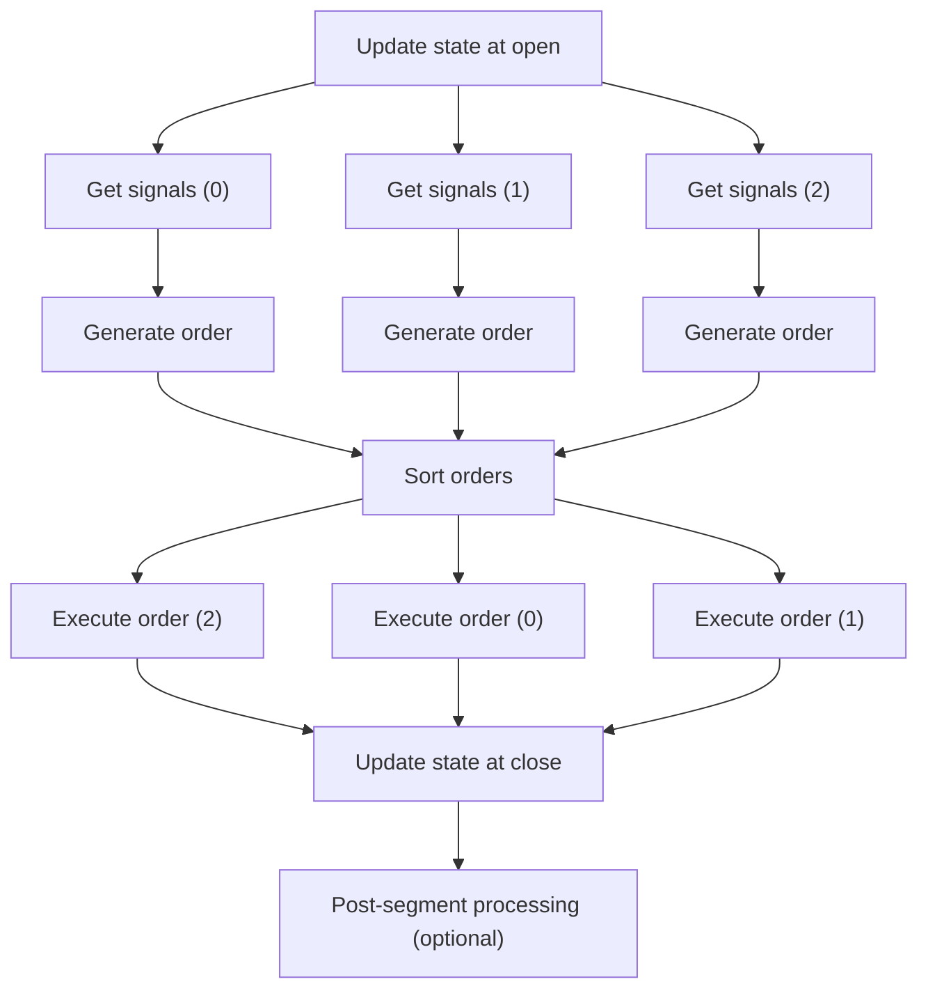
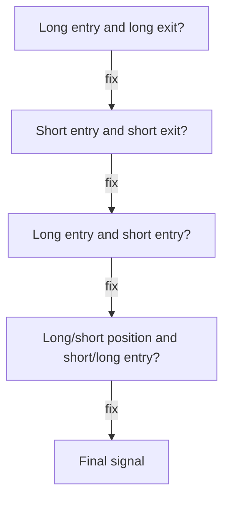
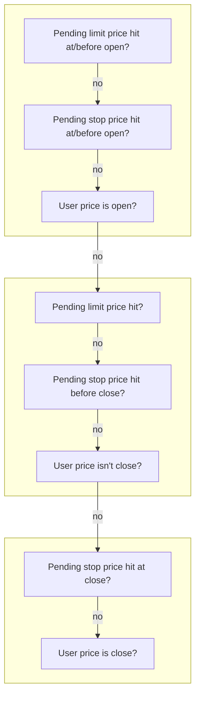
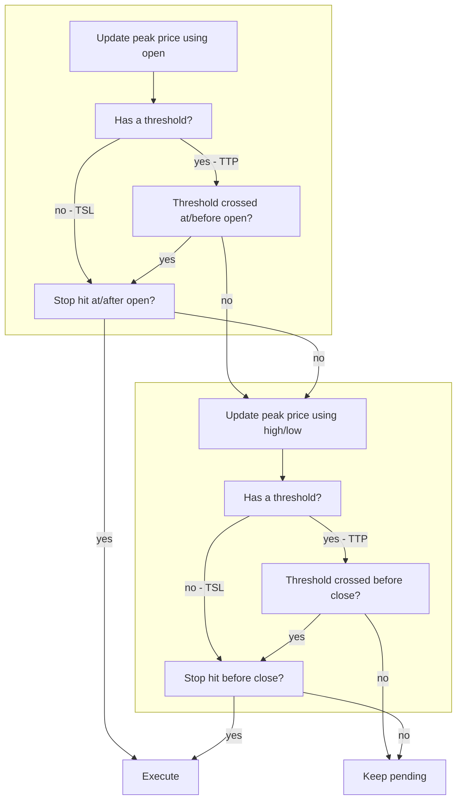

# :material-broadcast: From signals

The [Portfolio.from_orders](https://vectorbt.pro/pvt_6d1b3986/api/portfolio/base/#vectorbtpro.portfolio.base.Portfolio.from_orders)
(FO) method, discussed earlier, is the most basic simulation approach. It accepts order information as
multiple array-like arguments and broadcasts them to a single shape, allowing us to know exactly what
should be ordered for each asset at each bar. This method requires having all this information upfront,
regardless of what happens during the simulation. But what if we want to create an order only when we
are not currently in the market, or generally, make an order based on the current simulation state?
Such conditional logic cannot be represented using orders alone—we would need to use either a callback or
define more arrays. Both approaches are implemented in
[Portfolio.from_signals](https://vectorbt.pro/pvt_6d1b3986/api/portfolio/base/#vectorbtpro.portfolio.base.Portfolio.from_signals) (FS).

Before diving into this method, make sure to learn more about signals
[here](https://vectorbt.pro/pvt_6d1b3986/tutorials/signal-development). In short, signals are an abstraction layer over orders.
Each signal consists of four boolean values: :one: long entry, :two: long exit, :three: short entry,
and :four: short exit. The combination of these values allows us to control the direction of an
order relative to the current position. For example, a short entry flag will reverse the current
long position or open a new short one if we are not in the market. This way, position management can be
separated from order management, letting us focus on deciding whether we are bullish or bearish at any
given time—a perfect playground for machine learning models.

There is another reason to appreciate signals: statistically, within the entire universe of signal
[permutations](https://en.wikipedia.org/wiki/Permutation), there is at least one permutation that
always outperforms the market. This means we could design the perfect trading algorithm using only
the above signal schema—we just need to guess the right timing and direction for each signal. This
reduces the number of factors to just two (in an ideal scenario, since in the real world we must also
consider risk, execution constraints, and more). For example, if the price of a security is $21
on day 1, $20 on day 2, and $22 on day 3, we could enter a short position on day 1 and a long
position on day 2 to achieve positive returns. That's why trading systems and their backtesting
components do not have to be complex to be profitable—they just need a robust signal generator as
their algorithmic backbone, along with trading infrastructure that closely matches the backtesting system.

!!! example
    Here are all the signal permutations for a price series with four points and their total return.

    ```pycon
    >>> from vectorbtpro import *
    
    >>> price = np.array([21, 20, 22, 21])
    >>> returns = (price[1:] - price[:-1]) / price[:-1]
    >>> permutations = list(product([False, True], repeat=len(returns)))
    >>> total_return = np.prod(1 + np.where(permutations, returns, -returns), axis=1) - 1
    >>> pd.Series(total_return, index=permutations).sort_values(ascending=False)
    (False, True, False)     0.204762
    (False, True, True)      0.100000
    (True, True, False)      0.095238
    (True, True, True)       0.000000
    (False, False, False)   -0.014286
    (False, False, True)    -0.100000
    (True, False, False)    -0.103896
    (True, False, True)     -0.181818
    dtype: float64
    ```

    Do not run this on longer price series, since the number of permutations grows exponentially with
    the number of data points—`2^n`. For example, a year of daily history would require checking
    `2^365` or `7.515336e+109` permutations.

## Mechanics

Similar to FO, this method is also a class method of [Portfolio](https://vectorbt.pro/pvt_6d1b3986/api/portfolio/base/#vectorbtpro.portfolio.base.Portfolio)
and includes two Numba-compiled core functions: [from_signals_nb](https://vectorbt.pro/pvt_6d1b3986/api/portfolio/nb/from_signals/#vectorbtpro.portfolio.nb.from_signals.from_signals_nb)
and [from_signal_func_nb](https://vectorbt.pro/pvt_6d1b3986/api/portfolio/nb/from_signals/#vectorbtpro.portfolio.nb.from_signals.from_signal_func_nb).
FS shares many arguments with FO, especially those that set up the simulation, such as `init_cash`, as well as
those that contain order information, like `size`. For example, if you check the API documentation for the
`size` argument under [Portfolio.from_signals](https://vectorbt.pro/pvt_6d1b3986/api/portfolio/base/#vectorbtpro.portfolio.base.Portfolio.from_signals),
you will see "See `Portfolio.from_orders`." The simulation procedure of FS is also very similar to that of
FO: as it loops over all columns and rows, at each iteration it resolves the current order and executes it
by appending information about the filled order to the order records and updating the current simulation state.
However, that is where the similarities end.

### Framework

Below is an abstract visualization of the FS framework running on three rows and two groups, with two columns
and one column, respectively:

{: loading=lazy style="width:800px;" }

If you have worked with VBT for a while, you have likely noticed that the framework of
[Portfolio.from_signals](https://vectorbt.pro/pvt_6d1b3986/api/portfolio/base/#vectorbtpro.portfolio.base.Portfolio.from_signals)
follows that of [Portfolio.from_orders](https://vectorbt.pro/pvt_6d1b3986/api/portfolio/base/#vectorbtpro.portfolio.base.Portfolio.from_signals)
and [Portfolio.from_order_func](https://vectorbt.pro/pvt_6d1b3986/api/portfolio/base/#vectorbtpro.portfolio.base.Portfolio.from_order_func).
Like most things in the VBT universe, simulation with FS is performed by iterating over a
"target shape." This shape has two dimensions: rows representing the time axis and columns representing
the asset axis (or, more generally, configurations). Columns are further divided into groups:
if multiple columns share the same cash, they are placed into the same group (as shown in the blue rectangle
on the left above), while columns without cash sharing or grouping are treated as isolated and appear as a
group with exactly one column (blue rectangle on the right above). Groups are treated as separate, atomic
backtesting instances that are not connected in any way; splitting the shape by target groups should not
affect the final result. This is also why chunking is generally performed on groups rather than columns :bulb:

The actual iteration over rows and groups takes place in [column-major order](https://en.wikipedia.org/wiki/Row-_and_column-major_order):
the simulator starts by moving over the rows in the first group, and once finished, continues with
the second group. Each time it processes a new row within a group, all the assets at that row
are considered a "segment" because they compete for the same resources at the same time
or are connected by any user-defined methods. For example, an account with `BTC-USD` and `ETH-USD` on
the date `2020-01-01` forms a segment since the value of both assets contributes to the total value
of the group at this date. Each asset within a segment is called an "element," which is the smallest
simulation unit. An element in FS can hold only one order, so the number of filled orders is
capped by the number of rows times the number of columns. For example, a year's worth of daily
`BTC-USD` and `ETH-USD` history can generate at most `365 * 2 = 730` orders, or one order per bar and asset.

#### Segment workflow

The segment is where the main part of the simulation occurs:



FS first updates the current simulation state using the opening price. This step is needed to obtain
the group value in case an order has a size defined as a (target) percentage, allowing the size to be
converted into an absolute number of units. Then, it iterates over the columns in the
current group and determines the four signals for each column. These signals are then
converted into an order specification similar to that used by FO.

After resolving all order specifications, and if the automatic call sequence is enabled, the
simulator attempts to sort the orders by their potential value so that sell orders are executed first.
This is necessary for rebalancing. This sorting is only possible if all orders within the current group
(limit, order, and user-defined) happen either all at the beginning or all at the end of the current bar.
If some orders occur in the middle of the bar, or if some happen at the beginning and others at the end,
an error will be thrown because orders can only be sorted if they are guaranteed to occur simultaneously.
If the dynamic call sequence is disabled and there are orders in multiple bar zones, the simulator
will sort them by bar zone.

Finally, FS processes the columns in the newly established call sequence to execute the orders,
and updates the simulation state again using the closing price. This final update is necessary to
optionally generate the portfolio returns and for the segment post-processing function.

### Signal generation

FS supports two signal generation modes: fixed (cached) and dynamic (non-cached). The first
mode is implemented by the function [from_signals_nb](https://vectorbt.pro/pvt_6d1b3986/api/portfolio/nb/from_signals/#vectorbtpro.portfolio.nb.from_signals.from_signals_nb),
which uses four pre-defined arrays as signals and does not allow defining callbacks. Because of this,
it is fully cacheable and does not need to be recompiled for each new runtime, unless a new set of data types
is detected. The second mode is implemented by the function
[from_signal_func_nb](https://vectorbt.pro/pvt_6d1b3986/api/portfolio/nb/from_signals/#vectorbtpro.portfolio.nb.from_signals.from_signal_func_nb),
which does not accept signal arrays but defines a signal function. This is a special callback meant to
generate the four signals for each asset and at each bar dynamically. This mode is especially suited
for use cases where the signal depends on the current simulation state. Additionally, it defines a
callback that is called after processing the current segment, which can be used to pre-compute various metrics,
such as the Sharpe ratio. The main drawback is that it cannot be cached (yet), so it must
be recompiled in each new runtime (:coffin: to those running VBT as a script).

The convenience of the [Portfolio.from_signals](https://vectorbt.pro/pvt_6d1b3986/api/portfolio/base/#vectorbtpro.portfolio.base.Portfolio.from_signals)
method, which wraps both of these modes, is its ability to automatically choose the appropriate mode:
whenever you override any default callback, it will run the second mode instead of the first.

#### Signal function

Recall that in FO, all data had to be provided as arrays, and it was not possible to dynamically change
the information or influence execution in any way. FS is much more flexible: while most information is
still expected to be defined beforehand (acting as a facade), signals can be generated both
statically and dynamically. Let's experiment with dynamic signal generation.

The second mode is implemented by accepting a user-defined callback function, `signal_func_nb`. 
Whenever the main simulation loop processes a new row (bar), it asks each asset in the current group to 
generate signals using this callback function. To do so, it packs all potentially useful information, 
such as the current cash balance and group value, into a named tuple of 
type [SignalContext](https://vectorbt.pro/pvt_6d1b3986/api/portfolio/enums/#vectorbtpro.portfolio.enums.SignalContext). In return, 
the function must provide four signals, which will then be used to create an order for that asset.

Here is an example of a very simple signal function that does not generate any orders:

```pycon
>>> from vectorbtpro import *

>>> @njit
... def signal_func_nb(c):
...     return False, False, False, False

>>> close = pd.DataFrame({
...     "BTC-USD": [20594.29, 20719.41, 19986.60, 21084.64],
...     "ETH-USD": [1127.51, 1125.37, 1051.32, 1143.20],
...     "DOT-USD": [7.88, 7.74, 7.41, 7.78],
...     "BNB-USD": [216.90, 219.67, 214.23, 228.92]
... })

>>> pf = vbt.Portfolio.from_signals(
...     close=close,
...     signal_func_nb=signal_func_nb
... )
>>> pf.order_records
array([], dtype={...})
```

!!! hint
    To avoid waiting for the function to compile, remove the `@njit` decorator from `signal_func_nb`
    and pass `jitted=False` to `from_signals` to fully disable Numba for this method. Do this only if the
    amount of input data is small (< 1000).

To understand when the function is called, let's narrow the data to two assets and print out 
the current column and row:

```pycon
>>> @njit
... def signal_func_nb(c):
...     print(c.col, c.i)
...     return False, False, False, False

>>> pf = vbt.Portfolio.from_signals(
...     close=close[["BTC-USD", "ETH-USD"]],
...     signal_func_nb=signal_func_nb
... )
0 0
0 1
0 2
0 3
1 0
1 1
1 2
1 3
```

You can see that the function was called at each row, first for column `BTC-USD` and then for column `ETH-USD`.
In this scenario, both assets are isolated tests, so the simulator processes one column after the other.
However, once we introduce grouping with or without cash sharing, which binds columns together,
the simulator processes the columns group-wise: it iterates through groups, then rows, and finally
through columns within the current group and row. Let's demonstrate this by defining two groups,
with two assets sharing the same cash:

```pycon
>>> @njit
... def signal_func_nb(c):
...     print(c.group, c.col, c.i)
...     return False, False, False, False

>>> pf = vbt.Portfolio.from_signals(
...     close=close,
...     signal_func_nb=signal_func_nb,
...     group_by=[0, 0, 1, 1],
...     cash_sharing=True
... )
0 0 0
0 1 0
0 0 1
0 1 1
0 0 2
0 1 2
0 0 3
0 1 3
1 2 0
1 3 0
1 2 1
1 3 1
1 2 2
1 3 2
1 2 3
1 3 3
```

The context tuple passed to the signal function contains all the necessary information to
identify the position of the call in the simulation. For example, `c.index[c.i]` can be used with
[SignalContext.index](https://vectorbt.pro/pvt_6d1b3986/api/portfolio/enums/#vectorbtpro.portfolio.enums.SignalContext.index)
and [SignalContext.i](https://vectorbt.pro/pvt_6d1b3986/api/portfolio/enums/#vectorbtpro.portfolio.enums.SignalContext.i)
to get the timestamp of the current bar. You can also change the state of any pending limit
or stop order before it is processed, since the signal function is conceptually executed
just before the beginning of the bar.

Because the groups are processed from left to right and each group's state is stored globally,
you can access the order records and, in general, the latest simulation state of all groups
that have been processed so far. For example, [SignalContext.last_cash](https://vectorbt.pro/pvt_6d1b3986/api/portfolio/enums/#vectorbtpro.portfolio.enums.SignalContext.last_cash)
contains as many elements as there are groups. This is both powerful and potentially risky:
you can create complex intergroup relationships if you wish, or accidentally access the wrong group
if you are not paying close attention.

### Signal resolution

Signals add an extra layer of abstraction over orders, so logic is needed to translate signals into
order specifications. Whenever the simulator receives a new set of four signals at each row and column,
it first consolidates them into a single signal, which is then converted into an order. The resolution step
checks for conflicting signals. Usually, you would expect only one `True` signal and three `False` signals,
but sometimes multiple signals can be `True`, especially when the signal function is merging data from
different boolean arrays. In such cases, the simulator uses the following multi-step procedure to resolve
conflicts:



First, the simulator checks if there are multiple `True` signals within the same direction, such as both
long entry and long exit being set. To choose between these, the simulator uses the argument
`upon_long_conflict` of type [ConflictMode](https://vectorbt.pro/pvt_6d1b3986/api/portfolio/enums/#vectorbtpro.portfolio.enums.ConflictMode).
For example, the "adjacent" option will pick the signal adjacent to your current position,
so only the long entry remains active if you are in a long position. This step uses the function
[resolve_signal_conflict_nb](https://vectorbt.pro/pvt_6d1b3986/api/portfolio/nb/from_signals/#vectorbtpro.portfolio.nb.from_signals.resolve_signal_conflict_nb):

```pycon
>>> vbt.pf_nb.resolve_signal_conflict_nb(
...     position_now=20,
...     is_entry=True,
...     is_exit=True,
...     direction=vbt.pf_enums.Direction.LongOnly,
...     conflict_mode=vbt.pf_enums.ConflictMode.Adjacent
... )
(True, False)
```

After at most one signal is selected in each direction, the simulator checks if both long entry and
short entry are active. It then calls [resolve_dir_conflict_nb](https://vectorbt.pro/pvt_6d1b3986/api/portfolio/nb/from_signals/#vectorbtpro.portfolio.nb.from_signals.resolve_dir_conflict_nb),
using the argument `upon_dir_conflict` of type [DirectionConflictMode](https://vectorbt.pro/pvt_6d1b3986/api/portfolio/enums/#vectorbtpro.portfolio.enums.DirectionConflictMode)
to determine which direction wins. For example, you can choose to always go short when there is uncertainty:

```pycon
>>> vbt.pf_nb.resolve_dir_conflict_nb(
...     position_now=20,
...     is_long_entry=True,
...     is_short_entry=True,
...     upon_dir_conflict=vbt.pf_enums.DirectionConflictMode.Short,
... )
(False, True)
```

Finally, the function [resolve_opposite_entry_nb](https://vectorbt.pro/pvt_6d1b3986/api/portfolio/nb/from_signals/#vectorbtpro.portfolio.nb.from_signals.resolve_opposite_entry_nb)
handles cases when an entry signal is opposite to the current position's direction. For example,
if you are in a long position and the short entry signal is given, the simulator uses the
argument `upon_opposite_entry` of type [OppositeEntryMode](https://vectorbt.pro/pvt_6d1b3986/api/portfolio/enums/#vectorbtpro.portfolio.enums.OppositeEntryMode)
to decide whether to reduce, close, or fully reverse the long position.
Here is how you could make the short entry signal behave like the long exit signal:

```pycon
>>> vbt.pf_nb.resolve_opposite_entry_nb(
...     position_now=20,
...     is_long_entry=False,
...     is_long_exit=False,
...     is_short_entry=True,
...     is_short_exit=False,
...     upon_opposite_entry=vbt.pf_enums.OppositeEntryMode.Close,
...     accumulate=False,  # (1)!
... )
(False, True, False, False, 0)
```

1. This argument can be `True`, `False`, or any of [AccumulationMode](https://vectorbt.pro/pvt_6d1b3986/api/portfolio/enums/#vectorbtpro.portfolio.enums.AccumulationMode).

At the end of these steps, there will be only one active signal out of four :railway_track:

### Signal conversion

Now that we have identified the single signal, what comes next? It is time to convert it into an order!
This step is straightforward and is performed by [signal_to_size_nb](https://vectorbt.pro/pvt_6d1b3986/api/portfolio/nb/from_signals/#vectorbtpro.portfolio.nb.from_signals.signal_to_size_nb),
which takes the four signals (with three now deactivated) and the size requirement for this row and column,
and returns the order size, size type, and direction to use.
For example, if you are in a position of 20 shares and receive a long exit signal, the
size becomes minus 20 shares, the size type is [SizeType.Amount](https://vectorbt.pro/pvt_6d1b3986/api/portfolio/enums/#vectorbtpro.portfolio.enums.SizeType.Amount),
and the direction is [Direction.LongOnly](https://vectorbt.pro/pvt_6d1b3986/api/portfolio/enums/#vectorbtpro.portfolio.enums.Direction.LongOnly):

```pycon
>>> vbt.pf_nb.signal_to_size_nb(
...     position_now=20,
...     val_price_now=20594.29,  # (1)!
...     value_now=411885.80,  # (2)!
...     is_long_entry=False,
...     is_long_exit=True,
...     is_short_entry=False,
...     is_short_exit=False,
...     size=0.1,  # (3)!
...     size_type=vbt.pf_enums.SizeType.ValuePercent,  # (4)!
...     accumulate=False  # (5)!
... )
(-20.0, 0, 0)
```

1. Latest known asset price.
2. Latest known group value.
3. Default value for this element.
4. Default value for this element.
5. Default value for this element.

Even though we provided the default order specification for the current element,
such as `size`, the function ignored it here because it is not needed for closing the current position.
However, if you wanted to reverse the current position (close it and then place a new order
using the default specification), those inputs would now be used:

```pycon
>>> vbt.pf_nb.signal_to_size_nb(
...     position_now=20,
...     val_price_now=20594.29,
...     value_now=411885.80,
...     is_long_entry=False,
...     is_long_exit=False,
...     is_short_entry=True,  # (1)!
...     is_short_exit=False,
...     size=0.1,
...     size_type=vbt.pf_enums.SizeType.ValuePercent,
...     accumulate=False
... )
(-22.0, 0, 2)
```

1. Reverses the long position.

Here, the size is calculated as follows: decrease the position by 20 shares to close out the long position,
and, since we are working with a percentage of the current group value, open a new short position
of `size * value_now / val_price_now = 2.0` shares. The size type is [SizeType.Amount](https://vectorbt.pro/pvt_6d1b3986/api/portfolio/enums/#vectorbtpro.portfolio.enums.SizeType.Amount)
and the direction is [Direction.Both](https://vectorbt.pro/pvt_6d1b3986/api/portfolio/enums/#vectorbtpro.portfolio.enums.Direction.Both)
because this operation goes in both directions.

### Main order resolution

The simulator calls the signal function, resolves the signals, and converts them into
an order specification. However, this is not the only order that may compete for the current bar:
there may also be pending limit and stop orders. Since the FS simulation function can process at most
one order per bar, it must pick a winner, which should always be the order that executes first.
But how do we determine which order comes first without any intra-bar data?
We can divide each bar into three "zones": opening (the first rectangle below), somewhere in the middle
(the second rectangle), and closing (the third rectangle). For example, if a stop order is triggered at or
before the opening of the current bar and a user order is set to execute at the closing price,
the stop order should go first. Here is the full decision chain:



As shown, limit orders have precedence over stop orders, and stop orders have priority over user orders,
but only if they are triggered within the same zone of a bar.

### Limit management

A market order is a transaction designed to execute as quickly as possible at the current market price.
A limit order, by contrast, is an order to buy or sell an asset with a restriction on the maximum price to
be paid or the minimum price to be received (the "limit price"). The price of a limit order is compared
against a pre-defined price level. If this level is not reached, the order remains pending and will not be
filled unless the price reaches the specified limit.

#### Creation

When a stop or user-defined order is created and its order type is provided via `order_type` as
[OrderType.Limit](https://vectorbt.pro/pvt_6d1b3986/api/portfolio/enums/#vectorbtpro.portfolio.enums.OrderType.Limit), the simulator first
determines the limit price type at which the order should execute: open, close, or something else.
This is an important concept: the `price` argument guides VBT on where in the bar the operation should
occur. If the limit price is the open price (provided as either
[PriceType.Open](https://vectorbt.pro/pvt_6d1b3986/api/portfolio/enums/#vectorbtpro.portfolio.enums.PriceType.Open) or `-np.inf`), the
simulator can use the entire candle for its checks and execute the order as soon as the price is hit within
the same bar. If the limit price is not the close price, but falls somewhere in between, the simulator can use
only the close price. If the limit price is the close price (provided as either
[PriceType.Close](https://vectorbt.pro/pvt_6d1b3986/api/portfolio/enums/#vectorbtpro.portfolio.enums.PriceType.Close) or `np.inf`), the
simulator cannot execute the limit order immediately and must delay its first check to the next bar.

If the limit order is not executed in the same bar where it was created, it is marked as pending, and all
relevant information is stored in a record array of type
[limit_info_dt](https://vectorbt.pro/pvt_6d1b3986/api/portfolio/enums/#vectorbtpro.portfolio.enums.limit_info_dt), structured by asset.
This array can hold only one instance per asset, so FS allows only one limit order to be active at a time.
In a signal function, you can access this array through `c.limit_info_dt`, allowing you to change any
information before the new bar. For example, to change the price: `c.limit_info_dt["init_price"][c.col] =
new_price`.

#### Expiration

When the simulator arrives at the next bar, it first calls
[check_limit_expired_nb](https://vectorbt.pro/pvt_6d1b3986/api/portfolio/nb/from_signals/#vectorbtpro.portfolio.nb.from_signals.check_limit_expired_nb)
to check if the pending limit order has expired at the start or somewhere in the middle of the bar.
If it has expired at the start, the order is discarded. If it expires during the bar, the simulator also checks
whether the order was hit at the bar's open; if it was not, the order is discarded since there is no guarantee
that the order was hit before the deadline. For example, suppose the order can be in force for at most 36
hours, it was issued on `2020-01-01`, and now it is `2020-01-02`:

```pycon
>>> vbt.pf_nb.check_limit_expired_nb(
...     creation_idx=0,
...     i=1,
...     tif=vbt.dt.to_ns(vbt.timedelta("36h")),  # (1)!
...     index=vbt.dt.to_ns(vbt.date_range("2020-01-01", periods=3)),
...     freq=vbt.dt.to_ns(vbt.timedelta("1d"))
... )
(False, True)
```

1. Index and time deltas must be converted into nanoseconds.

We see that the function marks the order as expired, but not at the bar's start, so it can still be executed
using the open price. If the order's lifespan was 24 hours, the function would also raise the first flag and
prevent any execution:

```pycon
>>> vbt.pf_nb.check_limit_expired_nb(
...     creation_idx=0,
...     i=1,
...     tif=vbt.dt.to_ns(vbt.timedelta("24h")),
...     index=vbt.dt.to_ns(vbt.date_range("2020-01-01", periods=3)),
...     freq=vbt.dt.to_ns(vbt.timedelta("1d"))
... )
(True, True)
```

!!! info
    The lifespan is calculated by subtracting any time from the opening time of the creation bar,
    even if the order was placed at the very end of the creation bar.

#### Activation

Once it is confirmed that the order **can** be executed at the current bar (meaning it will not expire), the
simulator uses the function
[check_limit_hit_nb](https://vectorbt.pro/pvt_6d1b3986/api/portfolio/nb/from_signals/#vectorbtpro.portfolio.nb.from_signals.check_limit_hit_nb)
to determine whether the order **should** be executed by checking if its target price has been hit.
This check compares the price against the current candle. For example, with a pending buy limit order and
a target price of `9.5`, the function will check if the low price went below this target:

```pycon
>>> vbt.pf_nb.check_limit_hit_nb(
...     open=10.0,
...     high=11.0,
...     low=9.0,
...     close=10.5,
...     price=9.5,
...     size=2.0
... )
(9.5, False, False)
```

If the target price were `11`, the function would indicate that the price was hit at the bar's start, allowing
the order to be executed right away at the open price:

```pycon
>>> vbt.pf_nb.check_limit_hit_nb(
...     open=10.0,
...     high=11.0,
...     low=9.0,
...     close=10.5,
...     price=11.0,
...     size=2.0
... )
(10.0, True, False)
```

If the target price were `8`, the function would indicate that the price was not hit at all:

```pycon
>>> vbt.pf_nb.check_limit_hit_nb(
...     open=10.0,
...     high=11.0,
...     low=9.0,
...     close=10.5,
...     price=8.0,
...     size=2.0
... )
(nan, False, False)
```

#### Cancellation

If the target price is not hit, the limit order remains pending. The order can still be canceled manually
within the signal function, which is called before all the checks above, or within the post-segment function,
which is called after processing the entire segment. The pending order will also be canceled automatically
once a stop order is executed, since executing the stop order may change the simulation state and may
consume resources required to execute the limit order in the future.

Finally, the four signals returned by the signal function and resolved into a single signal can also affect the
pending order, regardless of whether the final signal is executed. For example, if there is a pending buy
limit order and the user decides to issue a long exit or short entry signal, the most intuitive action is to
cancel the pending order, since the user's intent has changed. This is the default behavior. Such
"pending conflicts" are resolved using the function
[resolve_pending_conflict_nb](https://vectorbt.pro/pvt_6d1b3986/api/portfolio/nb/from_signals/#vectorbtpro.portfolio.nb.from_signals.resolve_pending_conflict_nb),
which uses the arguments `upon_adj_limit_conflict` and `upon_opp_limit_conflict`, both of type
[PendingConflictMode](https://vectorbt.pro/pvt_6d1b3986/api/portfolio/enums/#vectorbtpro.portfolio.enums.PendingConflictMode), to decide
what to do if the direction of the pending order is adjacent or opposite to the direction of the resolved
user-defined signal.

```pycon
>>> vbt.pf_nb.resolve_pending_conflict_nb(
...     is_pending_long=True,
...     is_user_long=False,
...     upon_adj_conflict=vbt.pf_enums.PendingConflictMode.KeepIgnore,
...     upon_opp_conflict=vbt.pf_enums.PendingConflictMode.CancelIgnore,
... )
(False, False)
```

In this example, the function decides to cancel the limit order and to ignore the user-defined signal.

### Stop management

Stop orders are used to increase the likelihood of reaching a set entry or exit price, limit potential
losses, or lock in profits. These orders stay inactive until a specific price is reached, at which point they
are activated as a market or limit order. When a stop order is executed, it typically closes the position.

#### Types

There are four types of stop orders:

1. Stop loss (SL).
2. Trailing stop loss (TSL).
3. Trailing take profit (TTP).
4. Take profit (TP).

A stop-loss order limits our risk in a trade to a set amount if the market moves against us. For example,
if a stop-loss sell order is placed at $45 per unit, the order remains inactive until the price reaches or falls
below $45. At that point, the order is converted into a market or limit order, and the units are sold at the
best available price. A take profit order works in the opposite way. It defines the amount of profit we are 
willing to make on a trade and closes the position once that amount is reached. Combining an SL and TP order
creates a specific risk-to-reward ratio, which can be further adjusted to match the probabilities of
reaching each breakout scenario.

Trailing orders behave differently. As the price rises, the trailing stop follows it higher. When the
price stops rising, the new stop-loss price stays at its last level, automatically protecting our downside
while locking in profits as the price sets new highs. TTP is a variation of TSL that becomes active only
after a specific threshold is reached. These two orders are often viewed and displayed as a single order.

#### Creation

Unlike limit orders, stop orders are created after an entry order has been filled and act the same as
user-defined exit signals that are triggered once a stop condition is met. An entry order is any successfully
filled order that has opened a new position or increased an existing one. When the simulator identifies
such an order, it first determines the stop entry price provided through the `stop_entry_price` argument
of type [StopEntryPrice](https://vectorbt.pro/pvt_6d1b3986/api/portfolio/enums/#vectorbtpro.portfolio.enums.StopEntryPrice).
This price serves as the starting point for all stop values and thresholds.

!!! note
    By default, the stop entry price is the closing price, not the order price.
    This prevents the situation where the stop is hit on the very first bar and cannot be
    executed, as we lack intra-bar data and cannot execute two orders within the same bar.
    If the order price is used, the soonest the stop can execute is at the open of the next bar.

Based on this price, the simulator can also determine the exact timing within the bar when the stop order
should be triggered. Why does this matter? The simulator needs to know if it can use the current candle
to update the price of any TSL or TTP order. Internally, stop order data is stored in three arrays by asset:
[sl_info_dt](https://vectorbt.pro/pvt_6d1b3986/api/portfolio/enums/#vectorbtpro.portfolio.enums.sl_info_dt),
[tsl_info_dt](https://vectorbt.pro/pvt_6d1b3986/api/portfolio/enums/#vectorbtpro.portfolio.enums.tsl_info_dt), and
[tp_info_dt](https://vectorbt.pro/pvt_6d1b3986/api/portfolio/enums/#vectorbtpro.portfolio.enums.tp_info_dt). Each data type follows a similar
structure: the initial row and price, the current stop value (in absolute or percentage terms), the limit delta
and its format if the stop should eventually trigger a limit order. For trailing stops, the schema also
includes the updated price and the row where the update occurred.

#### Activation

Stop orders cannot be activated on the same bar in which they are issued, even if the entry price is the opening
price. This is because FS cannot handle two orders within the same bar. If you need this functionality, use a
flexible order function with [Portfolio.from_order_func](https://vectorbt.pro/pvt_6d1b3986/api/portfolio/base/#vectorbtpro.portfolio.base.Portfolio.from_order_func).
Upon reaching a new bar, the price of any pending SL and TP orders is then checked against the low and high
prices of the current candle, respectively (the reverse for short positions). This uses the
[check_stop_hit_nb](https://vectorbt.pro/pvt_6d1b3986/api/portfolio/nb/from_signals/#vectorbtpro.portfolio.nb.from_signals.check_stop_hit_nb)
function, which returns the stop price, whether it was hit on open, and whether it was hit on close.
For example, if the initial price is $10 per unit and the stop loss is set at 10%, the stop is marked as hit
if the lowest price of the candle is below `10 * (1 - 0.1) = 9` per unit:

```pycon
>>> vbt.pf_nb.check_stop_hit_nb(
...     open=10.0,
...     high=11.0,
...     low=9.0,
...     close=10.5,
...     is_position_long=True,
...     init_price=10.0,
...     stop=0.1
... )
(9.0, False, False)
```

If the initial price was $12 per unit, the stop would trigger immediately on open:

```pycon
>>> vbt.pf_nb.check_stop_hit_nb(
...     open=10.0,
...     high=11.0,
...     low=9.0,
...     close=10.5,
...     is_position_long=True,
...     init_price=12.0,
...     stop=0.1
... )
(10.0, True, False)
```

If the stop was not hit (here the initial price was $9), the returned stop price is NaN:

```pycon
>>> vbt.pf_nb.check_stop_hit_nb(
...     open=10.0,
...     high=11.0,
...     low=9.0,
...     close=10.5,
...     is_position_long=True,
...     init_price=9.0,
...     stop=0.1
... )
(nan, False, False)
```

For a TP order, set the argument `hit_below` to `False`.

Unlike fixed stop orders, TSL and TTP orders must also track the peak price on which the stop price is
based. Since we do not know if the highest price of a candle comes before the lowest price or the other way
around, the candle must be split into distinct zones, updating the peak price in the zone that comes before
the stop check. First, the simulator uses the opening price to update the peak price. Then, it checks if
the stop was hit during the entire bar. If not, it proceeds to update the peak price with the highest (for
long positions) or lowest (for short positions) price of the candle, and then checks the stop again using
only the closing price to avoid this ambiguity. This way, the simulator always assumes the pessimistic
scenario that the worst event (the stop being hit) happens before the best event (updating the peak price).

TTP orders add another layer of complexity, as they must also check if their activation threshold has been
reached. This check is performed using the
[check_tsl_th_hit_nb](https://vectorbt.pro/pvt_6d1b3986/api/portfolio/nb/from_signals/#vectorbtpro.portfolio.nb.from_signals.check_tsl_th_hit_nb)
function, which takes the initial and the peak price and tests whether the difference between them is
greater than or equal to the threshold. If it is, the order is converted into a regular TSL order. If not, the
simulator updates the peak price using the current candle and tries again to check for threshold crossover.
If the difference now meets the threshold, it uses
[check_stop_hit_nb](https://vectorbt.pro/pvt_6d1b3986/api/portfolio/nb/from_signals/#vectorbtpro.portfolio.nb.from_signals.check_stop_hit_nb),
but can no longer use the current candle. Since it is unclear if the stop was hit before or after the threshold
was crossed, only the closing price is used, and the argument `can_use_ohlc` is disabled. The following
diagram shows this process:



If multiple stops are hit, the simulator takes a pessimistic approach: SL is checked first, TSL and TTP are
checked second, and TP is checked last. The first pending stop is executed and all other pending stops
are canceled.

#### Resolution

After that, the winning stop is converted into four signals by the function
[generate_stop_signal_nb](https://vectorbt.pro/pvt_6d1b3986/api/portfolio/nb/from_signals/#vectorbtpro.portfolio.nb.from_signals.generate_stop_signal_nb),
which uses the current position and the default stop exit behavior defined by the
`stop_exit_type` argument of type [StopExitType](https://vectorbt.pro/pvt_6d1b3986/api/portfolio/enums/#vectorbtpro.portfolio.enums.StopExitType).
For example, instead of closing the position, you can have the function reverse it by using
`StopExitType.Reverse`:

```pycon
>>> vbt.pf_nb.generate_stop_signal_nb(
...     position_now=20,
...     stop_exit_type=vbt.pf_enums.StopExitType.Reverse
... )
(False, False, True, False, 0)
```

As shown, the short entry signal is `True` while the other signals are `False`. The number following the
signals represents the selected accumulation mode of type
[AccumulationMode](https://vectorbt.pro/pvt_6d1b3986/api/portfolio/enums/#vectorbtpro.portfolio.enums.AccumulationMode), which is used
in situations where you want to reduce the position instead of closing or reversing it. Next, the stop exit
price is resolved using the function [resolve_stop_exit_price_nb](https://vectorbt.pro/pvt_6d1b3986/api/portfolio/nb/from_signals/#vectorbtpro.portfolio.nb.from_signals.resolve_stop_exit_price_nb).
The logic is simple: if the `stop_exit_price` argument of type [StopExitPrice](https://vectorbt.pro/pvt_6d1b3986/api/portfolio/enums/#vectorbtpro.portfolio.enums.StopExitPrice)
is `StopExitPrice.Close`, then the closing price is used; otherwise, the stop price that was hit is used.
You can also provide an actual price as the argument.

```pycon
>>> vbt.pf_nb.resolve_stop_exit_price_nb(
...     stop_price=9.0,
...     close=10.5,
...     stop_exit_price=vbt.pf_enums.StopExitPrice.Stop
... )
9.0

>>> vbt.pf_nb.resolve_stop_exit_price_nb(
...     stop_price=9.0,
...     close=10.5,
...     stop_exit_price=9.5
... )
9.5
```

Finally, the order signal is converted into a market or limit order specification just like a
user-defined signal. See [Signal conversion](#signal-conversion).

#### Updating

In addition to updating any stop within a callback, you can also update the stop automatically when the
current position increases. In this case, the `upon_stop_update` argument of type
[StopUpdateMode](https://vectorbt.pro/pvt_6d1b3986/api/portfolio/enums/#vectorbtpro.portfolio.enums.StopUpdateMode) controls whether the
current stop should stay the same or be reset. This decision is made by the function
[should_update_stop_nb](https://vectorbt.pro/pvt_6d1b3986/api/portfolio/nb/from_signals/#vectorbtpro.portfolio.nb.from_signals.should_update_stop_nb).
For example, if your position has increased and you want to know whether the current stop should be
updated with `StopUpdateMode.Override`, you would do the following:

```pycon
>>> vbt.pf_nb.should_update_stop_nb(
...     new_stop=0.1,
...     upon_stop_update=vbt.pf_enums.StopUpdateMode.Override
... )
True
```

If the new stop value is NaN (i.e., no stop), you should not update:

```pycon
>>> vbt.pf_nb.should_update_stop_nb(
...     new_stop=np.nan,
...     upon_stop_update=vbt.pf_enums.StopUpdateMode.Override
... )
False
```

Unless you choose the option `StopUpdateMode.OverrideNaN`, which effectively disables all stops:

```pycon
>>> vbt.pf_nb.should_update_stop_nb(
...     new_stop=np.nan,
...     upon_stop_update=vbt.pf_enums.StopUpdateMode.OverrideNaN
... )
True
```

This does not apply when the current position decreases. But why is it important to consider updates
if signals normally just open or close positions, rather than increase or decrease them?
With accumulation, signals can add to or remove from the position. In such cases, you should consider:
should this change to the position invalidate previously defined stops, or should new stops be created?
The `upon_stop_update` argument controls this behavior.

#### Cancellation

Like updating, cancellation of currently pending stop orders occurs when the position is closed.
This clears all stops automatically. But similar to limit orders, there may be a conflict with an active
user-defined signal. This is resolved by the function
[resolve_pending_conflict_nb](https://vectorbt.pro/pvt_6d1b3986/api/portfolio/nb/from_signals/#vectorbtpro.portfolio.nb.from_signals.resolve_pending_conflict_nb).
The arguments used to resolve pending conflicts for stop orders are `upon_adj_stop_conflict` and
`upon_opp_stop_conflict`, both of type [PendingConflictMode](https://vectorbt.pro/pvt_6d1b3986/api/portfolio/enums/#vectorbtpro.portfolio.enums.PendingConflictMode).
For example, if a user decides to reduce the position and clear all pending stops at the same time, they can set
the `upon_adj_stop_conflict` argument (reducing or attempting to close the position are considered adjacent
signals) to the option `PendingConflictMode.CancelExecute`.

## Signals

We have covered some theory on how this simulation method works. Now, let's take a break from reading
and focus on signal arrays, which—together with a signal function—are the main input to this method.
As you already know, signals come in two types:

1. Direction-unaware signals: entries and exits enhanced by direction.
2. Direction-aware signals: long entries, long exits, short entries, short exits.

The first type is a compressed form of the second. You can always convert direction-unaware signals
into direction-aware signals, but not the other way around, since the first format covers a total of
`2 * 2 * 3 = 12` combinations, while the second format covers
`2 * 2 * 2 * 2 = 16` combinations. On the other hand, the first format is easier to use
because you can set the direction globally and work with two arrays instead of four.

First, let's fetch the entire history of `BTCUSDT` and `ETHUSDT` for our examples below:

```pycon
>>> data = vbt.BinanceData.pull(["BTCUSDT", "ETHUSDT"])
```

Since we will not need the entire history to illustrate most concepts, let's select the week of data
between February 18 and February 24, 2021, when there was a substantial price change in both directions:

```pycon
>>> sub_data = data.loc["2021-02-18":"2021-02-24"]

>>> sub_data.plot(symbol="BTCUSDT").show()
```

{: .iimg loading=lazy }
{: .iimg loading=lazy }

Let's try passing the data without any signals:

```pycon
>>> pf = vbt.Portfolio.from_signals(sub_data)  # (1)!
>>> pf.orders.count()
symbol
BTCUSDT    0
ETHUSDT    0
Name: count, dtype: int64
```

1. Even though the first argument expects the closing price (`close`), you can pass the entire data
instance, from which the OHLC features will be extracted automatically.

By default, all signals are set to `False`, so no orders were generated.

Now, let's say our ML model correctly predicted the peak on February 21 and signaled us to enter a
position on February 18 and close it on February 21. To do this, we need to build our entry and exit
arrays with the same shape as our data. Instead of specifying the same signals for each asset
repeatedly, you can provide a Series instead of a DataFrame. The Series will be applied to each asset
thanks to [broadcasting](https://vectorbt.pro/pvt_6d1b3986/documentation/portfolio/from-orders/#broadcasting):

```pycon
>>> entries = pd.Series([X, O, O, O, O, O, O])
>>> exits   = pd.Series([O, O, O, X, O, O, O])
>>> pf = vbt.Portfolio.from_signals(
...     sub_data,
...     entries=entries,  # (1)!
...     exits=exits
... )
>>> pf.orders.readable
   Order Id   Column              Signal Index            Creation Index  \
0         0  BTCUSDT 2021-02-18 00:00:00+00:00 2021-02-18 00:00:00+00:00   
1         1  BTCUSDT 2021-02-21 00:00:00+00:00 2021-02-21 00:00:00+00:00   
2         0  ETHUSDT 2021-02-18 00:00:00+00:00 2021-02-18 00:00:00+00:00   
3         1  ETHUSDT 2021-02-21 00:00:00+00:00 2021-02-21 00:00:00+00:00   

                 Fill Index      Size     Price  Fees  Side    Type Stop Type  
0 2021-02-18 00:00:00+00:00  0.001940  51552.60   0.0   Buy  Market      None  
1 2021-02-21 00:00:00+00:00  0.001940  57408.57   0.0  Sell  Market      None  
2 2021-02-18 00:00:00+00:00  0.051557   1939.61   0.0   Buy  Market      None  
3 2021-02-21 00:00:00+00:00  0.051557   1933.53   0.0  Sell  Market      None  
```

1. You could also specify this as a two-dimensional NumPy array with one column.

You can see that the first order in the `BTCUSDT` column is a buy market order that opened a new long
position. The second order is the same size but on the opposite side, so it was used to close the long
position. Reading orders is not always straightforward, especially when you want to determine when
positions are opened or closed. To get a better overview, let's calculate and print the position for each
symbol at each bar:

```pycon
>>> pf.assets
symbol                     BTCUSDT   ETHUSDT
Open time                                   
2021-02-18 00:00:00+00:00  0.00194  0.051557
2021-02-19 00:00:00+00:00  0.00194  0.051557
2021-02-20 00:00:00+00:00  0.00194  0.051557
2021-02-21 00:00:00+00:00  0.00000  0.000000
2021-02-22 00:00:00+00:00  0.00000  0.000000
2021-02-23 00:00:00+00:00  0.00000  0.000000
2021-02-24 00:00:00+00:00  0.00000  0.000000
```

The returned array represents the position at the end of each bar, so we are still in the market on
February 20 but out of the market on February 21.

We provided the same array for each symbol, but what if our ML model indicated that the peak for
`ETHUSDT` was one day ahead of `BTCUSDT`? As soon as your signal specification varies by columns, you
need to build the signal array as a DataFrame with values defined per element. Let's keep the entry
array the same for both symbols (since the entry signals do not vary by columns in this case) and
expand only the exit array:

```pycon
>>> entries = pd.Series([X, O, O, O, O, O, O])
>>> exits = pd.DataFrame({
...     0: [O, O, O, X, O, O, O],
...     1: [O, O, X, O, O, O, O],
... })  # (1)!
>>> pf = vbt.Portfolio.from_signals(
...     sub_data,
...     entries=entries,
...     exits=exits
... )
>>> pf.assets
symbol                     BTCUSDT   ETHUSDT
Open time                                   
2021-02-18 00:00:00+00:00  0.00194  0.051557
2021-02-19 00:00:00+00:00  0.00194  0.051557
2021-02-20 00:00:00+00:00  0.00194  0.000000
2021-02-21 00:00:00+00:00  0.00000  0.000000
2021-02-22 00:00:00+00:00  0.00000  0.000000
2021-02-23 00:00:00+00:00  0.00000  0.000000
2021-02-24 00:00:00+00:00  0.00000  0.000000
```

1. You could also use symbol names as column names. Defining rows and columns as a simple range of
values (from `0` to `n`) will ignore the labels and broadcast only by shapes.

We can now see that the long position in the `ETHUSDT` column was closed one day before the position
in `BTCUSDT`, just as our hypothetical model intended. To simplify array creation and avoid setting
each element manually, you can use the symbol wrapper of the data instance to create empty boolean
arrays matching the shape of your data, and fill them on specific dates:

```pycon
>>> exits = sub_data.symbol_wrapper.fill(False)  # (1)!
>>> exits.loc["2021-02-21", "BTCUSDT"] = True
>>> exits.loc["2021-02-20", "ETHUSDT"] = True
>>> exits
symbol                     BTCUSDT  ETHUSDT
Open time                                  
2021-02-18 00:00:00+00:00    False    False
2021-02-19 00:00:00+00:00    False    False
2021-02-20 00:00:00+00:00    False     True
2021-02-21 00:00:00+00:00     True    False
2021-02-22 00:00:00+00:00    False    False
2021-02-23 00:00:00+00:00    False    False
2021-02-24 00:00:00+00:00    False    False
```

1. Create an array with the same number of columns as your symbols, and fill it with `False`.

For those who enjoy using advanced features, here is how to let VBT's broadcaster create both
arrays and fill them dynamically with [index dictionaries](https://vectorbt.pro/pvt_6d1b3986/api/base/wrapping/#vectorbtpro.base.wrapping.ArrayWrapper.fill_and_set):

```pycon
>>> pf = vbt.Portfolio.from_signals(
...     sub_data,
...     entries=vbt.index_dict({0: True}),
...     exits=vbt.index_dict({
...         vbt.idx("2021-02-21", "BTCUSDT"): True,
...         vbt.idx("2021-02-20", "ETHUSDT"): True
...     })
... )
>>> pf.assets
symbol                     BTCUSDT   ETHUSDT
Open time                                   
2021-02-18 00:00:00+00:00  0.00194  0.051557
2021-02-19 00:00:00+00:00  0.00194  0.051557
2021-02-20 00:00:00+00:00  0.00194  0.000000
2021-02-21 00:00:00+00:00  0.00000  0.000000
2021-02-22 00:00:00+00:00  0.00000  0.000000
2021-02-23 00:00:00+00:00  0.00000  0.000000
2021-02-24 00:00:00+00:00  0.00000  0.000000
```

The best part of the approach above is that the broadcaster will not create arrays larger than
necessary. It will detect that the entry specification is the same for both symbols and create
an array with one column instead of two, saving memory.

### Direction-unaware

In all the examples above, we provided only two arrays: `entries` and `exits`. When you do this,
the method treats the provided signals as direction-unaware, meaning an additional argument,
`direction`, is used to control the signal direction. By default, the direction is `Direction.LongOnly`
(see `signal_direction` in [portfolio settings](https://vectorbt.pro/pvt_6d1b3986/api/_settings/#vectorbtpro._settings.portfolio)).
To change the direction, you can override `direction` with any option available in
[Direction](https://vectorbt.pro/pvt_6d1b3986/api/portfolio/enums/#vectorbtpro.portfolio.enums.Direction). You can provide
an option either as an integer or a field name. For example, let's allow *both* directions so the
system reverses the position on exit instead of just closing it:

```pycon
>>> pf = vbt.Portfolio.from_signals(
...     sub_data,
...     entries=entries,
...     exits=exits,
...     direction="both"  # (1)!
... )
>>> pf.assets
symbol                     BTCUSDT   ETHUSDT
Open time                                   
2021-02-18 00:00:00+00:00  0.00194  0.051557
2021-02-19 00:00:00+00:00  0.00194  0.051557
2021-02-20 00:00:00+00:00  0.00194 -0.051557
2021-02-21 00:00:00+00:00 -0.00194 -0.051557
2021-02-22 00:00:00+00:00 -0.00194 -0.051557
2021-02-23 00:00:00+00:00 -0.00194 -0.051557
2021-02-24 00:00:00+00:00 -0.00194 -0.051557
```

1. You can also provide this in numeric format as `Direction.Both`.

Zero values have now turned negative, which means positions are being reversed.
Just like with the signal arguments, the direction argument can also be provided as an array.
This allows you to define different directions for different dates and symbols. For example,
let's long `BTCUSDT` and short `ETHUSDT`. Thanks to broadcasting, you can provide per-column
information as a two-dimensional array with just one row:

```pycon
>>> direction = pd.DataFrame([["longonly", "shortonly"]])
>>> pf = vbt.Portfolio.from_signals(
...     sub_data,
...     entries=entries,
...     exits=exits,
...     direction=direction
... )
>>> pf.assets
symbol                     BTCUSDT   ETHUSDT
Open time                                   
2021-02-18 00:00:00+00:00  0.00194 -0.051557
2021-02-19 00:00:00+00:00  0.00194 -0.051557
2021-02-20 00:00:00+00:00  0.00194  0.000000
2021-02-21 00:00:00+00:00  0.00000  0.000000
2021-02-22 00:00:00+00:00  0.00000  0.000000
2021-02-23 00:00:00+00:00  0.00000  0.000000
2021-02-24 00:00:00+00:00  0.00000  0.000000
```

Position values under the `ETHUSDT` column are negative, indicating a short position.
The following example shows how to use per-element directions by entering a long position
at the first bar, exiting at the peak, then entering a short position at the next bar,
and finally exiting at the last bar:

```pycon
>>> L = vbt.pf_enums.Direction.LongOnly  # (1)!
>>> S = vbt.pf_enums.Direction.ShortOnly

>>> pf = vbt.Portfolio.from_signals(
...     sub_data.select("BTCUSDT"),  # (2)!
...     entries=  pd.Series([X, O, O, O, X, O, O]),
...     exits=    pd.Series([O, O, O, X, O, O, X]),
...     direction=pd.Series([L, L, L, L, S, S, S])
... )
>>> pf.assets
Open time
2021-02-18 00:00:00+00:00    0.001940
2021-02-19 00:00:00+00:00    0.001940
2021-02-20 00:00:00+00:00    0.001940
2021-02-21 00:00:00+00:00    0.000000
2021-02-22 00:00:00+00:00   -0.002059
2021-02-23 00:00:00+00:00   -0.002059
2021-02-24 00:00:00+00:00    0.000000
Freq: D, dtype: float64
```

1. Shortcuts for better readability, numeric format.
2. Select one symbol of data.

!!! note
    For larger arrays, prefer the numeric format over the string format, since strings
    must be converted to integers before simulation, which is a slower operation.

### Direction-aware

Direction-aware signals are a more flexible type of signal, allowing for a greater variety of signal
combinations. To use this mode, provide the arguments `short_entries` and `short_exits`
as short signals, along with the `entries` and `exits` arguments for long signals. This disables
the `direction` argument entirely, since the signals themselves now control the direction.
Let's adapt the example above:

```pycon
>>> pf = vbt.Portfolio.from_signals(
...     sub_data.select("BTCUSDT"),
...     entries=      pd.Series([X, O, O, O, O, O, O]),
...     exits=        pd.Series([O, O, O, X, O, O, O]),
...     short_entries=pd.Series([O, O, O, O, X, O, O]),
...     short_exits=  pd.Series([O, O, O, O, O, O, X]),
... )
>>> pf.assets
Open time
2021-02-18 00:00:00+00:00    0.001940
2021-02-19 00:00:00+00:00    0.001940
2021-02-20 00:00:00+00:00    0.001940
2021-02-21 00:00:00+00:00    0.000000
2021-02-22 00:00:00+00:00   -0.002059
2021-02-23 00:00:00+00:00   -0.002059
2021-02-24 00:00:00+00:00    0.000000
Freq: D, dtype: float64
```

So, when should you use each signal mode? Use direction-unaware signals when you have a single
direction throughout an entire column, and direction-aware signals when you want more granular control,
especially when positions must be closed under both directions. For example,
to close out any position at the end of a day.

### Signal function

Providing signals as pre-defined arrays offers one main advantage: caching. Even after you restart
the runtime, there will not be any recompilation if you pass signal arrays of the same format again.
Sometimes, however, you may want to trade some performance for added flexibility. This includes
path-dependent cases, where signals depend on previous or current simulation state,
making them impossible to generate in advance. Another use case is reducing RAM usage: 
by putting all indicator and signal generation logic into a single signal function,
you avoid the need for any intermediate arrays. This is useful when you need to test a large
number of parameters, or when you want to select which assets to trade from a large universe.
These situations often require very wide arrays in RAM, but a signal function makes such arrays
unnecessary.

Let's implement the last example above, but without using any arrays!

```pycon
>>> @njit
... def signal_func_nb(c):
...     ts = c.index[c.i]  # (1)!
...     if vbt.dt_nb.matches_date_nb(ts, 2021, 2, 18):  # (2)!
...         return True, False, False, False  # (3)!
...     if vbt.dt_nb.matches_date_nb(ts, 2021, 2, 21):
...         return False, True, False, False
...     if vbt.dt_nb.matches_date_nb(ts, 2021, 2, 22):
...         return False, False, True, False
...     if vbt.dt_nb.matches_date_nb(ts, 2021, 2, 24):
...         return False, False, False, True
...     return False, False, False, False

>>> pf = vbt.Portfolio.from_signals(
...     sub_data.select("BTCUSDT"),
...     signal_func_nb=signal_func_nb
... )
>>> pf.assets
Open time
2021-02-18 00:00:00+00:00    0.001940
2021-02-19 00:00:00+00:00    0.001940
2021-02-20 00:00:00+00:00    0.001940
2021-02-21 00:00:00+00:00    0.000000
2021-02-22 00:00:00+00:00   -0.002059
2021-02-23 00:00:00+00:00   -0.002059
2021-02-24 00:00:00+00:00    0.000000
Freq: D, dtype: float64
```

1. `c.index` returns an array with timestamps in nanosecond format, and `c.i`
returns the current row. By applying the latter to the former, we get the current timestamp.
2. Use [matches_date_nb](https://vectorbt.pro/pvt_6d1b3986/api/utils/datetime_nb/#vectorbtpro.utils.datetime_nb.matches_date_nb)
to check if the current day matches a specific date.
3. Signal functions must return a set of direction-aware signals.

We have replaced vectorized logic with iterative logic, which is usually more verbose
but offers greater flexibility and resembles the format used in most open-source backtesting frameworks.
However, this does not mean you must define everything iteratively. You can still
pass one or more arrays and make decisions based on them. To do this, have the signal
function accept arrays as positional arguments and select one element from each at each time step
to generate the four signals. Then, pass the actual arrays to FS as a tuple using `signal_args`.
Keep in mind that any array-like object must be a NumPy array, since Numba does not support Pandas.

```pycon
>>> @njit
... def signal_func_nb(c, entries, exits, short_entries, short_exits):
...     long_entry = entries[c.i]
...     long_exit = exits[c.i]
...     short_entry = short_entries[c.i]
...     short_exit = short_exits[c.i]
...     return long_entry, long_exit, short_entry, short_exit

>>> pf = vbt.Portfolio.from_signals(
...     sub_data.select("BTCUSDT"),
...     signal_func_nb=signal_func_nb,
...     signal_args=(
...         pd.Series([X, O, O, O, O, O, O]).values,
...         pd.Series([O, O, O, X, O, O, O]).values,
...         pd.Series([O, O, O, O, X, O, O]).values,
...         pd.Series([O, O, O, O, O, O, X]).values
...     )
... )
>>> pf.assets
Open time
2021-02-18 00:00:00+00:00    0.001940
2021-02-19 00:00:00+00:00    0.001940
2021-02-20 00:00:00+00:00    0.001940
2021-02-21 00:00:00+00:00    0.000000
2021-02-22 00:00:00+00:00   -0.002059
2021-02-23 00:00:00+00:00   -0.002059
2021-02-24 00:00:00+00:00    0.000000
Freq: D, dtype: float64
```

But what if we want to expand our data to multiple assets? The example above works only
if each array remains one-dimensional, since only rows are selected in the signal function.
To create shape-agnostic logic, you should use two-dimensional arrays for each input
and select the current column in the signal function as well. However, there is another issue:
you must handle broadcasting, which can be handled flexibly in the signal function,
either manually with [flex_select_nb](https://vectorbt.pro/pvt_6d1b3986/api/base/flex_indexing/#vectorbtpro.base.flex_indexing.flex_select_nb)
or automatically with [select_nb](https://vectorbt.pro/pvt_6d1b3986/api/portfolio/nb/iter_/#vectorbtpro.portfolio.nb.iter_.select_nb):

```pycon
>>> @njit
... def signal_func_nb(c, entries, exits, short_entries, short_exits):
...     long_entry = vbt.pf_nb.select_nb(c, entries)
...     long_exit = vbt.pf_nb.select_nb(c, exits)
...     short_entry = vbt.pf_nb.select_nb(c, short_entries)
...     short_exit = vbt.pf_nb.select_nb(c, short_exits)
...     return long_entry, long_exit, short_entry, short_exit

>>> pf = vbt.Portfolio.from_signals(
...     sub_data,
...     signal_func_nb=signal_func_nb,
...     signal_args=(
...         vbt.to_2d_array(pd.Series([X, O, O, O, O, O, O])),
...         vbt.to_2d_array(pd.Series([O, O, O, X, O, O, O])),
...         vbt.to_2d_array(pd.Series([O, O, O, O, X, O, O])),
...         vbt.to_2d_array(pd.Series([O, O, O, O, O, O, X]))
...     )
... )
>>> pf.assets
symbol                      BTCUSDT   ETHUSDT
Open time                                    
2021-02-18 00:00:00+00:00  0.001940  0.051557
2021-02-19 00:00:00+00:00  0.001940  0.051557
2021-02-20 00:00:00+00:00  0.001940  0.051557
2021-02-21 00:00:00+00:00  0.000000  0.000000
2021-02-22 00:00:00+00:00 -0.002059 -0.056080
2021-02-23 00:00:00+00:00 -0.002059 -0.056080
2021-02-24 00:00:00+00:00  0.000000  0.000000
```

Now our strategy can be applied to any number of columns. Great! But even this is not
the most flexible design :face_exhaling: What if the user provides a signal array that does not
have the same number of rows as the data? If bound checking is enabled, you would get an "index is
out of bounds" error because the signal function would try to select an element that does not exist.
To ensure an array broadcasts against the data automatically before simulation, define it in the
`broadcast_named_args` dictionary, and then use a template to substitute its name with the
broadcasted array in `signal_args`:

```pycon
>>> entries = pd.Series({vbt.utc_timestamp("2021-02-18"): True})
>>> exits = pd.Series({vbt.utc_timestamp("2021-02-21"): True})
>>> short_entries = pd.Series({vbt.utc_timestamp("2021-02-22"): True})
>>> short_exits = pd.Series({vbt.utc_timestamp("2021-02-24"): True})

>>> pf = vbt.Portfolio.from_signals(
...     sub_data,
...     signal_func_nb=signal_func_nb,
...     signal_args=(
...         vbt.Rep("entries"),  # (1)!
...         vbt.Rep("exits"),
...         vbt.Rep("short_entries"),
...         vbt.Rep("short_exits")
...     ),
...     broadcast_named_args=dict(
...         entries=entries,
...         exits=exits,
...         short_entries=short_entries,
...         short_exits=short_exits
...     )
... )
>>> pf.assets
symbol                      BTCUSDT   ETHUSDT
2021-02-18 00:00:00+00:00  0.001940  0.051557
2021-02-19 00:00:00+00:00  0.001940  0.051557
2021-02-20 00:00:00+00:00  0.001940  0.051557
2021-02-21 00:00:00+00:00  0.000000  0.000000
2021-02-22 00:00:00+00:00 -0.002059 -0.056080
2021-02-23 00:00:00+00:00 -0.002059 -0.056080
2021-02-24 00:00:00+00:00  0.000000  0.000000
```

1. `entries` is recognized as a key in `broadcast_named_args`.

Our setup now works just like the built-in arguments `entries`, `exits`, `short_entries`,
and `short_exits` :magic_wand: You no longer need to convert them to NumPy arrays,
as the broadcaster takes care of this automatically. This also allows you to use index
dictionaries and other advanced broadcasting features:

```pycon
>>> pf = vbt.Portfolio.from_signals(
...     sub_data,
...     signal_func_nb=signal_func_nb,
...     signal_args=(
...         vbt.Rep("entries"),
...         vbt.Rep("exits"),
...         vbt.Rep("short_entries"),
...         vbt.Rep("short_exits")
...     ),
...     broadcast_named_args=dict(
...         entries=      vbt.index_dict({"2021-02-18": True, "_def": False}),
...         exits=        vbt.index_dict({"2021-02-21": True, "_def": False}),
...         short_entries=vbt.index_dict({"2021-02-22": True, "_def": False}),
...         short_exits=  vbt.index_dict({"2021-02-24": True, "_def": False})
...     )
... )
```

However, backtesting signals on fixed dates is rarely our main interest. Let's create a signal
function that produces a long entry signal when there is an above-crossover and a short entry signal
when there is a below-crossover of two moving average arrays. We will also parameterize this strategy
by introducing a flexible parameter, `wait`, that controls the number of bars to wait after a crossover
has been detected before placing a signal. If an opposite crossover occurs during this time,
the signal is canceled, so `wait` works as a confirmation period. This parameter will broadcast
with the data, letting you define it per row, column, or element.

```pycon
>>> @njit
... def signal_func_nb(c, fast_sma, slow_sma, wait):
...     curr_wait = vbt.pf_nb.select_nb(c, wait)  # (1)!
...     i_wait = c.i - curr_wait  # (2)!
...     if i_wait < 0:  # (3)!
...         return False, False, False, False
...
...     if vbt.nb.iter_crossed_above_nb(fast_sma, slow_sma, i_wait, c.col):  # (4)!
...         cross_confirmed = True
...         for j in range(i_wait + 1, c.i + 1):  # (5)!
...             if not vbt.nb.iter_above_nb(fast_sma, slow_sma, j, c.col):
...                 cross_confirmed = False
...                 break
...         if cross_confirmed:
...             return True, False, False, False
...
...     if vbt.nb.iter_crossed_below_nb(fast_sma, slow_sma, i_wait, c.col):  # (6)!
...         cross_confirmed = True
...         for j in range(i_wait + 1, c.i + 1):
...             if not vbt.nb.iter_below_nb(fast_sma, slow_sma, j, c.col):
...                 cross_confirmed = False
...                 break
...         if cross_confirmed:
...             return False, False, True, False
...
...     return False, False, False, False

>>> fast_sma = data.run("sma", 20, short_name="fast_sma").real
>>> slow_sma = data.run("sma", 50, short_name="slow_sma").real
>>> pf = vbt.Portfolio.from_signals(
...     data,
...     signal_func_nb=signal_func_nb,
...     signal_args=(
...         vbt.Rep("fast_sma"),
...         vbt.Rep("slow_sma"),
...         vbt.Rep("wait")
...     ),
...     broadcast_named_args=dict(
...         fast_sma=fast_sma,
...         slow_sma=slow_sma,
...         wait=0  # (7)!
...     )
... )
>>> pf.orders.count()
fast_sma_timeperiod  slow_sma_timeperiod  symbol 
20                   50                   BTCUSDT    40
                                          ETHUSDT    32
Name: count, dtype: int64
```

1. Since the confirmation period is an array-like parameter, get the value defined for the current row and column.
2. Calculate the row where the crossover should have occurred.
3. If the current period is less than the confirmation period, return no signal.
4. Check whether the fast SMA has crossed above the slow SMA at the current bar.
5. If true, loop over the confirmation period (including the current bar) and verify that the fast
SMA has always stayed above the slow SMA for confirmation.
6. Apply the same logic for the below-crossover.
7. The waiting period is a flexible parameter that broadcasts with other arrays.

To confirm that our strategy has produced the correct number of orders, let's
manually count the total number of crossover signals:

```pycon
>>> n_crossed_above = fast_sma.vbt.crossed_above(slow_sma).sum()
>>> n_crossed_below = fast_sma.vbt.crossed_below(slow_sma).sum()
>>> n_crossed_above + n_crossed_below
fast_sma_timeperiod  slow_sma_timeperiod  symbol 
20                   50                   BTCUSDT    40
                                          ETHUSDT    32
Name: count, dtype: int64
```

To demonstrate the full power of VBT's broadcaster, let's test the confirmation period
with 0, 1, 7, and 30 bars by wrapping the parameter using [Param](https://vectorbt.pro/pvt_6d1b3986/api/utils/params/#vectorbtpro.utils.params.Param):

```pycon
>>> pf = vbt.Portfolio.from_signals(
...     data,
...     signal_func_nb=signal_func_nb,
...     signal_args=(
...         vbt.Rep("fast_sma"),
...         vbt.Rep("slow_sma"),
...         vbt.Rep("wait")
...     ),
...     broadcast_named_args=dict(
...         fast_sma=fast_sma,
...         slow_sma=slow_sma,
...         wait=vbt.Param([0, 1, 7, 30])
...     )
... )
>>> pf.orders.count()
wait  fast_sma_timeperiod  slow_sma_timeperiod  symbol 
0     20                   50                   BTCUSDT    40
                                                ETHUSDT    32
1     20                   50                   BTCUSDT    38
                                                ETHUSDT    32
7     20                   50                   BTCUSDT    36
                                                ETHUSDT    30
30    20                   50                   BTCUSDT    14
                                                ETHUSDT    16
Name: count, dtype: int64
```

We can see that the number of orders gradually decreases as the confirmation period increases.
If you appreciate VBT for its performance, you might notice that although the number of crossovers
is low, having a second loop is not ideal for performance. We can rewrite the logic to
iterate over the data only once. To do this, we need to introduce a temporary array that stores
the index of the latest crossover confirmed so far, and once the confirmation period is complete,
we can issue a signal. This is a perfect example of how to temporarily store and then share data
between multiple calls to the signal function!

The temporary array we create will be a one-dimensional NumPy array where
the latest crossover index is stored for each column. While a regular typed list could work,
remember that NumPy arrays have advantages when used with Numba. Why store data per column and
not just one value? Using a single value works for ungrouped portfolios, where columns are processed
one after another. However, if the portfolio is grouped, columns are processed in a zigzag manner
within their groups, so you should always structure your temporary data per column to be safe.
Another challenge is creating such an array: how do we know the number of columns in advance?
Fortunately, we can use a template!

```pycon
>>> @njit
... def signal_func_nb(c, fast_sma, slow_sma, wait, temp_coi):  # (1)!
...     if temp_coi[c.col] != -1:  # (2)!
...         crossed_above = vbt.nb.iter_crossed_above_nb(
...             fast_sma, slow_sma, temp_coi[c.col], c.col
...         )
...         crossed_below = vbt.nb.iter_crossed_below_nb(
...             fast_sma, slow_sma, temp_coi[c.col], c.col
...         )
...         if crossed_above:  # (3)!
...             if not vbt.pf_nb.iter_above_nb(c, fast_sma, slow_sma):  # (4)!
...                 temp_coi[c.col] = -1
...         if crossed_below:
...             if not vbt.pf_nb.iter_below_nb(c, fast_sma, slow_sma):
...                 temp_coi[c.col] = -1
...
...     curr_wait = vbt.pf_nb.select_nb(c, wait)
...     if temp_coi[c.col] != -1:  # (5)!
...         if c.i - temp_coi[c.col] == curr_wait:
...             if crossed_above:
...                 temp_coi[c.col] = -1
...                 return True, False, False, False
...             if crossed_below:
...                 temp_coi[c.col] = -1
...                 return False, False, True, False
...     else:  # (6)!
...         if vbt.pf_nb.iter_crossed_above_nb(c, fast_sma, slow_sma):
...             if curr_wait == 0:
...                 return True, False, False, False
...             temp_coi[c.col] = c.i
...         if vbt.pf_nb.iter_crossed_below_nb(c, fast_sma, slow_sma):
...             if curr_wait == 0:
...                 return False, False, True, False
...             temp_coi[c.col] = c.i
...
...     return False, False, False, False

>>> pf = vbt.Portfolio.from_signals(
...     data,
...     signal_func_nb=signal_func_nb,
...     signal_args=(
...         vbt.Rep("fast_sma"),
...         vbt.Rep("slow_sma"),
...         vbt.Rep("wait"),
...         vbt.RepEval("np.full(wrapper.shape_2d[1], -1)")  # (7)!
...     ),
...     broadcast_named_args=dict(
...         fast_sma=fast_sma,
...         slow_sma=slow_sma,
...         wait=vbt.Param([0, 1, 7, 30])
...     )
... )
>>> pf.orders.count()
wait  fast_sma_timeperiod  slow_sma_timeperiod  symbol 
0     20                   50                   BTCUSDT    40
                                                ETHUSDT    32
1     20                   50                   BTCUSDT    38
                                                ETHUSDT    32
7     20                   50                   BTCUSDT    36
                                                ETHUSDT    30
30    20                   50                   BTCUSDT    14
                                                ETHUSDT    16
Name: count, dtype: int64
```

1. The temporary array is taken as a regular argument.
2. Check whether there is a crossover index stored for this column.
3. If true, check the type of the crossover and whether it can still be confirmed.
If it cannot be confirmed at this bar, remove the index.
4. Use generic iterative functions (those starting with `vbt.nb.iter_`; see [generic.iter_](https://vectorbt.pro/pvt_6d1b3986/api/generic/nb/iter_))
when you need to operate on a custom row or column, and portfolio iterative functions
(those starting with `vbt.pf_nb.iter_`; see [portfolio.iter_](https://vectorbt.pro/pvt_6d1b3986/api/portfolio/nb/iter_))
to operate on the current row or column from the context.
5. If there is still an index in the temporary array, the crossover has been confirmed so far,
so check if the confirmation period is over, and if so, return the signal.
6. If there is no crossover index, check for a crossover at this bar.
If true, store it in the temporary array and continue. If the confirmation period
is zero, return the signal immediately.
7. Create the temporary array `temp_coi` using an evaluation template that runs a code expression
after all arrays have been broadcast and the final shape is established.
Use `wrapper` to access the shape information.

This code is not even complicated: you would need about the same number of lines to implement this logic
in traditional backtesting software. The main difference is that VBT relies on functional
programming, while other frameworks are object-oriented, where functions
like `crossed_above_nb` are methods of the backtesting instance (`self.crossed_above()`)
and variables like `temp_coi` are instance attributes (`self.temp_coi`).

### Conflicts

When signals are generated automatically, it is common for multiple signals of the same type
to occur one after another, or for multiple signals of different types to appear at the same bar.
The first case is handled by the FS method, which considers only the first signal
and ignores the rest (unless [accumulation](#accumulation) is enabled), as shown in this
example where we issue a long entry signal multiple times:

```pycon
>>> pf = vbt.Portfolio.from_signals(sub_data, entries=True)  # (1)!
>>> pf.asset_flow
symbol                     BTCUSDT   ETHUSDT
Open time                                   
2021-02-18 00:00:00+00:00  0.00194  0.051557
2021-02-19 00:00:00+00:00  0.00000  0.000000
2021-02-20 00:00:00+00:00  0.00000  0.000000
2021-02-21 00:00:00+00:00  0.00000  0.000000
2021-02-22 00:00:00+00:00  0.00000  0.000000
2021-02-23 00:00:00+00:00  0.00000  0.000000
2021-02-24 00:00:00+00:00  0.00000  0.000000
```

1. When signals are supplied as a single value, that value is broadcast across the entire data shape,
so it appears in every row and column.

But what happens if we start issuing a long exit signal at the same time?

```pycon
>>> pf = vbt.Portfolio.from_signals(sub_data, entries=True, exits=True)
>>> pf.asset_flow
symbol                     BTCUSDT  ETHUSDT
Open time                                  
2021-02-18 00:00:00+00:00      0.0      0.0
2021-02-19 00:00:00+00:00      0.0      0.0
2021-02-20 00:00:00+00:00      0.0      0.0
2021-02-21 00:00:00+00:00      0.0      0.0
2021-02-22 00:00:00+00:00      0.0      0.0
2021-02-23 00:00:00+00:00      0.0      0.0
2021-02-24 00:00:00+00:00      0.0      0.0
```

We can see that the simulator simply ignored conflicting signals. However, there are times when you may
want to give preference to one signal type over another. In the previous example, we encountered a
"long signal conflict," which you can resolve using the `upon_long_conflict` argument of type
[ConflictMode](https://vectorbt.pro/pvt_6d1b3986/api/portfolio/enums/#vectorbtpro.portfolio.enums.ConflictMode).
For example, if long entries are more important to you than long exits:

```pycon
>>> pf = vbt.Portfolio.from_signals(
...     sub_data, 
...     entries=True, 
...     exits=True,
...     upon_long_conflict="entry"
... )
>>> pf.asset_flow
symbol                     BTCUSDT   ETHUSDT
Open time                                   
2021-02-18 00:00:00+00:00  0.00194  0.051557
2021-02-19 00:00:00+00:00  0.00000  0.000000
2021-02-20 00:00:00+00:00  0.00000  0.000000
2021-02-21 00:00:00+00:00  0.00000  0.000000
2021-02-22 00:00:00+00:00  0.00000  0.000000
2021-02-23 00:00:00+00:00  0.00000  0.000000
2021-02-24 00:00:00+00:00  0.00000  0.000000
```

What if we want to allow both directions, so that an exit signal can become a short entry signal?
In this case, we have a "signal direction conflict," which is controlled by the argument
`upon_dir_conflict` of type [DirectionConflictMode](https://vectorbt.pro/pvt_6d1b3986/api/portfolio/enums/#vectorbtpro.portfolio.enums.DirectionConflictMode).
Let's choose to prefer short signals over long signals in any direction:

```pycon
>>> pf = vbt.Portfolio.from_signals(
...     sub_data, 
...     entries=True, 
...     exits=True,
...     direction="both",
...     upon_dir_conflict="short"
... )
>>> pf.asset_flow
symbol                     BTCUSDT   ETHUSDT
Open time                                   
2021-02-18 00:00:00+00:00 -0.00194 -0.051557
2021-02-19 00:00:00+00:00  0.00000  0.000000
2021-02-20 00:00:00+00:00  0.00000  0.000000
2021-02-21 00:00:00+00:00  0.00000  0.000000
2021-02-22 00:00:00+00:00  0.00000  0.000000
2021-02-23 00:00:00+00:00  0.00000  0.000000
2021-02-24 00:00:00+00:00  0.00000  0.000000
```

We can see that both orders became sell orders. Now, let's combine both cases
and apply this knowledge to a scenario where all four signals are provided! We will open a long position
at the first bar, and on each subsequent bar, only the signal opposite to the current
position will win and reverse the position:

```pycon
>>> pf = vbt.Portfolio.from_signals(
...     sub_data, 
...     entries=True, 
...     exits=vbt.index_dict({0: False, "_def": True}),
...     short_entries=vbt.index_dict({0: False, "_def": True}),
...     short_exits=vbt.index_dict({0: False, "_def": True}),
...     upon_long_conflict="entry",
...     upon_short_conflict="entry",
...     upon_dir_conflict="opposite",
...     upon_opposite_entry="reverse"
... )
>>> pf.asset_flow
symbol                      BTCUSDT   ETHUSDT
Open time                                    
2021-02-18 00:00:00+00:00  0.001940  0.051557
2021-02-19 00:00:00+00:00 -0.003880 -0.103114
2021-02-20 00:00:00+00:00  0.003884  0.105377
2021-02-21 00:00:00+00:00 -0.003889 -0.107641
2021-02-22 00:00:00+00:00  0.004127  0.117085
2021-02-23 00:00:00+00:00 -0.004366 -0.126528
2021-02-24 00:00:00+00:00  0.004297  0.122982
```

Great, we have forced VBT to reverse the position at each bar :cold_face:

## Orders

As we have learned, signals are simply another abstraction layer over orders; they control the timing
and direction of orders. But how do you specify the parameters of a typical order that a signal should be
converted into? Just like [Portfolio.from_orders](https://vectorbt.pro/pvt_6d1b3986/api/portfolio/base/#vectorbtpro.portfolio.base.Portfolio.from_orders),
the class method [Portfolio.from_signals](https://vectorbt.pro/pvt_6d1b3986/api/portfolio/base/#vectorbtpro.portfolio.base.Portfolio.from_signals)
accepts a variety of order-related arguments. In fact, it takes all the arguments that can be
found as fields in the class [Order](https://vectorbt.pro/pvt_6d1b3986/api/portfolio/enums/#vectorbtpro.portfolio.enums.Order).
If any argument is set to `None`, the method will use the default value defined in the
[portfolio settings](https://vectorbt.pro/pvt_6d1b3986/api/_settings/#vectorbtpro._settings.portfolio). For example, the default
size is `np.inf`, which means that each signal instructs the simulator to use the entire available capital.
Also, each order-related argument is array-like and broadcasts together with the signals. This allows you to
set an argument to a single value and have it apply to each signal. Let's make each
entry signal order $1 worth of each asset by adjusting the size and size type arguments:

```pycon
>>> pf = vbt.Portfolio.from_signals(
...     sub_data,
...     entries=pd.Series([X, O, O, O, O, O, O]),
...     exits=  pd.Series([O, O, O, X, O, O, O]),
...     size=1,
...     size_type="value"
... )
>>> pf.assets
symbol                      BTCUSDT   ETHUSDT
Open time                                    
2021-02-18 00:00:00+00:00  0.000019  0.000516
2021-02-19 00:00:00+00:00  0.000019  0.000516
2021-02-20 00:00:00+00:00  0.000019  0.000516
2021-02-21 00:00:00+00:00  0.000000  0.000000
2021-02-22 00:00:00+00:00  0.000000  0.000000
2021-02-23 00:00:00+00:00  0.000000  0.000000
2021-02-24 00:00:00+00:00  0.000000  0.000000
```

As we can see, the simulator ordered `1 / 51552.60 = 0.000019` units of `BTCUSDT` and then closed the
position. For more granular control over any order parameter, you can specify this information
as an array. For example, let's enter a position with 50% of the available cash, close the position,
then open a new position in the opposite direction with 25% of the available cash, and close that position
again:

```pycon
>>> pf = vbt.Portfolio.from_signals(
...     sub_data,
...     entries=      pd.Series([X,   O, O, O, O,    O, O]),
...     exits=        pd.Series([O,   O, O, X, O,    O, O]),
...     short_entries=pd.Series([O,   O, O, O, X,    O, O]),
...     short_exits=  pd.Series([O,   O, O, O, O,    O, X]),
...     size=         pd.Series([0.5, 0, 0, 0, 0.25, 0, 0]),
...     size_type="valuepercent",  # (1)!
... )
>>> pf.asset_value / pf.value  # (2)!
symbol                      BTCUSDT   ETHUSDT
Open time                                    
2021-02-18 00:00:00+00:00  0.500000  0.500000  << long entry of 50%
2021-02-19 00:00:00+00:00  0.520256  0.501976
2021-02-20 00:00:00+00:00  0.519967  0.496546
2021-02-21 00:00:00+00:00  0.000000  0.000000  << long exit
2021-02-22 00:00:00+00:00 -0.250000 -0.250000  << short entry of 25%
2021-02-23 00:00:00+00:00 -0.220680 -0.215853
2021-02-24 00:00:00+00:00  0.000000  0.000000  << short exit
```

1. Treat the size as a percentage of the total portfolio value.
2. Get the allocation at each bar, that is, the ratio of the asset value to the
total portfolio value.

Thanks to VBT's powerful broadcasting mechanism, you can backtest arbitrary
configurations with just a couple of lines of code. Below, we are testing three different
mutual configurations of the size and size type arguments:

```pycon
>>> pf = vbt.Portfolio.from_signals(
...     sub_data,
...     entries=pd.Series([X, O, O, O, O, O, O]),
...     exits=  pd.Series([O, O, O, X, O, O, O]),
...     size=     vbt.Param([np.inf,   1,       0.5], level=0),  # (1)!
...     size_type=vbt.Param(["amount", "value", "valuepercent"], level=0)
... )
>>> pf.total_return
size  size_type     symbol 
inf   amount        BTCUSDT    0.113592
                    ETHUSDT   -0.003135
1.0   value         BTCUSDT    0.001136
                    ETHUSDT   -0.000031
0.5   valuepercent  BTCUSDT    0.056796
                    ETHUSDT   -0.001567
Name: total_return, dtype: float64
```

1. Without sharing the same `level`, both parameters would build a Cartesian product.

Each configuration is applied to the entire set of signal arrays.

### Accumulation

If you want to sell $1 worth of each asset instead of closing the entire position whenever
an exit signal is encountered, you need to enable accumulation:

```pycon
>>> pf = vbt.Portfolio.from_signals(
...     sub_data,
...     entries=pd.Series([X, O, O, O, O, O, O]),
...     exits=  pd.Series([O, O, O, X, O, O, O]),
...     size=1,
...     size_type="value",
...     accumulate=True  # (1)!
... )
>>> pf.assets
symbol                      BTCUSDT   ETHUSDT
Open time                                    
2021-02-18 00:00:00+00:00  0.000019  0.000516
2021-02-19 00:00:00+00:00  0.000019  0.000516
2021-02-20 00:00:00+00:00  0.000019  0.000516
2021-02-21 00:00:00+00:00  0.000002  0.000000
2021-02-22 00:00:00+00:00  0.000002  0.000000
2021-02-23 00:00:00+00:00  0.000002  0.000000
2021-02-24 00:00:00+00:00  0.000002  0.000000
```

1. See [AccumulationMode](https://vectorbt.pro/pvt_6d1b3986/api/portfolio/enums/#vectorbtpro.portfolio.enums.AccumulationMode).

There is a leftover in the `BTCUSDT` column since we made a profit, while the position
has been closed entirely in the `ETHUSDT` column since we made a loss ($1 is worth less than
at the beginning of the simulation). There is also another implication: whenever accumulation is enabled,
the method starts working similarly to [Portfolio.from_orders](https://vectorbt.pro/pvt_6d1b3986/api/portfolio/base/#vectorbtpro.portfolio.base.Portfolio.from_orders).
For instance, it treats each signal as an order, regardless of whether we are already in the market.
This is best illustrated by the following example, where we issue a long entry signal
at every single bar, both without and with accumulation:

```pycon
>>> pf = vbt.Portfolio.from_signals(
...     sub_data,
...     entries=True,
...     size=1,
...     size_type="value",
...     accumulate=vbt.Param([False, True])
... )
>>> pf.asset_flow  # (1)!
accumulate                    False                True          
symbol                      BTCUSDT   ETHUSDT   BTCUSDT   ETHUSDT
Open time                                                        
2021-02-18 00:00:00+00:00  0.000019  0.000516  0.000019  0.000516
2021-02-19 00:00:00+00:00  0.000000  0.000000  0.000018  0.000512
2021-02-20 00:00:00+00:00  0.000000  0.000000  0.000018  0.000523
2021-02-21 00:00:00+00:00  0.000000  0.000000  0.000017  0.000517
2021-02-22 00:00:00+00:00  0.000000  0.000000  0.000018  0.000563
2021-02-23 00:00:00+00:00  0.000000  0.000000  0.000020  0.000634
2021-02-24 00:00:00+00:00  0.000000  0.000000  0.000020  0.000616
```

1. Calculate and print the asset flow at each bar, that is, the absolute number of units
bought (positive) or sold (negative).

As you can see, without accumulation, only the first signal is executed and all following
signals are ignored since we are already in a position. With accumulation enabled,
each signal is executed regardless of the current position. This allows for pyramiding
and other trading strategies that do not require binary position restrictions.

### Size types

A variety of size types are supported. To see the full list, refer to the enumerated type
[SizeType](https://vectorbt.pro/pvt_6d1b3986/api/portfolio/enums/#vectorbtpro.portfolio.enums.SizeType). Each size type can be specified
either as a (case-insensitive) string representing the field name or as an integer representing the value.
For example, both `size_type="value"` and `size_type=SizeType.Value` behave identically.
Most size types will be internally converted to the size type `Amount`, which represents the absolute
number of units to order. This conversion is mainly done using the valuation price `val_price`,
which defaults to the order price and is intended to represent the latest price at the time of decision-making.

!!! note
    When working directly with Numba-compiled functions, only the integer format is supported.

However, not all size types are supported in [Portfolio.from_signals](https://vectorbt.pro/pvt_6d1b3986/api/portfolio/base/#vectorbtpro.portfolio.base.Portfolio.from_signals).
Any target size type that defines a target, such as `TargetAmount`, `TargetValue`, and `TargetPercent(100)`,
cannot be safely used since the final order size might contradict the signal. For example, if you are in a
position of 10 units and issue an entry signal with a size of 3 units and a size type of `TargetAmount`,
the actual order will be a sell order of size 7, which is opposite to the direction of the signal issued.
Additionally, the size type `Percent` cannot be used in certain situations when both directions are allowed,
such as when reversing a position, because such a percentage cannot simply be "flipped".

### Size granularity

Size is always represented as a (usually 64-bit) floating-point number, and the entire simulation
logic of VBT is also built upon this number format. However, as you might know, floating
point numbers are not ideal for monetary calculations because their arithmetic
often leads to a loss of precision. Since Numba does not allow the use of fixed-point numbers,
VBT is forced to use floating-point numbers and applies several techniques to compare
them reliably, such as using
[numpy.isclose](https://numpy.org/doc/stable/reference/generated/numpy.isclose.html) and
[numpy.round_](https://numpy.org/doc/stable/reference/generated/numpy.round_.html).

But what if the size needs to be an integer, such as when trading stocks?
For this, you can use the `size_granularity` argument, which will round the final absolute
size to a certain number of decimal places. As a rule of thumb: use `1` for whole shares, `0.001` for
fractional shares, or a custom value for crypto. For example, Binance provides the step size
for each trading pair, which can be directly used as `size_granularity`.

```pycon
>>> pf = vbt.Portfolio.from_signals(
...     sub_data,
...     entries=pd.Series([X, O, O, O, O, O, O]),
...     exits=  pd.Series([O, O, O, X, O, O, O]),
...     size_granularity=vbt.Param([1, 0.001]),
...     init_cash=1000_000
... )
>>> pf.asset_flow
size_granularity            1.000           0.001         
symbol                    BTCUSDT ETHUSDT BTCUSDT  ETHUSDT
Open time                                                 
2021-02-18 00:00:00+00:00    19.0   515.0  19.397  515.567
2021-02-19 00:00:00+00:00     0.0     0.0   0.000    0.000
2021-02-20 00:00:00+00:00     0.0     0.0   0.000    0.000
2021-02-21 00:00:00+00:00   -19.0  -515.0 -19.397 -515.566
2021-02-22 00:00:00+00:00     0.0     0.0   0.000    0.000
2021-02-23 00:00:00+00:00     0.0     0.0   0.000    0.000
2021-02-24 00:00:00+00:00     0.0     0.0   0.000    0.000
```

!!! info
    Even though the traded size appears as an integer, it is still represented as a float.

### Price

By default, VBT executes an order immediately using the current closing price.
This behavior can be changed by adjusting the `price` argument, which can accept
either a price array or a price option of type [PriceType](https://vectorbt.pro/pvt_6d1b3986/api/portfolio/enums/#vectorbtpro.portfolio.enums.PriceType).
If you look into the portfolio settings, you will notice that `price` is set to the string `"close"`,
which is translated at runtime into the option `PriceType.Close`. This option
is simply an alias for the value `np.inf` (positive infinity). What does infinity do here?
Since an order price must fall within the price bounds of a bar, negative and positive
infinity represent the opening and closing prices, respectively (see [Price resolution](https://vectorbt.pro/pvt_6d1b3986/documentation/portfolio/#price-resolution));
both can be used within arrays. The other two options, `NextOpen` and `NextClose`,
are standalone options and cannot be used within arrays because they require other arguments.

!!! important
    Which option to choose depends on the price you used to generate your signals. Most of the time,
    signals are both generated and executed using the same closing price. To account for potential
    time gaps between signal generation and execution, you can use the next open or close, or shift
    your signals manually. If you generated signals using the opening price or another price that
    comes before it, you can also use the option `"open"` along with a bit of slippage.

Let's execute entries using the open and exits using the close. Remember that each order-related argument
is defined for all signal types: long entries and exits, and short entries and exits. This means
there is no argument that defines the price specifically for exits; otherwise, the number of
arguments would become too large. To make any argument value apply only to a subset of signal types,
you should set it using the signal types as a mask:

```pycon
>>> price = sub_data.symbol_wrapper.fill()  # (1)!
>>> entries = pd.Series([X, O, O, O, O, O, O]).vbt.broadcast_to(price)  # (2)!
>>> exits =   pd.Series([O, O, O, X, O, O, O]).vbt.broadcast_to(price)
>>> price[entries] = sub_data.open  # (3)!
>>> price[exits] = sub_data.close

>>> pf = vbt.Portfolio.from_signals(
...     sub_data,
...     entries=entries,
...     exits=exits,
...     price=price
... )

>>> pf.orders.price.to_pd() == sub_data.open  # (4)!
symbol                     BTCUSDT  ETHUSDT
Open time                                  
2021-02-18 00:00:00+00:00     True     True
2021-02-19 00:00:00+00:00    False    False
2021-02-20 00:00:00+00:00    False    False
2021-02-21 00:00:00+00:00    False    False
2021-02-22 00:00:00+00:00    False    False
2021-02-23 00:00:00+00:00    False    False
2021-02-24 00:00:00+00:00    False    False

>>> pf.orders.price.to_pd() == sub_data.close  # (5)!
symbol                     BTCUSDT  ETHUSDT
Open time                                  
2021-02-18 00:00:00+00:00    False    False
2021-02-19 00:00:00+00:00    False    False
2021-02-20 00:00:00+00:00    False    False
2021-02-21 00:00:00+00:00     True     True
2021-02-22 00:00:00+00:00    False    False
2021-02-23 00:00:00+00:00    False    False
2021-02-24 00:00:00+00:00    False    False
```

1. Create a new price array with the same shape as the data.
2. Define signals and broadcast them to the price array so they can be used as a mask.
3. Set any element in the price array that corresponds to an entry signal to the opening price.
4. Generate a mask of filled orders whose price is open (this comparison works only if slippage is zero!).
5. Generate a mask of filled orders whose price is close.

Now, let's execute orders using the opening price of the next bar instead:

```pycon
>>> pf = vbt.Portfolio.from_signals(
...     sub_data,
...     entries=pd.Series([X, O, O, O, O, O, O]),
...     exits=  pd.Series([O, O, O, X, O, O, O]),
...     price="nextopen"
... )
>>> pf.orders.price.to_pd() == sub_data.open
symbol                     BTCUSDT  ETHUSDT
Open time                                  
2021-02-18 00:00:00+00:00    False    False
2021-02-19 00:00:00+00:00     True     True
2021-02-20 00:00:00+00:00    False    False
2021-02-21 00:00:00+00:00    False    False
2021-02-22 00:00:00+00:00     True     True
2021-02-23 00:00:00+00:00    False    False
2021-02-24 00:00:00+00:00    False    False
```

As we can see, the simulator waited for one bar and then executed each signal using the opening price.
This is one of the safest approaches for backtesting because it allows you the freedom
to run indicators on any price without worrying about look-ahead bias during execution.
The most bulletproof approach is to use the next close, as the difference between
the previous close and the next open is usually negligible.

### Shifting

We could have achieved the same result as above by manually shifting the signal arrays by one bar:

```pycon
>>> pf = vbt.Portfolio.from_signals(
...     sub_data,
...     entries=pd.Series([X, O, O, O, O, O, O]).vbt.signals.fshift(),
...     exits=  pd.Series([O, O, O, X, O, O, O]).vbt.signals.fshift(),
...     price="open"  # (1)!
... )
>>> pf.orders.price.to_pd() == sub_data.open
symbol                     BTCUSDT  ETHUSDT
Open time                                  
2021-02-18 00:00:00+00:00    False    False
2021-02-19 00:00:00+00:00     True     True
2021-02-20 00:00:00+00:00    False    False
2021-02-21 00:00:00+00:00    False    False
2021-02-22 00:00:00+00:00     True     True
2021-02-23 00:00:00+00:00    False    False
2021-02-24 00:00:00+00:00    False    False
```

1. When shifting manually, use the open or close of the current bar.

This is one of the most underrated features of VBT: since you are working with array
data, you can shift the data so that any current bar uses information from the past. In the example
above, after forward-shifting the signal arrays, the long entry signal on February 18
moves to February 19, but the index remains the same. Thus, the surrounding price
information in the form of OHLC (the `open`, `high`, `low`, and `close` arguments) must be left unchanged
and should never be shifted. This also means you not only have to shift the signals
but also any information linked to those signals, such as the order direction and price.

```pycon
>>> pf = vbt.Portfolio.from_signals(
...     sub_data,
...     entries=  pd.Series([X, O, O, O, X, O, O]).vbt.fshift(1, False),
...     exits=    pd.Series([O, O, O, X, O, O, X]).vbt.fshift(1, False),
...     direction=pd.Series([L, L, L, L, S, S, S]).vbt.fshift(1, -1)
... )
>>> pf.assets
symbol                      BTCUSDT   ETHUSDT
Open time                                    
2021-02-18 00:00:00+00:00  0.000000  0.000000
2021-02-19 00:00:00+00:00  0.001789  0.051151
2021-02-20 00:00:00+00:00  0.001789  0.051151
2021-02-21 00:00:00+00:00  0.001789  0.051151
2021-02-22 00:00:00+00:00  0.000000  0.000000
2021-02-23 00:00:00+00:00 -0.001979 -0.057624
2021-02-24 00:00:00+00:00 -0.001979 -0.057624
```

!!! hint
    As a rule of thumb: if an argument is signal-anchored, it should be shifted as well.
    If an argument is date-anchored, it should remain unchanged.

To reduce the need for manual shifting, VBT can handle it for us automatically!
To enable this, provide the `from_ago` argument, which represents how many bars ago
all the signal and order information should be taken from. For example, when `from_ago=1`,
the related information is taken from the previous bar:

```pycon
>>> pf = vbt.Portfolio.from_signals(
...     sub_data,
...     entries=  pd.Series([X, O, O, O, X, O, O]),
...     exits=    pd.Series([O, O, O, X, O, O, X]),
...     direction=pd.Series([L, L, L, L, S, S, S]),
...     from_ago=1
... )
>>> pf.assets
symbol                      BTCUSDT   ETHUSDT
Open time                                    
2021-02-18 00:00:00+00:00  0.000000  0.000000
2021-02-19 00:00:00+00:00  0.001789  0.051151
2021-02-20 00:00:00+00:00  0.001789  0.051151
2021-02-21 00:00:00+00:00  0.001789  0.051151
2021-02-22 00:00:00+00:00  0.000000  0.000000
2021-02-23 00:00:00+00:00 -0.001979 -0.057624
2021-02-24 00:00:00+00:00 -0.001979 -0.057624
```

This argument can also be supplied as an array.

### Slippage

By default, an order is executed as a market order. You can see this in the portfolio settings
under the key `order_type`. Market orders are transactions meant to execute as quickly as possible
at the current market price, which is always `price` (by default, the closing price). In reality,
however, the price at which an order is executed often does not match the price at which it was requested.
To account for this difference, we need to introduce slippage. Assuming the trading volume
is high, we should see less slippage. When the trading volume is low, we should expect
to see more slippage. An optimal slippage value can be calculated from order book data
(see [this blog](https://www.hodlbot.io/blog/an-analysis-of-slippage-on-the-binance-exchange)).

But let's assume for a moment that the average slippage is 0.5%. Using this together with the default
price is generally not recommended, since the closing price is meant to be the latest price seen at each bar.
To make the simulation more realistic, we should apply slippage to the next open instead:

```pycon
>>> pf = vbt.Portfolio.from_signals(
...     sub_data,
...     entries=pd.Series([X, O, O, O, O, O, O]),
...     exits=  pd.Series([O, O, O, X, O, O, O]),
...     price="nextopen",
...     slippage=0.005  # (1)!
... )
>>> pf.orders.price.to_pd()  # (2)!
symbol                         BTCUSDT     ETHUSDT
Open time                                         
2021-02-18 00:00:00+00:00          NaN         NaN
2021-02-19 00:00:00+00:00  51810.37305  1948.60455
2021-02-20 00:00:00+00:00          NaN         NaN
2021-02-21 00:00:00+00:00          NaN         NaN
2021-02-22 00:00:00+00:00  57125.28825  1923.87230
2021-02-23 00:00:00+00:00          NaN         NaN
2021-02-24 00:00:00+00:00          NaN         NaN

>>> pf.orders.price.to_pd() / sub_data.open  # (3)!
symbol                     BTCUSDT  ETHUSDT
Open time                                  
2021-02-18 00:00:00+00:00      NaN      NaN
2021-02-19 00:00:00+00:00    1.005    1.005
2021-02-20 00:00:00+00:00      NaN      NaN
2021-02-21 00:00:00+00:00      NaN      NaN
2021-02-22 00:00:00+00:00    0.995    0.995
2021-02-23 00:00:00+00:00      NaN      NaN
2021-02-24 00:00:00+00:00      NaN      NaN
```

1. 0.01 is 1%.
2. Get the filled order price.
3. Get the filled order price relative to the opening price.

We can see that slippage increased the price by 0.5% when buying and decreased
the price by 0.5% when selling. Adding slippage will always result in a fixed price penalty,
so the slippage value should always reflect the average penalty recorded in the market for
transactions of this size. Since slippage is not static and depends on many factors,
it can be provided as an array.

### Limit orders

To help reduce or eliminate slippage, traders use limit orders instead of market orders. A limit order
only fills at the price we want, or better. Unlike a market order, it will never fill at a worse price.
However, there is a catch: while the price is guaranteed, the filling of the order is not, and limit orders
will not be executed unless the asset price meets the order requirements. If the asset does not reach
the specified price, the order does not get filled, and we may miss out on the trading opportunity. So,
what happens when we execute our signals using limit orders? Let's change the default order type
by setting the `order_type` argument to `"limit"`:

```pycon
>>> pf = vbt.Portfolio.from_signals(
...     sub_data,
...     entries=pd.Series([X, O, O, O, O, O, O]),
...     exits=  pd.Series([O, O, O, X, O, O, O]),
...     order_type="limit"
... )
>>> pf.orders.price.to_pd()
symbol                      BTCUSDT  ETHUSDT
Open time                                   
2021-02-18 00:00:00+00:00       NaN      NaN
2021-02-19 00:00:00+00:00  51552.60  1938.91
2021-02-20 00:00:00+00:00       NaN      NaN
2021-02-21 00:00:00+00:00       NaN      NaN
2021-02-22 00:00:00+00:00  57412.35  1933.54
2021-02-23 00:00:00+00:00       NaN      NaN
2021-02-24 00:00:00+00:00       NaN      NaN
```

Since the default order price is the closing price, the simulator used it as the target limit
price and skipped the entry bar. On the next bar, the simulator checked if the limit price
was reached by comparing it against the full candle. As shown above, each of the target prices
could be met as early as the next bar, which is similar to using the next opening price
as the order execution price. However, such a rapid match does not always happen: what if we want
to enter a short trade on February 22 using the previous high as the limit price?

```pycon
>>> pf = vbt.Portfolio.from_signals(
...     sub_data,
...     entries=pd.Series([O, O, O, O, X, O, O]),
...     direction="shortonly",
...     price=sub_data.high.vbt.fshift(),  # (1)!
...     order_type="limit"
... )
>>> pf.orders.price.to_pd()
symbol                     BTCUSDT  ETHUSDT
Open time                                  
2021-02-18 00:00:00+00:00      NaN      NaN
2021-02-19 00:00:00+00:00      NaN      NaN
2021-02-20 00:00:00+00:00      NaN      NaN
2021-02-21 00:00:00+00:00      NaN      NaN
2021-02-22 00:00:00+00:00      NaN      NaN
2021-02-23 00:00:00+00:00      NaN      NaN
2021-02-24 00:00:00+00:00      NaN      NaN
```

1. Shift the high price by one bar to use the previous high price.

In this case, no limit order could be filled since the same price or higher (we are selling) could not be
found at any time during or after February 22. Now we have an order that could potentially
remain pending forever. How can we limit its lifetime? There are several possibilities.

#### Time in force

Time-in-force orders can be created using the `limit_tif` argument, which expects a time delta in any
format that can be converted to `np.timedelta64` and then to a 64-bit integer representing nanoseconds.
Accepted formats include a string, `pd.Timedelta`, `datetime.timedelta`, `np.timedelta64`, or an integer.
The time-in-force period begins counting at the **start** of the entry bar (even if the limit order
was placed at the end of the bar) and will be checked at the beginning of each bar, starting with the
second one. Let's create a buy limit order on February 20 using the previous low price:

```pycon
>>> pf = vbt.Portfolio.from_signals(
...     sub_data,
...     entries=pd.Series([O, O, X, O, O, O, O]),
...     price=sub_data.low.vbt.fshift(),
...     order_type="limit"
... )
>>> pf.orders.price.to_pd()
symbol                     BTCUSDT  ETHUSDT
Open time                                  
2021-02-18 00:00:00+00:00      NaN      NaN
2021-02-19 00:00:00+00:00      NaN      NaN
2021-02-20 00:00:00+00:00      NaN      NaN
2021-02-21 00:00:00+00:00      NaN   1891.0
2021-02-22 00:00:00+00:00  50710.2      NaN
2021-02-23 00:00:00+00:00      NaN      NaN
2021-02-24 00:00:00+00:00      NaN      NaN
```

We can see that the limit order in the `BTCUSDT` column was executed in two bars,
while the limit order in the `ETHUSDT` column was executed in just one bar.
Below, we test a TIF option passed as a frequency string, which is supported only outside of arrays:

```pycon
>>> pf = vbt.Portfolio.from_signals(
...     sub_data,
...     entries=pd.Series([O, O, X, O, O, O, O]),
...     price=sub_data.low.vbt.fshift(),
...     order_type="limit",
...     limit_tif="2d"  # (1)!
... )
>>> pf.orders.price.to_pd()
symbol                     BTCUSDT  ETHUSDT
Open time                                  
2021-02-18 00:00:00+00:00      NaN      NaN
2021-02-19 00:00:00+00:00      NaN      NaN
2021-02-20 00:00:00+00:00      NaN      NaN
2021-02-21 00:00:00+00:00      NaN   1891.0
2021-02-22 00:00:00+00:00      NaN      NaN
2021-02-23 00:00:00+00:00      NaN      NaN
2021-02-24 00:00:00+00:00      NaN      NaN
```

1. Gets translated into a time delta using [to_timedelta64](https://vectorbt.pro/pvt_6d1b3986/api/utils/datetime_/#vectorbtpro.utils.datetime_.to_timedelta64).

Why is there no order in `BTCUSDT`? Because 2 days from `2021-02-20 00:00:00` is `2021-02-22 00:00:00`,
which is when the order is canceled. Since each timestamp represents the
opening time of a bar, the pending order no longer exists in the fifth bar. To specify
TIF inside an array or to test multiple configurations, use a Pandas or NumPy format,
or specify the total duration in nanoseconds instead of a string.
Let's test all formats at once!

```pycon
>>> pf = vbt.Portfolio.from_signals(
...     sub_data,
...     entries=pd.Series([O, O, X, O, O, O, O]),
...     price=sub_data.low.vbt.fshift(),
...     order_type="limit",
...     limit_tif=vbt.Param([
...         -1,  # (1)!
...         pd.Timedelta(days=1),  # (2)!
...         2 * np.timedelta64(86400000000000),  # (3)!
...         3 * vbt.dt_nb.d_ns  # (4)!
...     ], keys=["none", "1 days", "2 days", "3 days"])
... )
>>> pf.orders.price.to_pd()
limit_tif                     none          1 days          2 days          \
symbol                     BTCUSDT ETHUSDT BTCUSDT ETHUSDT BTCUSDT ETHUSDT   
Open time                                                                    
2021-02-18 00:00:00+00:00      NaN     NaN     NaN     NaN     NaN     NaN   
2021-02-19 00:00:00+00:00      NaN     NaN     NaN     NaN     NaN     NaN   
2021-02-20 00:00:00+00:00      NaN     NaN     NaN     NaN     NaN     NaN   
2021-02-21 00:00:00+00:00      NaN  1891.0     NaN     NaN     NaN  1891.0   
2021-02-22 00:00:00+00:00  50710.2     NaN     NaN     NaN     NaN     NaN   
2021-02-23 00:00:00+00:00      NaN     NaN     NaN     NaN     NaN     NaN   
2021-02-24 00:00:00+00:00      NaN     NaN     NaN     NaN     NaN     NaN   

limit_tif                   3 days          
symbol                     BTCUSDT ETHUSDT  
Open time                                   
2021-02-18 00:00:00+00:00      NaN     NaN  
2021-02-19 00:00:00+00:00      NaN     NaN  
2021-02-20 00:00:00+00:00      NaN     NaN  
2021-02-21 00:00:00+00:00      NaN  1891.0  
2021-02-22 00:00:00+00:00  50710.2     NaN  
2021-02-23 00:00:00+00:00      NaN     NaN  
2021-02-24 00:00:00+00:00      NaN     NaN  
```

1. Do not use TIF.
2. TIF of 1 day in Pandas format.
3. TIF of 2 days in NumPy format.
4. TIF of 3 days in integer format (nanoseconds).

!!! note
    NumPy and integer formats are preferred when building large arrays.

You can also specify the number of rows instead of a time delta by adjusting the time delta
format (`time_delta_format`), which uses the enumerated type
[TimeDeltaFormat](https://vectorbt.pro/pvt_6d1b3986/api/portfolio/enums/#vectorbtpro.portfolio.enums.TimeDeltaFormat). This is
needed when the index is not datetime-like, such as after splitting the data
for cross-validation. Let's switch the time delta format to `Rows` and do the same as above,
but now wait for a specific number of rows to pass:

```pycon
>>> pf = vbt.Portfolio.from_signals(
...     sub_data,
...     entries=pd.Series([O, O, X, O, O, O, O]),
...     price=sub_data.low.vbt.fshift(),
...     order_type="limit",
...     limit_tif=vbt.Param(
...         [-1, 1, 2, 3], 
...         keys=["none", "1 rows", "2 rows", "3 rows"]
...     ),
...     time_delta_format="rows"
... )
```

If you are confident that your index has a fixed frequency (for example, days instead of business days)
and does not have gaps, you can also calculate the number of rows by dividing time deltas:

```pycon
>>> index_td = vbt.timedelta("1 minute")
>>> tif_td = vbt.timedelta("1 day")
>>> int(tif_td / index_td)
1440
```

#### Expiration date

Another way to let limit orders expire based on dates and times is by setting an expiration date
with `limit_expiry`. There are two main options: set a frequency at which limit orders should expire,
or provide a datetime-like array that can include `pd.Timestamp`, `datetime.datetime`,
and `np.datetime64` objects. The argument will be converted into the 64-bit integer format
representing Unix time (total nanoseconds since 1970). Let's start with the first option
by making limit orders behave like day orders. When passed a frequency, the simulation method
will determine the right bound of each timestamp by using
[ArrayWrapper.get_period_ns_index](https://vectorbt.pro/pvt_6d1b3986/api/base/wrapping/#vectorbtpro.base.wrapping.ArrayWrapper.get_period_ns_index):

```pycon
>>> sub_data.symbol_wrapper.get_period_ns_index("1d")
array([1613692800000000000, 1613779200000000000, 1613865600000000000,
       1613952000000000000, 1614038400000000000, 1614124800000000000,
       1614211200000000000])
```

Since our data is already daily, let's make a pending limit order expire at
the end of the week in which it was created:

```pycon
>>> pf = vbt.Portfolio.from_signals(
...     sub_data,
...     entries=pd.Series([O, O, X, O, O, O, O]),
...     price=sub_data.low.vbt.fshift(),
...     order_type="limit",
...     limit_expiry="monday"  # (1)!
... )
>>> pf.orders.price.to_pd()
symbol                     BTCUSDT  ETHUSDT
Open time                                  
2021-02-18 00:00:00+00:00      NaN      NaN
2021-02-19 00:00:00+00:00      NaN      NaN
2021-02-20 00:00:00+00:00      NaN      NaN
2021-02-21 00:00:00+00:00      NaN   1891.0
2021-02-22 00:00:00+00:00  50710.2      NaN
2021-02-23 00:00:00+00:00      NaN      NaN
2021-02-24 00:00:00+00:00      NaN      NaN

>>> sub_data.symbol_wrapper.index.to_period(vbt.offset("monday"))  # (2)!
PeriodIndex(['2021-02-16/2021-02-22', '2021-02-16/2021-02-22',
             '2021-02-16/2021-02-22', '2021-02-16/2021-02-22',
             '2021-02-16/2021-02-22', '2021-02-23/2021-03-01',
             '2021-02-23/2021-03-01'],
            dtype='period[W-MON]', name='Open time')
```

1. See [Anchored offsets](https://pandas.pydata.org/docs/user_guide/timeseries.html#anchored-offsets).
2. The user warning "Converting to PeriodArray/Index representation will drop timezone information" can be ignored.

Both orders could be executed because the dates `2021-02-20`, `2021-02-21`, and `2021-02-22`
are part of the same week, `2021-02-16/2021-02-22`. If we change the week layout to start
on a Sunday, only the first two dates belong to the same week, resulting in the
expiration of the pending order in the `BTCUSDT` column:

```pycon
>>> pf = vbt.Portfolio.from_signals(
...     sub_data,
...     entries=pd.Series([O, O, X, O, O, O, O]),
...     price=sub_data.low.vbt.fshift(),
...     order_type="limit",
...     limit_expiry="sunday"
... )
>>> pf.orders.price.to_pd()
symbol                     BTCUSDT  ETHUSDT
Open time                                  
2021-02-18 00:00:00+00:00      NaN      NaN
2021-02-19 00:00:00+00:00      NaN      NaN
2021-02-20 00:00:00+00:00      NaN      NaN
2021-02-21 00:00:00+00:00      NaN   1891.0
2021-02-22 00:00:00+00:00      NaN      NaN
2021-02-23 00:00:00+00:00      NaN      NaN
2021-02-24 00:00:00+00:00      NaN      NaN

>>> sub_data.symbol_wrapper.index.to_period(vbt.offset("sunday"))
PeriodIndex(['2021-02-15/2021-02-21', '2021-02-15/2021-02-21',
             '2021-02-15/2021-02-21', '2021-02-15/2021-02-21',
             '2021-02-22/2021-02-28', '2021-02-22/2021-02-28',
             '2021-02-22/2021-02-28'],
            dtype='period[W-SUN]', name='Open time')
```

We can also build our own `limit_expiry` array. For example, let's simulate a TIF
of 2 days by relying only on the expiration dates, just as if we used `limit_tif="2d"`:

```pycon
>>> pf = vbt.Portfolio.from_signals(
...     sub_data,
...     entries=pd.Series([O, O, X, O, O, O, O]),
...     price=sub_data.low.vbt.fshift(),
...     order_type="limit",
...     limit_expiry=vbt.RepEval("""
...     expiry_index = wrapper.index + pd.Timedelta(days=2)
...     expiry_arr = vbt.to_2d_array(vbt.dt.to_ns(expiry_index))
...     expiry_arr
...     """)  # (1)!
... )
>>> pf.orders.price.to_pd()
symbol                     BTCUSDT  ETHUSDT
Open time                                  
2021-02-18 00:00:00+00:00      NaN      NaN
2021-02-19 00:00:00+00:00      NaN      NaN
2021-02-20 00:00:00+00:00      NaN      NaN
2021-02-21 00:00:00+00:00      NaN   1891.0
2021-02-22 00:00:00+00:00      NaN      NaN
2021-02-23 00:00:00+00:00      NaN      NaN
2021-02-24 00:00:00+00:00      NaN      NaN
```

1. After broadcasting, the final index may be different from the original one,
so we need to create a template that adds 2 days to the final index and converts it
into a two-dimensional array. Leaving it as one-dimensional will broadcast values per column.

!!! note
    Do not attempt to pass a `pd.Index` directly, as it will be converted into parameters.
    Use `pd.Series` instead.

#### Conflicts

What happens if you issue a signal while a limit order is pending? Since FS can track
only one limit order per column at a time, it must choose a winner. Two arguments
are relevant here: `upon_adj_limit_conflict` and `upon_opp_limit_conflict`, both of type
[PendingConflictMode](https://vectorbt.pro/pvt_6d1b3986/api/portfolio/enums/#vectorbtpro.portfolio.enums.PendingConflictMode).
The first controls the decision if both orders attempt to go in the same direction,
and the second applies when their directions are opposite. Let's introduce a sell market order
on February 21 and test various conflict resolution options:

```pycon
>>> all_conflict_modes = vbt.pf_enums.PendingConflictMode._fields  # (1)!
>>> pf = vbt.Portfolio.from_signals(
...     sub_data.select("BTCUSDT"),
...     entries=      pd.Series([O, O, X, O, O, O, O]),
...     short_entries=pd.Series([O, O, O, X, O, O, O]),
...     price=sub_data.select("BTCUSDT").low.vbt.fshift(),
...     order_type=vbt.index_dict({2: "limit", "_def": "market"}),  # (2)!
...     upon_opp_limit_conflict=vbt.Param(all_conflict_modes)
... )
>>> pf.orders.price.to_pd()
upon_opp_limit_conflict    KeepIgnore  KeepExecute  CancelIgnore  \
Open time                                                          
2021-02-18 00:00:00+00:00         NaN          NaN           NaN   
2021-02-19 00:00:00+00:00         NaN          NaN           NaN   
2021-02-20 00:00:00+00:00         NaN          NaN           NaN   
2021-02-21 00:00:00+00:00         NaN     53863.93           NaN   
2021-02-22 00:00:00+00:00     50710.2     50710.20           NaN   
2021-02-23 00:00:00+00:00         NaN          NaN           NaN   
2021-02-24 00:00:00+00:00         NaN          NaN           NaN   

upon_opp_limit_conflict    CancelExecute  
Open time                                 
2021-02-18 00:00:00+00:00            NaN  
2021-02-19 00:00:00+00:00            NaN  
2021-02-20 00:00:00+00:00            NaN  
2021-02-21 00:00:00+00:00       53863.93  
2021-02-22 00:00:00+00:00            NaN  
2021-02-23 00:00:00+00:00            NaN  
2021-02-24 00:00:00+00:00            NaN  
```

1. Get the list of all available options.
2. Only the first order should be a limit order.

As you may have noticed, the first word in the option's name indicates what to do with the
pending limit order, and the second word indicates what to do with the user-defined order.
By default, the limit order wins when the user-defined signal is in the same direction (buy and buy,
or sell and sell; option `KeepIgnore`) to avoid repeated execution of similar signals.
The user-defined signal wins when the two orders are in opposite directions (buy and sell,
or sell and buy; option `CancelExecute`) to account for a change in market regime.

#### Delta

The target price of a limit order comes from the `price` argument. But what if you want
to place a limit order at a price a certain distance (also called "delta") above or below another price,
such as 10 percent away from the current closing price? For this, you need to know in advance
whether the signal is a buy or a sell: if it is a buy order, the price should be below the
closing price, and if it is a sell order, the price should be above the closing price.
To avoid figuring this out ahead of time and building a price array manually,
you can use the `limit_delta` argument, which specifies how far from `price` the target limit
price should be. This argument's format is controlled by another option, `delta_format`, of type
[DeltaFormat](https://vectorbt.pro/pvt_6d1b3986/api/portfolio/enums/#vectorbtpro.portfolio.enums.DeltaFormat).
The default format is a percentage (`Percent`), so passing `limit_delta=0.1` is interpreted as 10 percent.
Let's try different deltas for a buy limit order on the very first bar:

```pycon
>>> pf = vbt.Portfolio.from_signals(
...     sub_data,
...     entries=pd.Series([X, O, O, O, O, O, O]),
...     order_type="limit",
...     limit_delta=vbt.Param([0, 0.1, 0.5])
... )
>>> pf.orders.price.to_pd()
limit_delta                    0.0                0.1               0.5  \
symbol                     BTCUSDT  ETHUSDT   BTCUSDT   ETHUSDT BTCUSDT   
Open time                                                                 
2021-02-18 00:00:00+00:00      NaN      NaN       NaN       NaN     NaN   
2021-02-19 00:00:00+00:00  51552.6  1938.91       NaN       NaN     NaN   
2021-02-20 00:00:00+00:00      NaN      NaN       NaN       NaN     NaN   
2021-02-21 00:00:00+00:00      NaN      NaN       NaN       NaN     NaN   
2021-02-22 00:00:00+00:00      NaN      NaN       NaN  1745.649     NaN   
2021-02-23 00:00:00+00:00      NaN      NaN  46397.34       NaN     NaN   
2021-02-24 00:00:00+00:00      NaN      NaN       NaN       NaN     NaN   

limit_delta                        
symbol                    ETHUSDT  
Open time                          
2021-02-18 00:00:00+00:00     NaN  
2021-02-19 00:00:00+00:00     NaN  
2021-02-20 00:00:00+00:00     NaN  
2021-02-21 00:00:00+00:00     NaN  
2021-02-22 00:00:00+00:00     NaN  
2021-02-23 00:00:00+00:00     NaN  
2021-02-24 00:00:00+00:00     NaN  
```

As we can see, without a delta, the target limit price is just the current closing price.
With a limit delta of 10 percent, the target limit price becomes `close * (1 - limit_delta)`,
which in this example was only matched after a few bars. The final limit delta of 50 percent
was not matched at all, since the selected price window does not include dips of that magnitude.
If the limit order were a sell, the calculation would be `close * (1 + limit_delta)`.

#### Reversing

So far, we have looked at regular buy/sell limit orders that fill whenever the price
reaches or drops below/exceeds the target price. Now, you can reverse the matching
logic with the `limit_reverse` argument to simulate buy/sell **stop** orders. For example, a buy
stop order with an absolute delta of $100 searches for a price $100 higher (instead
of lower) than the current closing price and executes the limit order at that price:

```pycon
>>> pf = vbt.Portfolio.from_signals(
...     sub_data.select("BTCUSDT"),
...     entries=pd.Series([X, O, O, O, O, O, O]),
...     order_type="limit",
...     limit_delta=vbt.Param([0, 100, 5000, 10000]),
...     delta_format="absolute",
...     limit_reverse=True
... )
>>> pf.orders.price.to_pd()
limit_delta                   0        100      5000   10000
Open time                                                   
2021-02-18 00:00:00+00:00       NaN      NaN      NaN    NaN
2021-02-19 00:00:00+00:00  51552.61  51652.6      NaN    NaN
2021-02-20 00:00:00+00:00       NaN      NaN  56552.6    NaN
2021-02-21 00:00:00+00:00       NaN      NaN      NaN    NaN
2021-02-22 00:00:00+00:00       NaN      NaN      NaN    NaN
2021-02-23 00:00:00+00:00       NaN      NaN      NaN    NaN
2021-02-24 00:00:00+00:00       NaN      NaN      NaN    NaN
```

!!! info
    Why does a delta of zero result in a different fill price with and without reversing?
    When reaching the second bar, the limit price is compared to the opening price.
    In the first example, the opening price is higher than the limit price, so the limit order
    is executed using the limit price. In the second example, because the opening price is higher,
    the limit order is executed using the opening price.

#### Adjustment

In the theoretical section, we discussed how you can modify any limit order from a callback.
There are four callbacks you can use: a signal function (`signal_func_nb`), an adjustment function
(`adjust_func_nb`), a post-signal function (`post_signal_func_nb`), and a post-segment function
(`post_segment_func_nb`). The signal function is called at the beginning of a bar and should only be
used if you need to define the four user-defined signals dynamically. The adjustment function is called
at the beginning of the default signal function [dir_signal_func_nb](https://vectorbt.pro/pvt_6d1b3986/api/portfolio/nb/from_signals/#vectorbtpro.portfolio.nb.from_signals.dir_signal_func_nb)
for direction-unaware and [ls_signal_func_nb](https://vectorbt.pro/pvt_6d1b3986/api/portfolio/nb/from_signals/#vectorbtpro.portfolio.nb.from_signals.ls_signal_func_nb)
for direction-aware signals, which are provided using boolean arrays (statically). The post-segment
function is called at the end of a bar, useful for tasks such as pre-calculating metrics like portfolio returns.

!!! note
    The adjustment function is called only if the signals are provided statically,
    meaning `signal_func_nb` has not been overridden. Also, note that overriding any of the
    above functions will disable caching of [Portfolio.from_signals](https://vectorbt.pro/pvt_6d1b3986/api/portfolio/base/#vectorbtpro.portfolio.base.Portfolio.from_signals)!

Each of these functions accepts a named tuple representing the current simulation context, which includes
a one-dimensional record array [SignalContext.last_limit_info](https://vectorbt.pro/pvt_6d1b3986/api/portfolio/enums/#vectorbtpro.portfolio.enums.SignalContext.last_limit_info)
with the latest limit order information defined per column. By changing this array, you can modify the
limit order that is yet to be processed at this bar (or the next one, for the post-segment function).
We will focus on the adjustment function since it is designed to work with signal arrays.
This function should be Numba-compiled, take the current context variable (usually named `c`)
and any custom arguments (`adjust_args`), and return nothing (`None`). Why nothing? Because
all relevant information can be changed directly in the context. Let's create a function
that cancels any pending limit order (that is, one that has not been executed at the entry bar).
Limit orders will be created using the opening price and a parameterized custom delta:

```pycon
>>> @njit
... def adjust_func_nb(c):  # (1)!
...     limit_info = c.last_limit_info[c.col]  # (2)!
...     if limit_info.creation_idx != -1:  # (3)!
...         if c.i - limit_info.creation_idx >= 1:  # (4)!
...             vbt.pf_nb.clear_limit_info_nb(limit_info)  # (5)!

>>> pf = vbt.Portfolio.from_signals(
...     sub_data,
...     entries=pd.Series([X, O, O, O, O, O, O]),
...     price="open",
...     order_type="limit",
...     limit_delta=vbt.Param([0, 0.1]),
...     adjust_func_nb=adjust_func_nb
... )
>>> pf.orders.price.to_pd()
limit_delta                     0.0             0.1        
symbol                      BTCUSDT ETHUSDT BTCUSDT ETHUSDT
Open time                                                  
2021-02-18 00:00:00+00:00  52117.67  1849.7     NaN     NaN
2021-02-19 00:00:00+00:00       NaN     NaN     NaN     NaN
2021-02-20 00:00:00+00:00       NaN     NaN     NaN     NaN
2021-02-21 00:00:00+00:00       NaN     NaN     NaN     NaN
2021-02-22 00:00:00+00:00       NaN     NaN     NaN     NaN
2021-02-23 00:00:00+00:00       NaN     NaN     NaN     NaN
2021-02-24 00:00:00+00:00       NaN     NaN     NaN     NaN
```

1. Must take [SignalContext](https://vectorbt.pro/pvt_6d1b3986/api/portfolio/enums/#vectorbtpro.portfolio.enums.SignalContext).
2. Get the pending limit order information for the current column (asset).
3. Check whether there is a pending limit order.
4. Check whether the order has been pending for one bar or longer.
5. Use [clear_limit_info_nb](https://vectorbt.pro/pvt_6d1b3986/api/portfolio/nb/from_signals/#vectorbtpro.portfolio.nb.from_signals.clear_limit_info_nb) to cancel the order.

As we can see, without a delta, each order could be filled already at the entry bar. With a delta of 10
percent, the orders could not be filled at the entry bar and thus were canceled at the beginning
of the second bar (February 19). Now, let's do the opposite: if a limit order is still pending,
override its price with the valuation price and set the delta to 1 percent so it executes at this bar:

```pycon
>>> @njit
... def adjust_func_nb(c):
...     limit_info = c.last_limit_info[c.col]
...     if limit_info.creation_idx != -1:
...         if c.i - limit_info.creation_idx >= 1:
...             limit_info.init_price = -np.inf  # (1)!
...             limit_info.delta = 0.01

>>> pf = vbt.Portfolio.from_signals(
...     sub_data,
...     entries=pd.Series([X, O, O, O, O, O, O]),
...     price="open",
...     order_type="limit",
...     limit_delta=vbt.Param([0.1, 0.2]),
...     adjust_func_nb=adjust_func_nb
... )
>>> pf.orders.price.to_pd()
limit_delta                       0.1                    0.2           
symbol                        BTCUSDT    ETHUSDT     BTCUSDT    ETHUSDT
Open time                                                              
2021-02-18 00:00:00+00:00         NaN        NaN         NaN        NaN
2021-02-19 00:00:00+00:00  51037.0839  1919.5209  51037.0839  1919.5209
2021-02-20 00:00:00+00:00         NaN        NaN         NaN        NaN
2021-02-21 00:00:00+00:00         NaN        NaN         NaN        NaN
2021-02-22 00:00:00+00:00         NaN        NaN         NaN        NaN
2021-02-23 00:00:00+00:00         NaN        NaN         NaN        NaN
2021-02-24 00:00:00+00:00         NaN        NaN         NaN        NaN
```

1. Negative infinity will be translated into the valuation price, which is the latest
known price at the time the callback is called: the opening price for adjustment
and signal callbacks, and the closing price for post-segment callbacks. Note that
you cannot use positive infinity for the closing price because it is unknown!

Just as we canceled an order, we can also create a new order without the need for
user-defined signals—essentially, out of nothing!

```pycon
>>> @njit
... def adjust_func_nb(c, custom_delta):
...     limit_info = c.last_limit_info[c.col]
...     if c.i == 0:  # (1)!
...         curr_delta = vbt.pf_nb.select_nb(c, custom_delta)
...         vbt.pf_nb.set_limit_info_nb(limit_info, c.i, delta=curr_delta)  # (2)!

>>> pf = vbt.Portfolio.from_signals(
...     sub_data,
...     broadcast_named_args=dict(custom_delta=vbt.Param([0, 0.1])),  # (3)!
...     adjust_func_nb=adjust_func_nb,
...     adjust_args=(vbt.Rep("custom_delta"),)  # (4)!
... )
>>> pf.orders.price.to_pd()
custom_delta                    0.0                0.1         
symbol                      BTCUSDT ETHUSDT    BTCUSDT  ETHUSDT
Open time                                                      
2021-02-18 00:00:00+00:00  52117.67  1849.7        NaN      NaN
2021-02-19 00:00:00+00:00       NaN     NaN        NaN      NaN
2021-02-20 00:00:00+00:00       NaN     NaN        NaN      NaN
2021-02-21 00:00:00+00:00       NaN     NaN        NaN      NaN
2021-02-22 00:00:00+00:00       NaN     NaN        NaN  1664.73
2021-02-23 00:00:00+00:00       NaN     NaN  46905.903      NaN
2021-02-24 00:00:00+00:00       NaN     NaN        NaN      NaN
```

1. Create a signal order only at the very first bar.
2. Use [set_limit_info_nb](https://vectorbt.pro/pvt_6d1b3986/api/portfolio/nb/from_signals/#vectorbtpro.portfolio.nb.from_signals.set_limit_info_nb).
Check its signature to learn more about the default values. For example, it uses the current
valuation price, infinite size, and both directions by default.
3. To make a custom argument parameterizable, define it as a flexible argument
in `broadcast_named_args`. This means it should be set up to be specified per element.
4. Remember to put a comma after a single element in a tuple.

We just created limit orders dynamically, without any signals :sparkles:

### Stop orders

Like limit orders, stop orders are executed only when a price condition is met. Their information is also
stored per column inside a one-dimensional record array. However, unlike limit orders, stop orders are
deferred user-defined signals that result in a market or limit order, mainly to close out an existing
position. They are created after a successful entry order that either opens, increases, or reverses a
position (that is, closes out and then opens a new position in the opposite direction). There are three
types of stop orders: SL (`sl_stop`), TSL and TTP (`tsl_stop` and `tsl_th`, which act as a single order),
and TP (`tp_stop`). Each type is stored and tracked separately, but all operate as a one-cancels-all
(OCA) order, meaning that triggering one order fully cancels the others automatically. Any pending stop
orders will also be canceled if the entered position is closed out by other means.

Let's place a stop loss order at 10%:

```pycon
>>> pf = vbt.Portfolio.from_signals(
...     sub_data,
...     entries=pd.Series([X, O, O, O, O, O, O]),
...     sl_stop=0.1,
... )
>>> pf.orders.price.to_pd()
symbol                      BTCUSDT   ETHUSDT
Open time                                    
2021-02-18 00:00:00+00:00  51552.60  1939.610
2021-02-19 00:00:00+00:00       NaN       NaN
2021-02-20 00:00:00+00:00       NaN       NaN
2021-02-21 00:00:00+00:00       NaN       NaN
2021-02-22 00:00:00+00:00       NaN  1745.649
2021-02-23 00:00:00+00:00  46397.34       NaN
2021-02-24 00:00:00+00:00       NaN       NaN
```

!!! important
    When passing an instance of [Data](https://vectorbt.pro/pvt_6d1b3986/api/data/base/#vectorbtpro.data.base.Data) as the first argument
    (as shown with `sub_data`), the method will automatically extract OHLC from it. If you pass the
    closing price as the first argument instead, make sure to also provide the other price features (OHL)
    using the `open`, `high`, and `low` arguments. Without them, candles will be incomplete and VBT
    will make decisions based only on `close`!

We can see that the entered long position was exited at the price `51552.60 * 0.9 = 46397.34`.
To test multiple stop values, we can wrap them with the [Param](https://vectorbt.pro/pvt_6d1b3986/api/utils/params/#vectorbtpro.utils.params.Param)
class:

```pycon
>>> pf = vbt.Portfolio.from_signals(
...     sub_data,
...     entries=pd.Series([X, O, O, O, O, O, O]),
...     sl_stop=vbt.Param([np.nan, 0.1, 0.2]),  # (1)!
... )
>>> pf.orders.price.to_pd()
sl_stop                        NaN                0.1                0.2  \
symbol                     BTCUSDT  ETHUSDT   BTCUSDT   ETHUSDT  BTCUSDT   
Open time                                                                  
2021-02-18 00:00:00+00:00  51552.6  1939.61  51552.60  1939.610  51552.6   
2021-02-19 00:00:00+00:00      NaN      NaN       NaN       NaN      NaN   
2021-02-20 00:00:00+00:00      NaN      NaN       NaN       NaN      NaN   
2021-02-21 00:00:00+00:00      NaN      NaN       NaN       NaN      NaN   
2021-02-22 00:00:00+00:00      NaN      NaN       NaN  1745.649      NaN   
2021-02-23 00:00:00+00:00      NaN      NaN  46397.34       NaN      NaN   
2021-02-24 00:00:00+00:00      NaN      NaN       NaN       NaN      NaN   

sl_stop                              
symbol                      ETHUSDT  
Open time                            
2021-02-18 00:00:00+00:00  1939.610  
2021-02-19 00:00:00+00:00       NaN  
2021-02-20 00:00:00+00:00       NaN  
2021-02-21 00:00:00+00:00       NaN  
2021-02-22 00:00:00+00:00  1551.688  
2021-02-23 00:00:00+00:00       NaN  
2021-02-24 00:00:00+00:00       NaN  
```

1. NaN means no stop order.

Since each stop argument and its accompanying information broadcast together with the data,
we can provide them as fully-fledged arrays. Below, we define a stop loss based on the ATR:

```pycon
>>> atr = data.run("atr").atr
>>> sub_atr = atr.loc["2021-02-18":"2021-02-24"]

>>> pf = vbt.Portfolio.from_signals(
...     sub_data,
...     entries=pd.Series([X, O, O, O, O, O, O]),
...     sl_stop=sub_atr / sub_data.close
... )
>>> pf.orders.price.to_pd()
symbol                          BTCUSDT      ETHUSDT
Open time                                           
2021-02-18 00:00:00+00:00  51552.600000  1939.610000
2021-02-19 00:00:00+00:00           NaN          NaN
2021-02-20 00:00:00+00:00           NaN  1805.283249
2021-02-21 00:00:00+00:00           NaN          NaN
2021-02-22 00:00:00+00:00  48335.716826          NaN
2021-02-23 00:00:00+00:00           NaN          NaN
2021-02-24 00:00:00+00:00           NaN          NaN
```

What about absolute stop values? They can be specified just like for limit orders:

```pycon
>>> pf = vbt.Portfolio.from_signals(
...     sub_data.select("BTCUSDT"),
...     entries=pd.Series([X, O, O, O, O, O, O]),
...     sl_stop=100,
...     delta_format="absolute"
... )
>>> pf.orders.price.to_pd()
Open time
2021-02-18 00:00:00+00:00    51552.6
2021-02-19 00:00:00+00:00    51452.6
2021-02-20 00:00:00+00:00        NaN
2021-02-21 00:00:00+00:00        NaN
2021-02-22 00:00:00+00:00        NaN
2021-02-23 00:00:00+00:00        NaN
2021-02-24 00:00:00+00:00        NaN
Freq: D, dtype: float64
```

You can also provide a target stop price directly:

```pycon
>>> pf = vbt.Portfolio.from_signals(
...     sub_data.select("BTCUSDT"),
...     entries=pd.Series([X, O, O, O, O, O, O]),
...     sl_stop=51452.6,
...     delta_format="target"
... )
>>> pf.orders.price.to_pd()
Open time
2021-02-18 00:00:00+00:00    51552.6
2021-02-19 00:00:00+00:00    51452.6
2021-02-20 00:00:00+00:00        NaN
2021-02-21 00:00:00+00:00        NaN
2021-02-22 00:00:00+00:00        NaN
2021-02-23 00:00:00+00:00        NaN
2021-02-24 00:00:00+00:00        NaN
Freq: D, dtype: float64
```

Since the simulator can track multiple stop types at the same time, we can simulate a specific
risk-to-reward (R/R) ratio by setting both a stop loss and a take profit. For example, let's
simulate a risk-to-reward ratio of 1/2 based on the ATR:

```pycon
>>> pf = vbt.Portfolio.from_signals(
...     sub_data,
...     entries=pd.Series([X, O, O, O, O, O, O]),
...     sl_stop=1 * sub_atr / sub_data.close,
...     tp_stop=2 * sub_atr / sub_data.close
... )
>>> pf.orders.price.to_pd()
symbol                          BTCUSDT      ETHUSDT
Open time                                           
2021-02-18 00:00:00+00:00  51552.600000  1939.610000
2021-02-19 00:00:00+00:00           NaN          NaN
2021-02-20 00:00:00+00:00           NaN  1805.283249
2021-02-21 00:00:00+00:00  57986.366348          NaN
2021-02-22 00:00:00+00:00           NaN          NaN
2021-02-23 00:00:00+00:00           NaN          NaN
2021-02-24 00:00:00+00:00           NaN          NaN
```

The TP order won in the first column, while the SL order won in the second column. Is there a way to see
the order type, and ideally, the date of the signal that initiated it? Absolutely, VBT can handle
all of your wishes! :genie:

```pycon
>>> pf.orders.readable  # (1)!
   Order Id   Column              Signal Index            Creation Index  \
0         0  BTCUSDT 2021-02-18 00:00:00+00:00 2021-02-18 00:00:00+00:00   
1         1  BTCUSDT 2021-02-18 00:00:00+00:00 2021-02-21 00:00:00+00:00   
2         0  ETHUSDT 2021-02-18 00:00:00+00:00 2021-02-18 00:00:00+00:00   
3         1  ETHUSDT 2021-02-18 00:00:00+00:00 2021-02-20 00:00:00+00:00   

                 Fill Index      Size         Price  Fees  Side    Type  \
0 2021-02-18 00:00:00+00:00  0.001940  51552.600000   0.0   Buy  Market   
1 2021-02-21 00:00:00+00:00  0.001940  57986.366348   0.0  Sell  Market   
2 2021-02-18 00:00:00+00:00  0.051557   1939.610000   0.0   Buy  Market   
3 2021-02-20 00:00:00+00:00  0.051557   1805.283249   0.0  Sell  Market   

  Stop Type  
0      None  
1        TP  
2      None  
3        SL  

>>> pf.orders.stop_type.to_pd(mapping=True)  # (2)!
symbol                    BTCUSDT ETHUSDT
Open time                                
2021-02-18 00:00:00+00:00    None    None
2021-02-19 00:00:00+00:00    None    None
2021-02-20 00:00:00+00:00    None      SL
2021-02-21 00:00:00+00:00      TP    None
2021-02-22 00:00:00+00:00    None    None
2021-02-23 00:00:00+00:00    None    None
2021-02-24 00:00:00+00:00    None    None
```

1. Orders are represented as rows in a compressed record array. Specific information is included as a column.
2. Specific information as a time series.

From the first DataFrame, we can see that the first order is a buy market order (`Side` and `Type`) that
was filled on February 18th (`Fill Index`). The second order in the same column is a sell market order,
resulting from a TP order (`Stop Type`), that was issued on February 18th (`Signal Index`) but actually
filled on February 21st (`Fill Index`). The `Creation Index` column is the same as the `Fill Index` column
because all orders are market orders. The second DataFrame shows a typical representation of a single
piece of information by time and asset; it is best used when the information should be analyzed as a
time series with Pandas.

Now, let's discuss multiple stop configurations. Here is how to test each stop type independently:
that is, SL at 10%, TSL at 10%, TTP at 10% with a 10% threshold, and TP at 10%:

```pycon
>>> pf = vbt.Portfolio.from_signals(
...     sub_data,
...     entries=pd.Series([X, O, O, O, O, O, O]),
...     sl_stop= vbt.Param([0.1,    np.nan, np.nan, np.nan], level=0),
...     tsl_stop=vbt.Param([np.nan, 0.1,    0.1,    np.nan], level=0),
...     tsl_th=  vbt.Param([np.nan, np.nan, 0.1,    np.nan], level=0),
...     tp_stop= vbt.Param([np.nan, np.nan, np.nan, 0.1   ], level=0),
... )
>>> pf.total_return
sl_stop  tsl_stop  tsl_th  tp_stop  symbol 
0.1      NaN       NaN     NaN      BTCUSDT   -0.100000
                                    ETHUSDT   -0.100000
NaN      0.1       NaN     NaN      BTCUSDT    0.018717
                                    ETHUSDT   -0.052332
NaN      0.1       0.1     NaN      BTCUSDT    0.018717
                                    ETHUSDT   -0.163033
NaN      NaN       NaN     0.1      BTCUSDT    0.100000
                                    ETHUSDT   -0.163033
Name: total_return, dtype: float64
```

To build a product of various stop types, we can specify unique (non-repeating) values and omit
the `level` argument:

```pycon
>>> pf = vbt.Portfolio.from_signals(
...     sub_data,
...     entries=pd.Series([X, O, O, O, O, O, O]),
...     sl_stop=vbt.Param([np.nan, 0.1]),
...     tsl_stop=vbt.Param([np.nan, 0.1]),
...     tsl_th=vbt.Param([np.nan, 0.1]),
...     tp_stop=vbt.Param([np.nan, 0.1]),
... )
```

!!! warning
    The number of columns generated from a Cartesian product of multiple parameter combinations
    grows exponentially with the number of parameter combinations. Please show mercy to your RAM!

However, this would include a combination where `tsl_th` is not NaN but `tsl_stop` is NaN, which does
not make sense. What we want are three combinations: no TSL/TTP stop, TSL stop, and TTP stop. Therefore,
we need to combine these two arguments manually and link them by the same `level`:

```pycon
>>> pf = vbt.Portfolio.from_signals(
...     sub_data,
...     entries=pd.Series([X, O, O, O, O, O, O]),
...     sl_stop=vbt.Param([np.nan, 0.1], level=0),
...     tsl_stop=vbt.Param([np.nan, 0.1, 0.1], level=1),
...     tsl_th=vbt.Param([np.nan, np.nan, 0.1], level=1),
...     tp_stop=vbt.Param([np.nan, 0.1], level=2),
... )
```

!!! note
    If any arguments require a level, you must define a level for all arguments.

We can then call a metric and analyze it using Pandas. For example, let's calculate the average return
for 1) positions using either SL or TP, or 2) positions using both SL and TP together:

```pycon
>>> total_return = pf.total_return
>>> sl_stops = total_return.index.get_level_values("sl_stop")
>>> tp_stops = total_return.index.get_level_values("tp_stop")

>>> total_return[np.isnan(sl_stops) | np.isnan(tp_stops)].mean()
-0.045462468872515135

>>> total_return[~np.isnan(sl_stops) & ~np.isnan(tp_stops)].mean()
0.0
```

Seems like combining SL and TP works better on our "huge" time series with just 7 data points :upside_down_face:

The examples above only work if you are testing arguments provided as scalars (single values). But what
if you want to backtest different combinations of stop values given as arrays, such as those calculated
from the ATR? Doing this manually would be quite difficult, since you would need to tile each stop type
array by the number of stop values and then combine all stop type arrays using a Cartesian product.

A simpler solution is to build a basic indicator that prepares the arrays for us:

```pycon
>>> StopOrderPrep = vbt.IF.from_expr("""
...     sl_stop = @p_sl_mult * @in_atr / @in_close
...     tp_stop = @p_tp_mult * @in_atr / @in_close
...     sl_stop, tp_stop
... """)
>>> stop_order_prep = StopOrderPrep.run(
...     close=sub_data.close, 
...     atr=sub_atr,
...     sl_mult=[np.nan, 1],  # (1)!
...     tp_mult=[np.nan, 1],
...     param_product=True
... )
>>> pf = vbt.Portfolio.from_signals(
...     sub_data,
...     entries=pd.Series([X, O, O, O, O, O, O]),
...     sl_stop=stop_order_prep.sl_stop,
...     tp_stop=stop_order_prep.tp_stop,
... )
>>> pf.total_return
custom_sl_mult  custom_tp_mult  symbol 
NaN             NaN             BTCUSDT   -0.036398
                                ETHUSDT   -0.163033
NaN             1.0             BTCUSDT    0.062400
                                ETHUSDT   -0.163033
1.0             NaN             BTCUSDT   -0.062400
                                ETHUSDT   -0.069255
1.0             1.0             BTCUSDT    0.062400
                                ETHUSDT   -0.069255
Name: total_return, dtype: float64
```

1. NaN means no order, while 1 means one ATR divided by the close.

#### Entry point

You can set the entry price of stop orders using the `stop_entry_price` argument. This argument
accepts either the price itself or any option from the enumerated type
[StopEntryPrice](https://vectorbt.pro/pvt_6d1b3986/api/portfolio/enums/#vectorbtpro.portfolio.enums.StopEntryPrice). To separate real
prices from options, the options use a negative sign. By default, the entry price is the closing
price, even if the entry order was actually filled before the closing price, such as at the opening
price. This is because a stop order cannot be filled on the same bar as the entry order, so the
first check is postponed to the next bar. Let's see what happens if we define a stop order that can
be executed as early as the first bar:

```pycon
>>> pf = vbt.Portfolio.from_signals(
...     sub_data,
...     entries=pd.Series([X, O, O, O, O, O, O]),
...     price="open",
...     tp_stop=0.005,
...     stop_entry_price="fillprice"
... )
>>> pf.orders.price.to_pd()
symbol                         BTCUSDT  ETHUSDT
Open time                                      
2021-02-18 00:00:00+00:00  52117.67000  1849.70
2021-02-19 00:00:00+00:00  52378.25835  1938.91
2021-02-20 00:00:00+00:00          NaN      NaN
2021-02-21 00:00:00+00:00          NaN      NaN
2021-02-22 00:00:00+00:00          NaN      NaN
2021-02-23 00:00:00+00:00          NaN      NaN
2021-02-24 00:00:00+00:00          NaN      NaN
```

As we can see, even though the target price `52378.26` could theoretically be filled at the first
bar, since it is lower than the highest price of `52530.00` on that bar, the check was still
postponed to the next bar. This happens because the FS only allows one order per bar and asset.

#### Exit point

There are only a few options for defining a stop **exit** price: the stop price and the closing
price. If the stop is triggered at the beginning of a bar, the stop price will become the opening
price, and the same applies for the closing price. By default, a stop order is executed using the
stop price, but if you want to run the entire simulation using only closing prices, the closing
price option may be more suitable.

```pycon
>>> pf = vbt.Portfolio.from_signals(
...     sub_data,
...     entries=pd.Series([X, O, O, O, O, O, O]),
...     tp_stop=0.05,
...     stop_exit_price=vbt.Param(["stop", "close"])
... )
>>> pf.orders.price.to_pd()
stop_exit_price                stop               close         
symbol                      BTCUSDT    ETHUSDT  BTCUSDT  ETHUSDT
Open time                                                       
2021-02-18 00:00:00+00:00  51552.60  1939.6100  51552.6  1939.61
2021-02-19 00:00:00+00:00  54130.23        NaN  55906.0      NaN
2021-02-20 00:00:00+00:00       NaN  2036.5905      NaN  1913.00
2021-02-21 00:00:00+00:00       NaN        NaN      NaN      NaN
2021-02-22 00:00:00+00:00       NaN        NaN      NaN      NaN
2021-02-23 00:00:00+00:00       NaN        NaN      NaN      NaN
2021-02-24 00:00:00+00:00       NaN        NaN      NaN      NaN
```

By doing this, we effectively delay the execution of a stop order until the end of a bar.
Not only can we change the default stop exit price, but we can also change the default stop
exit behavior. Using the `stop_exit_type` argument of type
[StopExitType](https://vectorbt.pro/pvt_6d1b3986/api/portfolio/enums/#vectorbtpro.portfolio.enums.StopExitType), we can reduce,
reverse, or reverse and reduce the position, instead of just closing it. By default, the position
is closed by issuing an exit signal and disabling accumulation. Alternatively, we can reverse it by
issuing an opposite entry signal, and/or reduce it by keeping accumulation enabled.

```pycon
>>> pf = vbt.Portfolio.from_signals(
...     sub_data,
...     entries=pd.Series([X, O, O, O, O, O, O]),
...     tp_stop=0.01,  # (1)!
...     stop_exit_type=vbt.Param(["close", "reverse"])
... )
>>> pf.orders.price.to_pd()
stop_exit_type                 close                reverse           
symbol                       BTCUSDT    ETHUSDT     BTCUSDT    ETHUSDT
Open time                                                             
2021-02-18 00:00:00+00:00  51552.600  1939.6100  51552.6000  1939.6100
2021-02-19 00:00:00+00:00  52068.126  1959.0061  52068.1260  1959.0061
2021-02-20 00:00:00+00:00        NaN        NaN  55346.9400  1935.4500
2021-02-21 00:00:00+00:00        NaN        NaN  56399.6019  1932.1300
2021-02-22 00:00:00+00:00        NaN        NaN  56834.4843  1914.1947
2021-02-23 00:00:00+00:00        NaN        NaN         NaN        NaN
2021-02-24 00:00:00+00:00        NaN        NaN         NaN        NaN
```

1. TP of 1%.

Look at the columns under the parameter value `reverse`: they now contain five orders instead of two.
Why is that? By reversing, we close the current position and open a new one in the opposite
direction, using a single order. Opening a new position also creates a new stop order, which
results in a never-ending cycle of conditional reversals :grimacing: If you do not want this cycle,
you can define `stop_exit_type` as an array where only a specific stop is closed or reversed. Each
value in this array should be linked to the entry point rather than the exit point, since this
information (along with `stop_exit_price`) is order-anchored, not date-anchored. For example, let's
reverse only the first order:

```pycon
>>> pf = vbt.Portfolio.from_signals(
...     sub_data,
...     entries=pd.Series([X, O, O, O, O, O, O]),
...     tp_stop=0.01,
...     stop_exit_type=vbt.index_dict({0: "reverse", "_def": "close"})
... )
>>> pf.orders.price.to_pd()
symbol                       BTCUSDT    ETHUSDT
Open time                                      
2021-02-18 00:00:00+00:00  51552.600  1939.6100
2021-02-19 00:00:00+00:00  52068.126  1959.0061
2021-02-20 00:00:00+00:00  55346.940  1935.4500
2021-02-21 00:00:00+00:00        NaN        NaN
2021-02-22 00:00:00+00:00        NaN        NaN
2021-02-23 00:00:00+00:00        NaN        NaN
2021-02-24 00:00:00+00:00        NaN        NaN
```

The first position was reversed, while the second position was simply exited.

What about the order type? Upon exit, the order type becomes either a market or a limit order. This
behavior is controlled by the `stop_order_type` argument of type
[OrderType](https://vectorbt.pro/pvt_6d1b3986/api/portfolio/enums/#vectorbtpro.portfolio.enums.OrderType). There is also a
`stop_limit_delta` argument to specify a delta for the resulting limit order. Let's compare a 5% TP
order as a stop market order versus a stop limit order with a 1% delta:

```pycon
>>> pf = vbt.Portfolio.from_signals(
...     sub_data,
...     entries=pd.Series([X, O, O, O, O, O, O]),
...     tp_stop=0.05,
...     stop_order_type=vbt.Param(["market", "limit"]),
...     stop_limit_delta=0.01
... )
>>> pf.orders.price.to_pd()
stop_order_type              market                  limit         
symbol                      BTCUSDT    ETHUSDT     BTCUSDT  ETHUSDT
Open time                                                          
2021-02-18 00:00:00+00:00  51552.60  1939.6100  51552.6000  1939.61
2021-02-19 00:00:00+00:00  54130.23        NaN  54671.5323      NaN
2021-02-20 00:00:00+00:00       NaN  2036.5905         NaN      NaN
2021-02-21 00:00:00+00:00       NaN        NaN         NaN      NaN
2021-02-22 00:00:00+00:00       NaN        NaN         NaN      NaN
2021-02-23 00:00:00+00:00       NaN        NaN         NaN      NaN
2021-02-24 00:00:00+00:00       NaN        NaN         NaN      NaN
```

The latest stop limit order could not be filled because the highest price in the entire `ETHUSDT`
column is `2042.34`, while the requested limit price is `1939.61 * 1.05 * 1.01 = 2056.96`. Even if a
higher price existed on February 20, unless the stop price was triggered at open, the simulator
would not be able to use the entire candle to match the limit price since there is no intra-bar data
to confirm that the limit price was reached strictly after the stop price. The only information the
simulator can check in this case is the closing price. Only if the closing price is higher than the
limit price can we be sure the limit price was actually hit.

#### Conflicts

Conflicts between stop orders and user-defined signals follow the same resolution logic as limit
orders, with the only difference being in the argument naming: `upon_adj_stop_conflict` and
`upon_opp_stop_conflict`. By default, when a user-defined signal in any direction is encountered,
nothing happens. Any stop order remains pending, and the signal is executed as usual. This is
because pending stop orders are automatically canceled whenever the position is closed out. Let's
now cancel any signal when there is a stop order pending:

```pycon
>>> pf = vbt.Portfolio.from_signals(
...     sub_data,
...     entries=pd.Series([X, O, X, O, X, O, X]),
...     exits=  pd.Series([O, X, O, X, O, X, O]),
...     direction="both",
...     sl_stop=0.1,
...     upon_adj_stop_conflict="keepignore",
...     upon_opp_stop_conflict="keepignore",
... )
>>> pf.orders.price.to_pd()
symbol                      BTCUSDT   ETHUSDT
Open time                                    
2021-02-18 00:00:00+00:00  51552.60  1939.610
2021-02-19 00:00:00+00:00       NaN       NaN
2021-02-20 00:00:00+00:00       NaN       NaN
2021-02-21 00:00:00+00:00       NaN       NaN
2021-02-22 00:00:00+00:00       NaN  1745.649
2021-02-23 00:00:00+00:00  46397.34  1577.890
2021-02-24 00:00:00+00:00  49676.20       NaN
```

#### Adjustment

Similar to limit orders, stop orders are stored in one-dimensional record arrays where information
is organized by column: [SignalContext.last_sl_info](https://vectorbt.pro/pvt_6d1b3986/api/portfolio/enums/#vectorbtpro.portfolio.enums.SignalContext.last_sl_info)
for SL, [SignalContext.last_tsl_info](https://vectorbt.pro/pvt_6d1b3986/api/portfolio/enums/#vectorbtpro.portfolio.enums.SignalContext.last_tsl_info)
for TSL and TTP, and [SignalContext.last_tp_info](https://vectorbt.pro/pvt_6d1b3986/api/portfolio/enums/#vectorbtpro.portfolio.enums.SignalContext.last_tp_info)
for TP. For example, you can create an adjustment function that creates both a TP and an SL order
based on the maximum allowed, absolute, parameterizable profit and loss (PnL):

```pycon
>>> @njit
... def adjust_func_nb(c, max_loss, max_profit):
...     position_now = c.last_position[c.col]  # (1)!
...     if position_now != 0:  # (2)!
...         sl_info = c.last_sl_info[c.col]
...         tp_info = c.last_tp_info[c.col]
...         ml = vbt.pf_nb.select_nb(c, max_loss)  # (3)!
...         mp = vbt.pf_nb.select_nb(c, max_profit)
...
...         if not vbt.pf_nb.is_stop_info_active_nb(sl_info):  # (4)!
...             sl_info.stop = ml / (sl_info.init_price * position_now)  # (5)!
...         if not vbt.pf_nb.is_stop_info_active_nb(tp_info):
...             tp_info.stop = mp / (sl_info.init_price * position_now)

>>> pf = vbt.Portfolio.from_signals(
...     sub_data,
...     entries=pd.Series([X, O, O, O, O, O, O]),
...     adjust_func_nb=adjust_func_nb,
...     adjust_args=(vbt.Rep("max_loss"), vbt.Rep("max_profit")),
...     broadcast_named_args=dict(
...         max_loss=10,
...         max_profit=10
...     )
... )
>>> pf.exit_trades.pnl.to_pd()  # (6)!
symbol                     BTCUSDT  ETHUSDT
Open time                                  
2021-02-18 00:00:00+00:00      NaN      NaN
2021-02-19 00:00:00+00:00      NaN      NaN
2021-02-20 00:00:00+00:00     10.0      NaN
2021-02-21 00:00:00+00:00      NaN      NaN
2021-02-22 00:00:00+00:00      NaN    -10.0
2021-02-23 00:00:00+00:00      NaN      NaN
2021-02-24 00:00:00+00:00      NaN      NaN
```

1. Get the size of the current position. Remember that fields not associated with cash are 
accessible via column.
2. We are in the market when the position is not zero.
3. Our parameters broadcast against the data, so we need to select the current element flexibly.
4. There is a useful function [is_stop_info_active_nb](https://vectorbt.pro/pvt_6d1b3986/api/portfolio/nb/from_signals/#vectorbtpro.portfolio.nb.from_signals.is_stop_info_active_nb)
that checks whether the current stop information record is active (the stop value is not NaN).
5. Divide the maximum loss or profit by the notional value to get the optimal stop loss or take profit.
6. Get the PnL of each trade as a time series.

!!! hint
    To avoid recompiling the entire simulation function with each new run, define the adjustment
    function in a different cell or even a separate file. Caching does not help, because Numba does
    not allow caching callbacks.

Our losses and profits are now capped at $10! Here is what happened. Whenever you provide a custom
adjustment function or any other callback, the simulator switches to flexible mode and enables 
stop orders. Whenever a new position is opened or an existing one is increased, the simulator
initializes each stop type with the provided arguments. However, since we have not passed anything
related to SL and TP, their default stop value is NaN, so they are inactive by default. Regardless, 
they still contain valuable information, such as the initial price. Therefore, all that is left 
is to check whether the respective stop is inactive and override the stop value to activate it. 
You could also use the functions [set_sl_info_nb](https://vectorbt.pro/pvt_6d1b3986/api/portfolio/nb/from_signals/#vectorbtpro.portfolio.nb.from_signals.set_sl_info_nb)
and [set_tp_info_nb](https://vectorbt.pro/pvt_6d1b3986/api/portfolio/nb/from_signals/#vectorbtpro.portfolio.nb.from_signals.set_tp_info_nb)
to set the entire information, but in this case, it was not necessary.

#### Laddering :ladder:

??? youtube "Take Profit Ladders on YouTube"
    <iframe class="youtube-video" src="https://www.youtube.com/embed/u4RABJMXhXc?si=wkwT18xYQt4EUw0A" title="YouTube video player" frameborder="0" allow="accelerometer; autoplay; clipboard-write; encrypted-media; gyroscope; picture-in-picture; web-share" allowfullscreen></iframe>

We know how to define a single stop to close out an entire position, but what if we want to exit
a position gradually? For this, we need a way to provide multiple stop values. However, there is a 
challenge: stop arguments should broadcast together with other broadcastable arguments,
so when providing (for example) `tp_stop` as an array, the first axis should represent time
and the second axis should represent columns. Thanks to a new single-axis broadcasting feature,
we can now notify the broadcaster that the array's rows do not represent time, but something different.

In practice, [Portfolio.from_signals](https://vectorbt.pro/pvt_6d1b3986/api/portfolio/base/#vectorbtpro.portfolio.base.Portfolio.from_signals)
has a `stop_ladder` argument. When enabled, it switches to single-axis broadcasting, so that
providing a list (or one-dimensional array) of values is treated as a single ladder. You can also
provide a two-dimensional array to specify the ladder for each column.

!!! note
    Enabling this argument causes __all__ stop arguments to behave like ladders. There is no way to
    make one argument a ladder series and another a time series. Also, the `stop_ladder`
    argument affects all columns and cannot be specified per column.

In a ladder, each value is a step with a stop value. Just like steps on a real ladder, steps must be
ordered from low to high, so that a step is executed only after the previous one has been executed.
There is no limit to the number of steps. Let's enable laddering using the `stop_ladder` argument and
create our first TP ladder with two values: 1% and 5%.

```pycon
>>> pf = vbt.Portfolio.from_signals(
...     sub_data,
...     entries=pd.Series([X, O, O, O, O, O, O]),
...     stop_ladder=True,
...     tp_stop=[0.01, 0.05]
... )
>>> pf.asset_flow
symbol                     BTCUSDT   ETHUSDT
Open time                                   
2021-02-18 00:00:00+00:00  0.00194  0.051557
2021-02-19 00:00:00+00:00 -0.00097 -0.025778
2021-02-20 00:00:00+00:00 -0.00097 -0.025778
2021-02-21 00:00:00+00:00  0.00000  0.000000
2021-02-22 00:00:00+00:00  0.00000  0.000000
2021-02-23 00:00:00+00:00  0.00000  0.000000
2021-02-24 00:00:00+00:00  0.00000  0.000000
```

Both ladder steps were successfully executed and removed equal portions of the position. By default,
the exit size distribution of the steps is uniform: the exit size depends only on the number of
steps. But what if you want to remove an amount from the position that is proportional to the step
size? In this context, step size refers to the difference between the current stop price and the
previous stop price (the step range), relative to the difference between the last stop price and
the entry price (the full range). To achieve this, you can provide the `stop_ladder` argument with
the value "weighted", which corresponds to the mode `StopLadderMode.Weighted` (for possible ladder
modes, see
[StopLadderMode](https://vectorbt.pro/pvt_6d1b3986/api/portfolio/enums/#vectorbtpro.portfolio.enums.StopLadderMode)):

```pycon
>>> pf = vbt.Portfolio.from_signals(
...     sub_data,
...     entries=pd.Series([X, O, O, O, O, O, O]),
...     stop_ladder="weighted",
...     tp_stop=[0.01, 0.05]
... )
>>> pf.asset_flow
symbol                      BTCUSDT   ETHUSDT
Open time                                    
2021-02-18 00:00:00+00:00  0.001940  0.051557
2021-02-19 00:00:00+00:00 -0.000388 -0.010311
2021-02-20 00:00:00+00:00 -0.001552 -0.041245
2021-02-21 00:00:00+00:00  0.000000  0.000000
2021-02-22 00:00:00+00:00  0.000000  0.000000
2021-02-23 00:00:00+00:00  0.000000  0.000000
2021-02-24 00:00:00+00:00  0.000000  0.000000
```

The first step removed `(0.01 - 0) / (0.05 - 0) = 20%` of the initial position, while the second stop
removed the remaining `(0.05 - 0.01) / (0.05 - 0) = 80%`.

Suppose you want to have two parallel ladders: SL and TP. What happens to the exit size distribution
if both ladders are partially executed?

```pycon
>>> pf = vbt.Portfolio.from_signals(
...     sub_data,
...     entries=pd.Series([X, O, O, O, O, O, O]),
...     stop_ladder="uniform",
...     tp_stop=[0.1, 0.2],
...     sl_stop=[0.05, 0.1, 0.15]
... )

>>> pf.orders.stop_type.to_pd(mapping=True)
symbol                    BTCUSDT ETHUSDT
Open time                                
2021-02-18 00:00:00+00:00    None    None
2021-02-19 00:00:00+00:00    None    None
2021-02-20 00:00:00+00:00      TP      SL
2021-02-21 00:00:00+00:00    None    None
2021-02-22 00:00:00+00:00      SL      SL
2021-02-23 00:00:00+00:00      SL      SL
2021-02-24 00:00:00+00:00    None    None

>>> pf.asset_flow
symbol                      BTCUSDT   ETHUSDT
Open time                                    
2021-02-18 00:00:00+00:00  0.001940  0.051557
2021-02-19 00:00:00+00:00  0.000000  0.000000
2021-02-20 00:00:00+00:00 -0.000970 -0.017186
2021-02-21 00:00:00+00:00  0.000000  0.000000
2021-02-22 00:00:00+00:00 -0.000647 -0.017186
2021-02-23 00:00:00+00:00 -0.000323 -0.017186
2021-02-24 00:00:00+00:00  0.000000  0.000000
```

You can see that the first TP step in the `BTCUSDT` column removed half of the position because
there are only two steps in the TP ladder. Then, an SL step was hit and removed 33.3% of the
initial position, as there are three steps in the SL ladder. The final step then removed the rest of
the position. But what if your intention is to exit according to the current position size and not
the initial one? If the position changes suddenly, the exit sizes will be redistributed based on
this change. This can be achieved by providing the `StopLadderMode.AdaptUniform` or
`StopLadderMode.AdaptWeighted` mode:

```pycon
>>> pf = vbt.Portfolio.from_signals(
...     sub_data,
...     entries=pd.Series([X, O, O, O, O, O, O]),
...     stop_ladder="adaptuniform",
...     tp_stop=[0.1, 0.2],
...     sl_stop=[0.05, 0.1, 0.15]
... )
>>> pf.orders.stop_type.to_pd(mapping=True)
symbol                    BTCUSDT ETHUSDT
Open time                                
2021-02-18 00:00:00+00:00    None    None
2021-02-19 00:00:00+00:00    None    None
2021-02-20 00:00:00+00:00      TP      SL
2021-02-21 00:00:00+00:00    None    None
2021-02-22 00:00:00+00:00      SL      SL
2021-02-23 00:00:00+00:00      SL      SL
2021-02-24 00:00:00+00:00    None    None

>>> pf.asset_flow
symbol                      BTCUSDT   ETHUSDT
Open time                                    
2021-02-18 00:00:00+00:00  0.001940  0.051557
2021-02-19 00:00:00+00:00  0.000000  0.000000
2021-02-20 00:00:00+00:00 -0.000970 -0.017186
2021-02-21 00:00:00+00:00  0.000000  0.000000
2021-02-22 00:00:00+00:00 -0.000323 -0.017186
2021-02-23 00:00:00+00:00 -0.000323 -0.017186
2021-02-24 00:00:00+00:00  0.000000  0.000000
```

Both SL steps in the first column now remove exactly `1 / 3` of the new position and act as if they
were created right after the position changed due to the first TP step.

Now, let's illustrate how to specify a different ladder for a different column. To do this, we need
to construct a two-dimensional array. Since some ladders may have fewer steps than others, we need
to pad them with NaN:

```pycon
>>> pf = vbt.Portfolio.from_signals(
...     sub_data,
...     entries=pd.Series([X, O, O, O, O, O, O]),
...     stop_ladder=True,
...     tp_stop=np.column_stack((
...         np.array([0.1, 0.2, np.nan]),  # (1)!
...         np.array([0.01, 0.02, 0.03])  # (2)!
...     ))
... )
>>> pf.asset_flow
symbol                     BTCUSDT   ETHUSDT
Open time                                   
2021-02-18 00:00:00+00:00  0.00194  0.051557
2021-02-19 00:00:00+00:00  0.00000 -0.017186
2021-02-20 00:00:00+00:00 -0.00097 -0.017186
2021-02-21 00:00:00+00:00  0.00000  0.000000
2021-02-22 00:00:00+00:00  0.00000  0.000000
2021-02-23 00:00:00+00:00  0.00000  0.000000
2021-02-24 00:00:00+00:00  0.00000  0.000000
```

1. Gets applied on `BTCUSDT`.
2. Gets applied on `ETHUSDT`.

Padding would not be necessary if we provided the ladders as parameters:

```pycon
>>> pf = vbt.Portfolio.from_signals(
...     sub_data,
...     entries=pd.Series([X, O, O, O, O, O, O]),
...     stop_ladder=True,
...     tp_stop=vbt.Param([
...         np.array([0.1, 0.2]),  # (1)!
...         np.array([0.01, 0.02, 0.03])  # (2)!
...     ])
... )
>>> pf.asset_flow
tp_stop                    array_0             array_1          
symbol                     BTCUSDT   ETHUSDT   BTCUSDT   ETHUSDT
Open time                                                       
2021-02-18 00:00:00+00:00  0.00194  0.051557  0.001940  0.051557
2021-02-19 00:00:00+00:00  0.00000  0.000000 -0.000647 -0.017186
2021-02-20 00:00:00+00:00 -0.00097  0.000000 -0.000647 -0.017186
2021-02-21 00:00:00+00:00  0.00000  0.000000 -0.000647  0.000000
2021-02-22 00:00:00+00:00  0.00000  0.000000  0.000000  0.000000
2021-02-23 00:00:00+00:00  0.00000  0.000000  0.000000  0.000000
2021-02-24 00:00:00+00:00  0.00000  0.000000  0.000000  0.000000
```

1. Gets applied on both columns.
2. Gets applied on both columns.

Finally, let's discuss how to specify your own exit size for each ladder step. Since there are
no arguments for specifying the exit size, you need to modify it inside an adjustment or signal
function. Remember to use an adjustment function if you already have signal arrays, and a signal
function if you generate your signals dynamically. Inside the callback, you need to 1) retrieve the
current information record of the stop type for which you have defined the ladder, 2) select the exit
size corresponding to the current step (available via the record field `step`), and 3) write the exit
size to the record. Once the step is hit, your user-defined exit size will be used instead of the
default.

!!! note
    The default size and size type in any record are NaN and -1, respectively. Only once the step is
    hit will these be internally replaced by the calculated values. Therefore, you can check whether the
    ladder uses the default exit size by testing these fields against these values.

In the following example, we enter a trade with 6 units and then test two TP ladders:

1. Remove 3 units at the 10% level and the remaining 3 units at the 20% level.
2. Remove 1 unit at the 1% level, another 2 units at the 2% level, and the remaining 3 units at the 3% level.

```pycon
>>> @njit
... def adjust_func_nb(c, exit_size, exit_size_type):
...     tp_info = c.last_tp_info[c.col]
...     if vbt.pf_nb.is_stop_info_ladder_active_nb(tp_info):  # (1)!
...         if np.isnan(tp_info.exit_size):  # (2)!
...             tp_info.exit_size = vbt.pf_nb.select_nb(c, exit_size, i=tp_info.step)  # (3)!
...             tp_info.exit_size_type = vbt.pf_nb.select_nb(c, exit_size_type, i=tp_info.step)

>>> pf = vbt.Portfolio.from_signals(
...     sub_data,
...     entries=pd.Series([X, O, O, O, O, O, O]),
...     adjust_func_nb=adjust_func_nb,
...     adjust_args=(vbt.Rep("exit_size"), vbt.Rep("exit_size_type")),  # (4)!
...     stop_ladder=True,
...     tp_stop=vbt.Param([
...         np.array([0.1, 0.2]),
...         np.array([0.01, 0.02, 0.03])
...     ], level=0),  # (5)!
...     broadcast_named_args=dict(
...         exit_size=vbt.BCO(  # (6)!
...             vbt.Param([
...                 np.array([3, 3]),
...                 np.array([1, 2, 3])
...             ], level=0, hide=True),  # (7)!
...             axis=1,
...             merge_kwargs=dict(  # (8)!
...                 reset_index="from_start", 
...                 fill_value=np.nan,
...             )
...         ),
...         exit_size_type=vbt.BCO(
...             vbt.pf_enums.SizeType.Amount,  # (9)!
...             axis=1,
...             merge_kwargs=dict(
...                 reset_index="from_start", 
...                 fill_value=-1,
...             )
...         )
...     ),
...     size=6,
...     init_cash="auto"
... )
>>> pf.asset_flow
tp_stop                   array_0         array_1        
symbol                    BTCUSDT ETHUSDT BTCUSDT ETHUSDT
Open time                                                
2021-02-18 00:00:00+00:00     6.0     6.0     6.0     6.0
2021-02-19 00:00:00+00:00     0.0     0.0    -1.0    -1.0
2021-02-20 00:00:00+00:00    -3.0     0.0    -2.0    -2.0
2021-02-21 00:00:00+00:00     0.0     0.0    -3.0     0.0
2021-02-22 00:00:00+00:00     0.0     0.0     0.0     0.0
2021-02-23 00:00:00+00:00     0.0     0.0     0.0     0.0
2021-02-24 00:00:00+00:00     0.0     0.0     0.0     0.0
```

1. Check whether the TP ladder is active using
[is_stop_info_ladder_active_nb](https://vectorbt.pro/pvt_6d1b3986/api/portfolio/nb/from_signals/#vectorbtpro.portfolio.nb.from_signals.is_stop_info_ladder_active_nb).
2. We want to override the exit size and type only once per step. If the exit size is not NaN, then it has
already been overridden.
3. Because the exit size and type arrays at least partially broadcast to the target shape, we can use
[select_nb](https://vectorbt.pro/pvt_6d1b3986/api/portfolio/nb/iter_/#vectorbtpro.portfolio.nb.iter_.select_nb) by providing the current
step as `i`.
4. Exit size and type are passed to `broadcast_named_args`. These templates are then replaced by the actual
arrays once broadcasting is complete.
5. Specify the same level to avoid building the product between `tp_stop`, `exit_size`, and `exit_size_type`.
This way, the three parameters are treated as a single parameter.
6. Exit size and type must broadcast in the same way as our ladders, so we use
[BCO](https://vectorbt.pro/pvt_6d1b3986/api/base/reshaping/#vectorbtpro.base.reshaping.BCO) to change the default behavior.
7. The exit size should be provided in the same manner as `tp_stop`. Additionally, we hide the parameter
from the final columns since it is redundant.
8. These keyword arguments are needed if parameter arrays have different shapes. In this case, smaller
arrays are padded with NaN to match the length of the longest array.
9. In our example, the size type is the same for all sizes, so we can use a single value here.

### Dynamic

We have learned that order-related arguments such as `size` serve as a facade for the backtesting process
with FS. They are designed to be anchored by time rather than signals, so we cannot change
them dynamically. This is demonstrated by the fact that any signal function (`signal_func_nb`) returns
only signals and nothing else. But what if a signal needs to have a size or other order information
different from the default?

Remember that VBT takes order information as arrays and processes them iteratively. It goes
through each row and column, reads the current element, and uses this element along with the returned
signals. In theory, if we override the current element in the signal function, VBT should pick it up
and use it as the new order information. The only question is how to access the respective array if the
context (`c`) does not list it. To do this, use templates! For example, by passing `vbt.Rep("size")` in
`signal_args`, the method will look for a variable named `size` in its template context and pass it to
the signal function. Conveniently, the template context contains all the information passed
to the method, including the order-related arguments.

However, there is a catch: to avoid using too much memory, VBT keeps most array-like arguments
as two-dimensional arrays with only one element and uses flexible indexing (see
[this](https://vectorbt.pro/pvt_6d1b3986/documentation/fundamentals/#flexible-indexing) and [this](https://vectorbt.pro/pvt_6d1b3986/documentation/portfolio/#flexible-indexing))
to select that one element for each row and column. That means we either have to tell the broadcaster
to build the full array and then override each element (`arr[c.i, c.col] = ...`), which is wasteful but
could be useful if you also need to keep track of all values used previously.
Or, we can create an array with only one element per column and override only that element
(`arr[0, c.col] = ...`) so VBT uses flexible indexing.

Let's demonstrate both approaches by buying $10 worth of units when a long signal occurs and
selling $5 worth of units when a short signal occurs. Here is the first approach using a full-sized array:

```pycon
>>> @njit
... def signal_func_nb(c, long_signals, short_signals, size):
...     long_signal = vbt.pf_nb.select_nb(c, long_signals)
...     short_signal = vbt.pf_nb.select_nb(c, short_signals)
...     if long_signal:
...         size[c.i, c.col] = 10  # (1)!
...     if short_signal:
...         size[c.i, c.col] = 5
...     return long_signal, False, short_signal, False

>>> pf = vbt.Portfolio.from_signals(
...     sub_data,
...     signal_func_nb=signal_func_nb,
...     signal_args=(
...         vbt.Rep("long_signals"),
...         vbt.Rep("short_signals"),
...         vbt.Rep("size")  # (2)!
...     ),
...     size=vbt.RepEval("np.full(wrapper.shape_2d, np.nan)"),  # (3)!
...     size_type="value",
...     accumulate=True,
...     broadcast_named_args=dict(
...         long_signals= pd.Series([X, O, O, O, X, O, O]),
...         short_signals=pd.Series([O, O, X, O, O, O, X]),
...     )
... )
>>> pf.orders.value.to_pd()
symbol                     BTCUSDT  ETHUSDT
Open time                                  
2021-02-18 00:00:00+00:00     10.0     10.0
2021-02-19 00:00:00+00:00      NaN      NaN
2021-02-20 00:00:00+00:00     -5.0     -5.0
2021-02-21 00:00:00+00:00      NaN      NaN
2021-02-22 00:00:00+00:00     10.0     10.0
2021-02-23 00:00:00+00:00      NaN      NaN
2021-02-24 00:00:00+00:00     -5.0     -5.0
```

1. Set the value under the current row and column to be picked by VBT.
2. Forward the `size` array we built below to the signal function using templates.
3. With this template, we can delay the creation of the array until the target shape is known (that is,
after broadcasting all arrays), which is available via `wrapper.shape`.

!!! example
    Can we access the filled array after the simulation? Yes! The trick is to create an empty dictionary,
    pass it to the template, and save the created array to the dictionary inside the template expression:

    ```pycon
    >>> memory = {}
    >>> pf = vbt.Portfolio.from_signals(
    ...     # ...
    ...     size=vbt.RepEval("""
    ...         size = np.full(wrapper.shape_2d, np.nan)
    ...         memory["size"] = size
    ...         return size
    ...         """,
    ...         context=dict(memory=memory),  # (1)!
    ...         context_merge_kwargs=dict(nested=False)  # (2)!
    ...     ),
    ...     # ...
    ... )
    >>> memory["size"]
    [[10. 10.]
     [nan nan]
     [ 5.  5.]
     [nan nan]
     [10. 10.]
     [nan nan]
     [ 5.  5.]]
    ```

    1. Everything passed as `context` will be available as a variable in the template.
    2. To avoid losing the reference to the `memory` dictionary, disable
    nested dictionary merging when the local context is merged with the global context.

Here is the second approach using a one-element array:

```pycon
>>> @njit
... def signal_func_nb(c, long_signals, short_signals, size):
...     long_signal = vbt.pf_nb.select_nb(c, long_signals)
...     short_signal = vbt.pf_nb.select_nb(c, short_signals)
...     if long_signal:
...         size[0, c.col] = 10  # (1)!
...     if short_signal:
...         size[0, c.col] = 5
...     return long_signal, False, short_signal, False

>>> pf = vbt.Portfolio.from_signals(
...     sub_data,
...     signal_func_nb=signal_func_nb,
...     signal_args=(
...         vbt.Rep("long_signals"),
...         vbt.Rep("short_signals"),
...         vbt.Rep("size")
...     ),
...     size=vbt.RepEval("np.full((1, wrapper.shape_2d[1]), np.nan)"),  # (2)!
...     size_type="value",
...     accumulate=True,
...     broadcast_named_args=dict(
...         long_signals= pd.Series([X, O, O, O, X, O, O]),
...         short_signals=pd.Series([O, O, X, O, O, O, X]),
...     )
... )
>>> pf.orders.value.to_pd()
symbol                     BTCUSDT  ETHUSDT
Open time                                  
2021-02-18 00:00:00+00:00     10.0     10.0
2021-02-19 00:00:00+00:00      NaN      NaN
2021-02-20 00:00:00+00:00     -5.0     -5.0
2021-02-21 00:00:00+00:00      NaN      NaN
2021-02-22 00:00:00+00:00     10.0     10.0
2021-02-23 00:00:00+00:00      NaN      NaN
2021-02-24 00:00:00+00:00     -5.0     -5.0
```

1. Since our array has only one row, VBT will pick its value for any row and column.
Thus, we need to override this exact element.
2. Unlike in the previous example, here we only need one row.

#### Entry laddering

To showcase the full power of this trick, we will create a custom entry ladder!
Whenever a user-defined entry signal is detected, it will be split into multiple smaller
entry signals. Each of these signals will be executed after a predefined number of bars and will add a
predefined percentage of resources to the current position. We will also demonstrate how to group
arguments using named tuples and define custom record arrays to hold complex temporary information.
Finally, we will show how to parameterize the ladder and test two completely different ladders in a
single simulation.

```pycon
>>> Signals = namedtuple("Signals", [  # (1)!
...     "entries",
...     "exits"
... ])
>>> Order = namedtuple("Order", [  # (2)!
...     "size",
...     "size_type"
... ])
>>> ladder_dt = np.dtype([  # (3)!
...     ("after_n_bars", int_),
...     ("exit_pct", float_)
... ])
>>> ladder_info_dt = np.dtype([  # (4)!
...     ("init_idx", int_),
...     ("step", int_)
... ], align=True)

>>> @njit  # (5)!
... def signal_func_nb(c, signals, order, ladders, last_ladder_info):  # (6)!
...     is_entry = vbt.pf_nb.select_nb(c, signals.entries)
...     is_exit = vbt.pf_nb.select_nb(c, signals.exits)
...     position_now = c.last_position[c.col]
...     ladder_info = last_ladder_info[c.col]  # (7)!
...     
...     if position_now > 0 and is_exit:  # (8)!
...         ladder_info["init_idx"] = -1  # (9)!
...         ladder_info["step"] = -1
...         order.size[c.i, c.col] = np.inf  # (10)!
...         order.size_type[c.i, c.col] = vbt.pf_enums.SizeType.Amount
...         return False, True, False, False  # (11)!
...     
...     if is_entry:  # (12)!
...         ladder_info["init_idx"] = c.i
...         ladder_info["step"] = 0
...         return False, False, False, False
...         
...     step = ladder_info["step"]
...     if step != -1 and step < ladders.shape[0]:  # (13)!
...         after_n_bars = ladders.after_n_bars[step, c.col]  # (14)!
...         if after_n_bars != -1 and c.i >= ladder_info["init_idx"] + after_n_bars:  # (15)!
...             ladder_info["step"] = step + 1  # (16)!
...             order.size[c.i, c.col] = ladders.exit_pct[step, c.col]  # (17)!
...             order.size_type[c.i, c.col] = vbt.pf_enums.SizeType.Percent
...             return True, False, False, False  # (18)!
...     
...     return False, False, False, False  # (19)!

>>> pf = vbt.Portfolio.from_signals(
...     sub_data.select("BTCUSDT"),
...     signal_func_nb=signal_func_nb,
...     signal_args=(  # (20)!
...         vbt.RepEval(
...             "Signals(entries, exits)",
...             context=dict(Signals=Signals)  # (21)!
...         ),
...         vbt.RepEval(
...             "Order(size, size_type)",
...             context=dict(Order=Order)
...         ),
...         vbt.Rep("ladders"),  # (22)!
...         vbt.RepEval(  # (23)!
...             "np.full(wrapper.shape_2d[1], np.array((-1, -1), ladder_info_dt))",
...             context=dict(ladder_info_dt=ladder_info_dt)
...         )
...     ),
...     size=vbt.RepEval("np.full(wrapper.shape_2d, np.nan)"),  # (24)!
...     size_type=vbt.RepEval("np.full(wrapper.shape_2d, -1)"),
...     accumulate=True,  # (25)!
...     broadcast_named_args=dict(
...         entries=pd.Series([X, O, O, O, O, O, O]),
...         exits=  pd.Series([O, O, O, O, O, O, O]),
...         ladders=vbt.BCO(  # (26)!
...             vbt.Param([  # (27)!
...                 np.array([  # (28)!
...                     (2, 1/4),  # (29)!
...                     (3, 1/3),
...                     (4, 1/2),
...                     (5, 1/1)
...                 ], dtype=ladder_dt),
...                 np.array([
...                     (2, 1/2),
...                     (4, 1/1),
...                 ], dtype=ladder_dt),
...             ]),
...             axis=1,  # (30)!
...             merge_kwargs=dict(  # (31)!
...                 reset_index="from_start", 
...                 fill_value=np.array((-1, np.nan), dtype=ladder_dt),
...             )
...         )
...     ),
... )
>>> pf.asset_flow
ladder                      array_0   array_1
Open time                                    
2021-02-18 00:00:00+00:00  0.000000  0.000000
2021-02-19 00:00:00+00:00  0.000000  0.000000
2021-02-20 00:00:00+00:00  0.000448  0.000895
2021-02-21 00:00:00+00:00  0.000435  0.000000
2021-02-22 00:00:00+00:00  0.000462  0.000924
2021-02-23 00:00:00+00:00  0.000511  0.000000
2021-02-24 00:00:00+00:00  0.000000  0.000000
```

1. Create a [namedtuple](https://realpython.com/python-namedtuple/) to store multiple arrays in a single
container. Passing several arrays to the signal function can take up a lot of space and make the code
harder to read. This named tuple holds two signal arrays: entries and exits.
2. The second named tuple holds order-related arrays, which are intended to be
overridden in the signal function: size and size type. You can add more fields if needed.
3. Ladders are stored in a two-dimensional array where each column represents a ladder and each
row corresponds to a step within that ladder. Each step specifies how many bars must pass and how much to
order (essentially as a tuple). Regular NumPy arrays cannot store this information, but structured arrays can.
Here, we define the data type for such an array.
4. We also need to track the index of the user-defined entry and the current step being processed.
We need this per ladder (per column), so we create a one-dimensional structured array.
5. If you have finished the function, remember to put it in a separate cell to avoid re-compilation.
Also, do not cache it because it might break if you modify any of the named tuples.
6. Our function takes the context, as well as the initialized named tuples and structured arrays we defined above.
7. Similar to built-in information arrays like `last_position` and `last_sl_info`, our latest ladder
information is also structured per column.
8. If we encounter a user-defined exit signal, we close out the position.
9. Reset the temporary information to deactivate our laddering logic in the upcoming bars.
10. Override the order-related information for this signal; here, we go all out.
11. Long exit.
12. If we encounter a user-defined entry signal, record the current bar index in the temporary information,
set the current step to zero to activate our laddering logic, and return no signal to skip to the next bar.
13. Check whether the ladder is active and the current step is less than the total number of steps.
14. Remember, ladders are stored in a two-dimensional array with one ladder per column. The first axis
represents steps and the second axis represents columns.
15. Next, check whether the condition for the current step is met,
meaning whether the current bar index is after the target bar index. But first, check
if the value is defined. This is important because ladders may have different numbers of steps.
16. Increment the current step.
17. Execute the signal by ordering the requested percentage of available resources.
18. Long entry.
19. If no action occurred during this bar, return no signal.
20. Use templates to construct named tuples and record arrays. The arrays defined in
`broadcast_named_args` will be automatically available to use in template expressions.
21. We need to provide the classes through the context, since they are not automatically available in expressions.
22. We define ladders in `broadcast_named_args` to broadcast it along with the data.
23. Create a structured NumPy array to hold temporary information per ladder (per column).
Here, `np.array((-1, -1), ladder_info_dt)` is a single value that instructs NumPy to use the data
type `ladder_info_dt` and fill both fields with -1.
24. Size and size type are built-in arguments that we want to override, so make them match the full shape.
25. Do not forget to enable accumulation to allow gradual increases in the position.
26. Use [BCO](https://vectorbt.pro/pvt_6d1b3986/api/base/reshaping/#vectorbtpro.base.reshaping.BCO) to control broadcasting
of a single argument.
27. Use [Param](https://vectorbt.pro/pvt_6d1b3986/api/utils/params/#vectorbtpro.utils.params.Param) to test multiple values
(such as different ladder arrays).
28. Any structured array can be initialized using regular tuples.
29. For example, in the first step, once we are two bars away from the user-defined entry signal,
place an order for 25% of the available cash balance.
30. Remember, the first axis represents steps, not bars. Therefore, the array is not broadcastable along
the time axis (`axis=0`), only along the column axis (`axis=1`).
31. What if one array has fewer steps than another? Internally, both arrays will
be stacked along columns, but stacking will not work if they have different shapes. Here, we specify that
whenever an array has too few rows, it should be padded using `fill_value`.

The strategy has successfully split the entry signal into several smaller entry orders distributed over time.
The code above is a great template for defining dynamic signal strategies of any complexity.

## Grouping

Until now, we have processed the columns `BTCUSDT` and `ETHUSDT` separately, meaning the second
column is always processed after the first column. However, you may want to include both
columns in the same portfolio for analysis. By introducing grouping, you can combine multiple columns
to be treated as a single column (read more [here](https://vectorbt.pro/pvt_6d1b3986/documentation/portfolio/from-orders/#grouping_1)).
In this context, it is important to distinguish between grouping after the simulation and
grouping before the simulation.

### After simulation

When your main scenario is to simulate columns __separately__ and then analyze them together,
you can group the columns after the simulation. This can be done when querying a specific metric
of interest:

```pycon
>>> pf = vbt.Portfolio.from_signals(
...     sub_data,
...     entries=      pd.Series([X, O, O, O, O, O, O]),
...     exits=        pd.Series([O, O, O, X, O, O, O]),
...     short_entries=pd.Series([O, O, O, O, X, O, O]),
...     short_exits=  pd.Series([O, O, O, O, O, O, X]),
... )
>>> pf.get_value(group_by=True)
Open time
2021-02-18 00:00:00+00:00    200.000000
2021-02-19 00:00:00+00:00    209.238037
2021-02-20 00:00:00+00:00    206.946937
2021-02-21 00:00:00+00:00    211.045749
2021-02-22 00:00:00+00:00    211.045749
2021-02-23 00:00:00+00:00    232.943589
2021-02-24 00:00:00+00:00    228.775332
Freq: D, Name: group, dtype: float64
```

Or by updating the entire portfolio:

```pycon
>>> grouped_pf = pf.replace(wrapper=pf.wrapper.replace(group_by=True))  # (1)!
>>> grouped_pf.value
Open time
2021-02-18 00:00:00+00:00    200.000000
2021-02-19 00:00:00+00:00    209.238037
2021-02-20 00:00:00+00:00    206.946937
2021-02-21 00:00:00+00:00    211.045749
2021-02-22 00:00:00+00:00    211.045749
2021-02-23 00:00:00+00:00    232.943589
2021-02-24 00:00:00+00:00    228.775332
Freq: D, Name: group, dtype: float64
```

1. The group-by instruction is part of the portfolio's wrapper.

In this case, the portfolio aggregates various metrics, such as the initial capital and time series
like cash flows, along the column axis. However, some time series cannot be aggregated,
such as asset flows:

```pycon
>>> grouped_pf.asset_flow
symbol                      BTCUSDT   ETHUSDT
Open time                                    
2021-02-18 00:00:00+00:00  0.001940  0.051557
2021-02-19 00:00:00+00:00  0.000000  0.000000
2021-02-20 00:00:00+00:00  0.000000  0.000000
2021-02-21 00:00:00+00:00 -0.001940 -0.051557
2021-02-22 00:00:00+00:00 -0.002059 -0.056080
2021-02-23 00:00:00+00:00  0.000000  0.000000
2021-02-24 00:00:00+00:00  0.002059  0.056080
```

You can disable grouping for individual metrics by passing `group_by=False`. However, you cannot
introduce cash sharing after the simulation, as it must be applied during the simulation to
have any real impact on the trading logic.

### Before simulation

Adding a group-by instruction before the simulation may or may not affect the simulation results.
For example, grouping with cash sharing will always affect the outcome, while grouping without cash
sharing will only affect the simulation when FS is run in flexible mode (that is, when any default
callbacks are overridden). In this case, columns are grouped so users can leverage grouping in
the callbacks, while all calculations are still performed on a per-column basis as if there were no
grouping. Let's use this feature to limit the number of active positions to just one in each group:

```pycon
>>> @njit
... def signal_func_nb(c, entries, exits):
...     is_entry = vbt.pf_nb.select_nb(c, entries)
...     is_exit = vbt.pf_nb.select_nb(c, exits)
...     other_in_position = False
...     for col in range(c.from_col, c.to_col):  # (1)!
...         if col != c.col and c.last_position[col] != 0:
...             other_in_position = True
...             break
...     if other_in_position:  # (2)!
...         return False, False, False, False
...     return is_entry, is_exit, False, False  # (3)!

>>> pf = vbt.Portfolio.from_signals(
...     sub_data,
...     signal_func_nb=signal_func_nb,
...     signal_args=(vbt.Rep("entries"), vbt.Rep("exits")),
...     broadcast_named_args=dict(
...         entries=pd.DataFrame({
...             0: [X, O, O, O, O, O, X], 
...             1: [O, X, O, X, O, O, O]
...         }), 
...         exits=pd.DataFrame({
...             0: [O, O, X, O, X, O, O], 
...             1: [O, O, O, O, O, X, O]
...         })
...     ),
...     group_by=True  # (4)!
... )
>>> pf.asset_flow
symbol                     BTCUSDT   ETHUSDT
Open time                                   
2021-02-18 00:00:00+00:00  0.00194  0.000000
2021-02-19 00:00:00+00:00  0.00000  0.000000
2021-02-20 00:00:00+00:00 -0.00194  0.000000
2021-02-21 00:00:00+00:00  0.00000  0.051719
2021-02-22 00:00:00+00:00  0.00000  0.000000
2021-02-23 00:00:00+00:00  0.00000 -0.051719
2021-02-24 00:00:00+00:00  0.00218  0.000000
```

1. Loop through the columns in this group and check whether there are open positions apart from this one.
2. If true, return no signal.
3. If false, return the signal.
4. Group all columns together. For multiple groups, use `vbt.ExceptLevel("symbol")`.

The first signal in the column `ETHUSDT` could not execute because there was already a position
open in column `BTCUSDT`. However, once the position was closed, the second signal was able to go through.

#### Sorting

Orders are only sorted in groups with cash sharing and in two situations: when orders in different
columns must be executed in different bar zones (that is, at different times) and need to be sorted
by time, and when orders are set to be sorted by order value as part of the automatic call sequence
enabled with `call_seq="auto"`. These two cases cannot be combined.

Let's look at the first case, where the first column is executed using the closing price and the
second column is executed using the opening price:

```pycon
>>> pf = vbt.Portfolio.from_signals(
...     sub_data,
...     entries=pd.Series([X, O, O, O, O, O, O]),
...     price=[["close", "open"]],  # (1)!
...     size=[[100, 50]],
...     size_type="value",
...     group_by=True,
...     cash_sharing=True  # (2)!
... )
>>> pf.orders.get_value(group_by=False).to_pd()
symbol                     BTCUSDT  ETHUSDT
Open time                                  
2021-02-18 00:00:00+00:00     50.0     50.0
2021-02-19 00:00:00+00:00      NaN      NaN
2021-02-20 00:00:00+00:00      NaN      NaN
2021-02-21 00:00:00+00:00      NaN      NaN
2021-02-22 00:00:00+00:00      NaN      NaN
2021-02-23 00:00:00+00:00      NaN      NaN
2021-02-24 00:00:00+00:00      NaN      NaN
```

1. If you want to provide information per column, build a two-dimensional array with exactly one row.
(Any array-like object is converted to a NumPy array, so a list works as well.)
2. Enable cash sharing.

As you can see, the second column was executed first and ended up using half of the available capital.
If both assets were executed in the same bar zone, they would not be sorted and would be executed
in order from the left column to the right:

```pycon
>>> pf = vbt.Portfolio.from_signals(
...     sub_data,
...     entries=pd.Series([X, O, O, O, O, O, O]),
...     price="close",
...     size=[[100, 50]],
...     size_type="value",
...     group_by=True,
...     cash_sharing=True
... )
>>> pf.orders.get_value(group_by=False).to_pd()
symbol                     BTCUSDT  ETHUSDT
Open time                                  
2021-02-18 00:00:00+00:00    100.0      NaN
2021-02-19 00:00:00+00:00      NaN      NaN
2021-02-20 00:00:00+00:00      NaN      NaN
2021-02-21 00:00:00+00:00      NaN      NaN
2021-02-22 00:00:00+00:00      NaN      NaN
2021-02-23 00:00:00+00:00      NaN      NaN
2021-02-24 00:00:00+00:00      NaN      NaN
```

Even though the second column requested $50 worth of assets, the simulator could not fulfill the
request because the default initial capital is $100, which was fully allocated to the first column.

To sort by order value, use the automatic call sequence:

```pycon
>>> pf = vbt.Portfolio.from_signals(
...     sub_data,
...     entries=pd.Series([X, O, O, O, O, O, O]),
...     price="close",
...     size=[[100, 50]],
...     size_type="value",
...     group_by=True,
...     cash_sharing=True,
...     call_seq="auto"  # (1)!
... )
>>> pf.orders.get_value(group_by=False).to_pd()
symbol                     BTCUSDT  ETHUSDT
Open time                                  
2021-02-18 00:00:00+00:00     50.0     50.0
2021-02-19 00:00:00+00:00      NaN      NaN
2021-02-20 00:00:00+00:00      NaN      NaN
2021-02-21 00:00:00+00:00      NaN      NaN
2021-02-22 00:00:00+00:00      NaN      NaN
2021-02-23 00:00:00+00:00      NaN      NaN
2021-02-24 00:00:00+00:00      NaN      NaN
```

1. This enables the automatic call sequence.

With this, the second column was executed first. However, if you attempt to sort by order value when
columns need to execute orders at different times, the simulation will fail:

```pycon
>>> pf = vbt.Portfolio.from_signals(
...     sub_data,
...     entries=pd.Series([X, O, O, O, O, O, O]),
...     price=[["close", "open"]],
...     size=[[100, 50]],
...     size_type="value",
...     group_by=True,
...     cash_sharing=True,
...     call_seq="auto"
... )
ValueError: Cannot sort orders by value if they are executed at different times
```

This makes sense if you think about it: if the simulator tries to sort both columns by value,
the second column would come first, but that is not possible if it should execute at the start of
the bar. Recall that each bar is divided into three zones: open, middle, and close. The only way
to sort orders by value is to use either the opening or the closing point of the bar. Sorting
cannot use the middle of the bar because its events are unknown. In VBT, you indicate where in
the bar an order should execute by setting the price to `-np.inf` (bar open) or `np.inf` (bar close).
Passing custom prices is considered to happen in the middle of the bar, which causes the operation to fail:

```pycon
>>> pf = vbt.Portfolio.from_signals(
...     sub_data,
...     entries=pd.Series([X, O, O, O, O, O, O]),
...     price=sub_data.close,
...     size=[[100, 50]],
...     size_type="value",
...     group_by=True,
...     cash_sharing=True,
...     call_seq="auto"
... )
ValueError: Cannot sort orders by value if they are executed at different times
```

Even if you know the provided array represents the closing price, VBT is not aware of this.
Therefore, always use an option from [PriceType](https://vectorbt.pro/pvt_6d1b3986/api/portfolio/enums/#vectorbtpro.portfolio.enums.PriceType)
when the automatic call sequence should be enabled. If you are using stop orders, set both
`PriceType.Close` and `StopExitPrice.Close` to execute all orders at the closing price, such as when
rebalancing. Limit orders, however, are never executed at the closing price, so using them with
the automatic call sequence is generally not possible.

## Custom outputs

After simulating the portfolio and obtaining your new portfolio instance, the first thing you
usually do is run various statistics. Since most statistics rely on returns, the portfolio
instance may sometimes need to recalculate returns multiple times. This process can be slow,
as it requires translating order records into asset flows, cash flows, assets, cash, asset value,
portfolio value, and finally, returns. These operations are called "reconstructions" because they
derive a specific property of the simulation after it is complete. As a result, performance
analysis often becomes the main bottleneck in a typical backtesting workflow. Fortunately, there is
a `save_returns` argument that, when enabled, pre-calculates returns during simulation and makes
them available to all metrics that need them (see more [here](https://vectorbt.pro/pvt_6d1b3986/documentation/portfolio/from-orders/#filling-returns)):

```pycon
>>> pf = vbt.Portfolio.from_signals(
...     sub_data,
...     entries=      pd.Series([X, O, O, O, O, O, O]),
...     exits=        pd.Series([O, O, O, X, O, O, O]),
...     short_entries=pd.Series([O, O, O, O, X, O, O]),
...     short_exits=  pd.Series([O, O, O, O, O, O, X]),
...     save_returns=True
... )
>>> pf.returns
symbol                      BTCUSDT   ETHUSDT
Open time                                    
2021-02-18 00:00:00+00:00  0.000000  0.000000
2021-02-19 00:00:00+00:00  0.084446  0.007935
2021-02-20 00:00:00+00:00 -0.001159 -0.021483
2021-02-21 00:00:00+00:00  0.028069  0.010732
2021-02-22 00:00:00+00:00  0.000000  0.000000
2021-02-23 00:00:00+00:00  0.096079  0.112338
2021-02-24 00:00:00+00:00 -0.013245 -0.023012
```

To verify these values, compare them to the reconstructed returns:

```pycon
>>> pf.get_returns()  # (1)!
symbol                      BTCUSDT   ETHUSDT
Open time                                    
2021-02-18 00:00:00+00:00  0.000000  0.000000
2021-02-19 00:00:00+00:00  0.084446  0.007935
2021-02-20 00:00:00+00:00 -0.001159 -0.021483
2021-02-21 00:00:00+00:00  0.028069  0.010732
2021-02-22 00:00:00+00:00  0.000000  0.000000
2021-02-23 00:00:00+00:00  0.096079  0.112338
2021-02-24 00:00:00+00:00 -0.013245 -0.023012
```

1. Every attribute with `get_` triggers a reconstruction.

Internally, FS creates a named tuple with an uninitialized returns array and gradually
fills it at the end of each bar. Once the simulation is finished, this tuple is attached
to the portfolio instance under the attribute
[Portfolio.in_outputs](https://vectorbt.pro/pvt_6d1b3986/api/portfolio/base/#vectorbtpro.portfolio.base.Portfolio.in_outputs):

```pycon
>>> pf.in_outputs
FSInOutputs(returns=array([[ 0.        ,  0.        ],
                           [ 0.08444579,  0.00793458],
                           [-0.00115927, -0.02148338],
                           [ 0.02806853,  0.01073183],
                           [ 0.        ,  0.        ],
                           [ 0.09607864,  0.11233812],
                           [-0.01324464, -0.02301153]]))
```

Since most outputs from the simulator are in NumPy format, you can use the method
[Portfolio.get_in_output](https://vectorbt.pro/pvt_6d1b3986/api/portfolio/base/#vectorbtpro.portfolio.base.Portfolio.get_in_output)
to wrap any array with Pandas:

```pycon
>>> pf.get_in_output("returns")
symbol                      BTCUSDT   ETHUSDT
Open time                                    
2021-02-18 00:00:00+00:00  0.000000  0.000000
2021-02-19 00:00:00+00:00  0.084446  0.007935
2021-02-20 00:00:00+00:00 -0.001159 -0.021483
2021-02-21 00:00:00+00:00  0.028069  0.010732
2021-02-22 00:00:00+00:00  0.000000  0.000000
2021-02-23 00:00:00+00:00  0.096079  0.112338
2021-02-24 00:00:00+00:00 -0.013245 -0.023012
```

There is one catch: the `save_returns` argument is available only in the fixed simulation mode,
which means that none of the default callbacks have been overridden. As soon as you switch to
flexible mode, you must define your own in-place output tuple using the `in_outputs` argument and fill
it with any information you want, usually in the segment post-processing function
`post_segment_func`. This callback receives the context
[SignalSegmentContext](https://vectorbt.pro/pvt_6d1b3986/api/portfolio/enums/#vectorbtpro.portfolio.enums.SignalSegmentContext),
which is similar to
[SignalContext](https://vectorbt.pro/pvt_6d1b3986/api/portfolio/enums/#vectorbtpro.portfolio.enums.SignalContext)
but does not include information on the current column, since a segment can include multiple columns
within a particular group at a given row. Therefore, you need to iterate over the columns in the
current segment manually.

For demonstration, here is a post-segment callback that fills the portfolio returns in the same
way as the fixed FS mode does. Additionally, it stores the total portfolio return per column to
avoid reconstructing it during post-analysis:

```pycon
>>> @njit
... def post_segment_func_nb(c):
...     returns = c.in_outputs.returns  # (1)!
...     total_return = c.in_outputs.total_return
...     i = c.i
...     g = c.group
...     if c.cash_sharing:  # (2)!
...         returns[i, g] = c.last_return[g]
...         total_return[g] = c.last_value[g] / c.init_cash[g] - 1
...     else:  # (3)!
...         for col in range(c.from_col, c.to_col):  # (4)!
...             returns[i, col] = c.last_return[col]
...             total_return[col] = c.last_value[col] / c.init_cash[col] - 1
            
>>> pf = vbt.Portfolio.from_signals(
...     sub_data,
...     entries=      pd.Series([X, O, O, O, O, O, O]),
...     exits=        pd.Series([O, O, O, X, O, O, O]),
...     short_entries=pd.Series([O, O, O, O, X, O, O]),
...     short_exits=  pd.Series([O, O, O, O, O, O, X]),
...     post_segment_func_nb=post_segment_func_nb,  # (5)!
...     in_outputs=dict(  # (6)!
...         returns=vbt.RepEval(  # (7)!
...             "np.full((target_shape[0], len(cs_group_lens)), np.nan)"
...         ),
...         total_return=vbt.RepEval(
...             "np.full(len(cs_group_lens), np.nan)"
...         )
...     )
... )
>>> pd.testing.assert_frame_equal(  # (8)!
...     pf.get_in_output("returns"),
...     pf.get_returns()
... )
>>> pd.testing.assert_series_equal(
...     pf.get_in_output("total_return"),
...     pf.get_total_return()
... )
```

1. [SignalSegmentContext.in_outputs](https://vectorbt.pro/pvt_6d1b3986/api/portfolio/enums/#vectorbtpro.portfolio.enums.SignalSegmentContext.in_outputs)
contains exactly the in-place output tuple that we provided.
2. If cash sharing is enabled, returns must be computed per group.
3. If cash sharing is disabled, returns must be computed per column.
4. Iterate over each column in the current group.
5. Overriding this callback is enough to switch to flexible mode.
6. The in-place output tuple can be provided as either a named tuple or a dict. If provided as a dict,
it will be automatically transformed into a named tuple by the method.
7. Use expression evaluation templates to build arrays only after the target shape is established.
Use `len(cs_group_lens)` to get the number of groups when cash sharing is enabled, and the number
of columns when cash sharing is disabled.
8. Check the pre-computed and reconstructed arrays for equality.

The most impressive aspect of the approach above is that any pre-computed metric found
among the attributes of the [Portfolio](https://vectorbt.pro/pvt_6d1b3986/api/portfolio/base/#vectorbtpro.portfolio.base.Portfolio) class
is automatically used by any built-in property or method that requires it, such as
[Portfolio.stats](https://vectorbt.pro/pvt_6d1b3986/api/portfolio/base/#vectorbtpro.portfolio.base.Portfolio.stats). The only limitation
is that you cannot change the grouping after the array has been created; when that happens,
the reconstructed version of the metric will be returned instead.

## Summary

Backtesting should not be complicated! One of the most crucial factors in successful trading is having
proper entry and exit timing. By parametrizing both the timing and direction of our trades, we can
theoretically achieve the worst and best possible returns in any market. Thus, representing
a trading strategy as a permutation of buy, sell, short-sell, and short-cover signals is
almost "[Turing-complete](https://en.wikipedia.org/wiki/Turing_completeness)" in this sense.
Reducing complex strategies to such a simple signal set has another advantage: it enables and
standardizes backtesting for many trading strategies using the same code base. The method
[Portfolio.from_signals](https://vectorbt.pro/pvt_6d1b3986/api/portfolio/base/#vectorbtpro.portfolio.base.Portfolio.from_signals)
not only makes this possible, but also encourages you to adjust the simulation to define
your own trading logic or to customize the default simulation behavior, making it a combination
of both vectorized and event-driven approaches. However, not everything should be represented
using signals: strategies that heavily rely on order details, such as rebalancing
strategies, are best implemented using other methods. Fortunately, VBT provides solutions for
these problems as well :ninja:


*[FO]: From-orders simulation method
*[FS]: From-signals simulation method
*[SL]: Stop loss
*[TSL]: Trailing stop loss
*[TTP]: Trailing take profit
*[TP]: Take profit

[:material-language-python: Python code](https://vectorbt.pro/pvt_6d1b3986/assets/jupytext/documentation/portfolio/from-signals.py.txt){ .md-button target="blank_" }