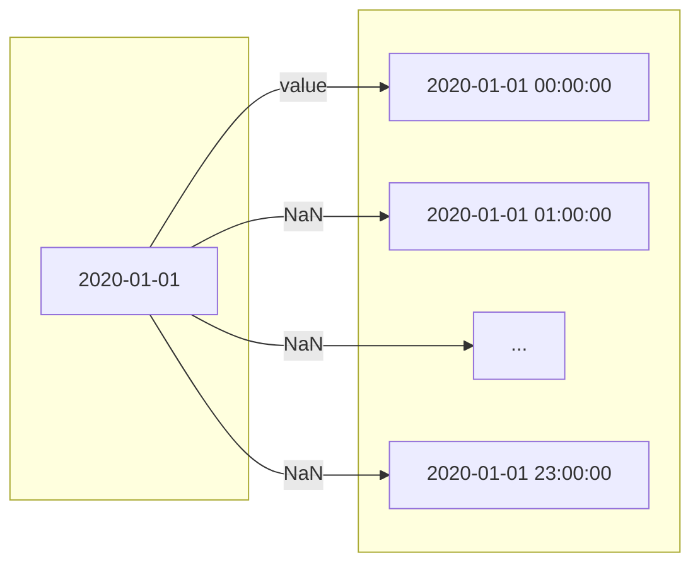
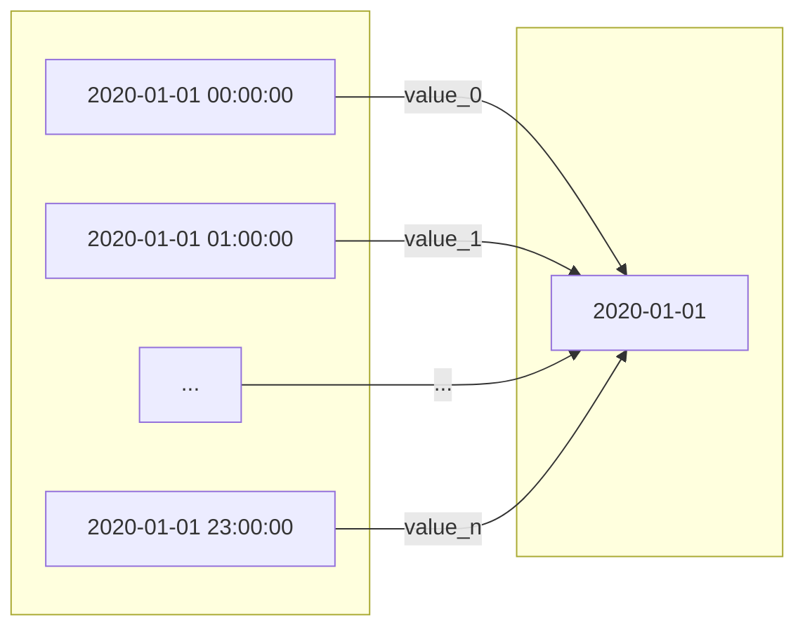

# :material-chart-timeline: MTF analysis

??? youtube "Multiple Timeframe Analysis on YouTube"
    <iframe class="youtube-video" src="https://www.youtube.com/embed/L6g3mslaTwE?si=viqfxQjMRjXSBGy7" title="YouTube video player" frameborder="0" allow="accelerometer; autoplay; clipboard-write; encrypted-media; gyroscope; picture-in-picture; web-share" allowfullscreen></iframe>

Focusing on a single time frame can cause us to miss the broader trend, overlook important support and
resistance levels, and ignore high-probability entry and stop points. By observing the same pair across
different time frames (or time compressions), we can identify the overall movement of an asset
([the trend is your friend](https://www.investopedia.com/articles/forex/05/050505.asp)) and spot key
chart patterns. In fact, all technical indicators can yield different results depending on the time
frame, and combining these results can provide a more complete view of the market we are trading in.

## Resampling

Since VBT works with time series, the main operation that allows us to switch between different
time frames is called _resampling_. There are two types of resampling: upsampling and downsampling.

[Upsampling](https://en.wikipedia.org/wiki/Upsampling) converts a time series to a shorter time frame
that has a higher frequency, such as changing daily prices to hourly prices. The "up" prefix means
there is an increase in the number of data points. This operation does not result in any information
loss because no data is removed, just re-indexed: the value for each day appears at the very first
hour in the upsampled array, while all other hours have NaN. By forward-filling those NaN values, you
can compare any daily time series with an hourly time series!



(Reload the page if the diagram does not appear.)

[Downsampling](https://en.wikipedia.org/wiki/Downsampling_(signal_processing)), on the other hand,
converts a time series to a longer time frame with a lower frequency, such as turning hourly prices
into daily prices. The "down" prefix means there is a decrease in the number of data points. Unlike
upsampling, downsampling **causes information loss** because multiple pieces of data are aggregated
into one. That's why time frames are also called time compressions. Even though we lose some
information, we can now see a broader trend!



!!! hint
    Downsampling is similar to a moving average, as both aggregate data at each time step
    to show a broader trend.

## Data

Before pulling any data, we should ask ourselves: _"What is the shortest time frame we want to analyze?"_
Once we answer this question, we need to pull data with that exact granularity. For example, to work
with the time frames `H1` (1 hour), `H4` (4 hours), and `D1` (1 day), we need data at least as
granular as `H1`, which can later be downsampled to get the `H4` and `D1` time frames.

!!! note
    This does not work the other way around: we cannot upsample `H4` or `D1` data to generate `H1`
    because most data points would just become NaN.

```pycon
>>> from vectorbtpro import *

>>> h1_data = vbt.BinanceData.pull(
...     "BTCUSDT", 
...     start="2020-01-01 UTC", 
...     end="2021-01-01 UTC",
...     timeframe="1h"
... )
```

[=100% "Period 18/18"]{: .candystripe .candystripe-animate }

Let's persist the data locally to avoid re-fetching it every time we start a new runtime:

```pycon
>>> h1_data.to_hdf()
```

We can then easily access the saved data using [HDFData](https://vectorbt.pro/pvt_6d1b3986/api/data/custom/hdf/#vectorbtpro.data.custom.hdf.HDFData):

```pycon
>>> h1_data = vbt.HDFData.pull("BinanceData.h5")
```

Let's look at the index of the data:

```pycon
>>> h1_data.wrapper.index  # (1)!
DatetimeIndex(['2020-01-01 00:00:00+00:00', '2020-01-01 01:00:00+00:00',
               '2020-01-01 02:00:00+00:00', '2020-01-01 03:00:00+00:00',
               '2020-01-01 04:00:00+00:00', '2020-01-01 05:00:00+00:00',
               ...
               '2020-12-31 18:00:00+00:00', '2020-12-31 19:00:00+00:00',
               '2020-12-31 20:00:00+00:00', '2020-12-31 21:00:00+00:00',
               '2020-12-31 22:00:00+00:00', '2020-12-31 23:00:00+00:00'],
              dtype='datetime64[ns, UTC]', name='Open time', length=8767, freq=None)
```

1. [Data](https://vectorbt.pro/pvt_6d1b3986/api/data/base/#vectorbtpro.data.base.Data), like many other VBT classes,
holds a wrapper, which contains useful metadata about the index and columns.

As expected, the index starts at midnight on January 1 and ends at 11 PM on December 31.
But why is `freq=None`? Pandas was not able to infer the frequency because some data
points are missing. This often happens when the exchange experiences downtime. To get all
the missing indices, we can create a resampler using [Resampler](https://vectorbt.pro/pvt_6d1b3986/api/base/resampling/base/#vectorbtpro.base.resampling.base.Resampler)
and then use [Resampler.index_difference](https://vectorbt.pro/pvt_6d1b3986/api/base/resampling/base/#vectorbtpro.base.resampling.base.Resampler.index_difference)
with `reverse=True`:

```pycon
>>> h1_resampler = h1_data.wrapper.get_resampler("1h")  # (1)!
>>> h1_resampler.index_difference(reverse=True)  # (2)!
DatetimeIndex(['2020-02-09 02:00:00+00:00', '2020-02-19 12:00:00+00:00',
               '2020-02-19 13:00:00+00:00', '2020-02-19 14:00:00+00:00',
               '2020-02-19 15:00:00+00:00', '2020-02-19 16:00:00+00:00',
               '2020-03-04 10:00:00+00:00', '2020-04-25 02:00:00+00:00',
               '2020-04-25 03:00:00+00:00', '2020-06-28 02:00:00+00:00',
               '2020-06-28 03:00:00+00:00', '2020-06-28 04:00:00+00:00',
               '2020-11-30 06:00:00+00:00', '2020-12-21 15:00:00+00:00',
               '2020-12-21 16:00:00+00:00', '2020-12-21 17:00:00+00:00',
               '2020-12-25 02:00:00+00:00'],
              dtype='datetime64[ns, UTC]', name='Open time', freq=None)
```

1. Resampler is a mapper between the index in the wrapper (source index)
and the resampled index (target index).
2. Gets all indices in the target index that are not present in the source index.

These are the time periods when Binance was likely down. The good news is that we do not need
to set these data points to NaN because VBT handles missing indices just fine. In fact,
marking these points as missing would only bloat the data and cause problems with indicators that
do not handle missing values well, such as TA-Lib.

How can we downsample this data to `H4` and `D1`? If we check the columns stored in the data
instance, we will see familiar column names: `Open`, `High`, `Low`, `Close`, and `Volume`.

```pycon
>>> h1_data.wrapper.columns
Index(['Open', 'High', 'Low', 'Close', 'Volume', 'Close time', 'Quote volume',
       'Number of trades', 'Taker base volume', 'Taker quote volume'],
      dtype='object')
```

First, let's remove the columns that are not relevant to us right now:

```pycon
>>> h1_ohlcv_data = h1_data[["Open", "High", "Low", "Close", "Volume"]]
```

The most standard way to resample any OHLCV data is by using Pandas:

```pycon
>>> h4_ohlcv = h1_ohlcv_data.get().resample("4h").agg({  # (1)!
...     "Open": "first",
...     "High": "max",
...     "Low": "min",
...     "Close": "last",
...     "Volume": "sum"
... })
>>> h4_ohlcv
                               Open      High       Low     Close  \
Open time                                                           
2020-01-01 00:00:00+00:00   7195.24   7245.00   7175.46   7225.01   
2020-01-01 04:00:00+00:00   7225.00   7236.27   7199.11   7209.83   
2020-01-01 08:00:00+00:00   7209.83   7237.73   7180.00   7197.20   
...                             ...       ...       ...       ...   
2020-12-31 12:00:00+00:00  28910.29  28989.03  27850.00  28770.00   
2020-12-31 16:00:00+00:00  28782.01  29000.00  28311.00  28897.83   
2020-12-31 20:00:00+00:00  28897.84  29169.55  28780.00  28923.63   

                                 Volume  
Open time                                
2020-01-01 00:00:00+00:00   2833.749180  
2020-01-01 04:00:00+00:00   2061.295051  
2020-01-01 08:00:00+00:00   3166.654361  
...                                 ...  
2020-12-31 12:00:00+00:00  19597.147389  
2020-12-31 16:00:00+00:00  10279.179141  
2020-12-31 20:00:00+00:00   7875.879035  

[2196 rows x 5 columns]
```

1. See [Resampler.aggregate](https://pandas.pydata.org/docs/reference/api/pandas.core.resample.Resampler.aggregate.html).

We can see that the time interval has increased from 1 hour to 4 hours; in other words, we have
constructed one larger bar from four smaller ones:

```pycon
>>> h1_ohlcv_data.get().iloc[:4]
                              Open     High      Low    Close      Volume
Open time                                                                
2020-01-01 00:00:00+00:00  7195.24  7196.25  7175.46  7177.02  511.814901
2020-01-01 01:00:00+00:00  7176.47  7230.00  7175.71  7216.27  883.052603
2020-01-01 02:00:00+00:00  7215.52  7244.87  7211.41  7242.85  655.156809
2020-01-01 03:00:00+00:00  7242.66  7245.00  7220.00  7225.01  783.724867

>>> h4_ohlcv.iloc[[0]]
                              Open    High      Low    Close      Volume
Open time                                                               
2020-01-01 00:00:00+00:00  7195.24  7245.0  7175.46  7225.01  2833.74918
```

Great! But, as with many things, VBT provides special methods that can perform this even more
efficiently or flexibly (and often both).

Remember how most classes in VBT subclass [Analyzable](https://vectorbt.pro/pvt_6d1b3986/api/generic/analyzable/#vectorbtpro.generic.analyzable.Analyzable)?
This class, in turn, subclasses [Wrapping](https://vectorbt.pro/pvt_6d1b3986/api/base/wrapping/#vectorbtpro.base.wrapping.Wrapping), which
is designed to manage all Pandas objects stored in a class instance. Because it also contains Pandas
metadata like index and columns, we can use that index for resampling. Specifically, any
subclass of [Wrapping](https://vectorbt.pro/pvt_6d1b3986/api/base/wrapping/#vectorbtpro.base.wrapping.Wrapping) has an abstract method
[Wrapping.resample](https://vectorbt.pro/pvt_6d1b3986/api/base/wrapping/#vectorbtpro.base.wrapping.Wrapping.resample),
which can be overridden to resample complex VBT objects, such as instances of
[Data](https://vectorbt.pro/pvt_6d1b3986/api/data/base/#vectorbtpro.data.base.Data) and
[Portfolio](https://vectorbt.pro/pvt_6d1b3986/api/portfolio/base/#vectorbtpro.portfolio.base.Portfolio).

Fortunately, VBT has already implemented this method in most classes that can be resampled.
Usually, it forwards most arguments and keyword arguments to
[Wrapping.get_resampler](https://vectorbt.pro/pvt_6d1b3986/api/base/wrapping/#vectorbtpro.base.wrapping.Wrapping.get_resampler)
to build a resampler, and then applies this resampler to all Pandas objects stored in the VBT
object. For example, [Data.resample](https://vectorbt.pro/pvt_6d1b3986/api/data/base/#vectorbtpro.data.base.Data.resample) looks for
OHLCV columns in a data instance and resamples them automatically. But what about other columns,
such as `Number of trades`? Their resampling function can be defined in the feature config
[Data.feature_config](https://vectorbt.pro/pvt_6d1b3986/api/data/base/#vectorbtpro.data.base.Data.feature_config). Even better,
VBT has defined resampling functions for all columns in all remote data classes!

Let's check the feature config of [BinanceData](https://vectorbt.pro/pvt_6d1b3986/api/data/custom/binance/#vectorbtpro.data.custom.binance.BinanceData):

```pycon
>>> print(vbt.prettify(vbt.BinanceData.feature_config))
Config({
    'Close time': {
        'resample_func': <function BinanceData.<lambda> at 0x7fd2d60c4378>
    },
    'Quote volume': {
        'resample_func': <function BinanceData.<lambda> at 0x7fd2d60c4400>
    },
    'Number of trades': {
        'resample_func': <function BinanceData.<lambda> at 0x7fd2d60c4488>
    },
    'Taker base volume': {
        'resample_func': <function BinanceData.<lambda> at 0x7fd2d60c4510>
    },
    'Taker quote volume': {
        'resample_func': <function BinanceData.<lambda> at 0x7fd2d60c4598>
    }
})
```

Each of these lambda functions takes the Pandas object and the resampler and performs the operation
using [GenericAccessor.resample_apply](https://vectorbt.pro/pvt_6d1b3986/api/generic/accessors/#vectorbtpro.generic.accessors.GenericAccessor.resample_apply).

!!! hint
    There is no need to define resampling functions for OHLCV columns because VBT already knows how to handle them.

Let's downsample `H1` to `H4` and `D1` with just one line of code each:

```pycon
>>> h1_data.use_feature_config_of(vbt.BinanceData) # (1)!

>>> h4_data = h1_data.resample("4h")
>>> d1_data = h1_data.resample("1d")
```

1. [HDFData](https://vectorbt.pro/pvt_6d1b3986/api/data/custom/hdf/#vectorbtpro.data.custom.hdf.HDFData) stores information from Binance
but does not have any built-in knowledge of its layout, so we use the feature config from
[BinanceData](https://vectorbt.pro/pvt_6d1b3986/api/data/custom/binance/#vectorbtpro.data.custom.binance.BinanceData). Note that this is only
necessary for data classes that are not tied to a specific column layout.

That's it!

```pycon
>>> d1_data.get().iloc[[0, -1]]  # (1)!
                               Open     High       Low     Close  \
Open time                                                          
2020-01-01 00:00:00+00:00   7195.24   7255.0   7175.15   7200.85   
2020-12-31 00:00:00+00:00  28875.55  29300.0  27850.00  28923.63   

                                 Volume  Quote volume  Trade count  \
Open time                                                            
2020-01-01 00:00:00+00:00  16792.388165  1.212145e+08       194010   
2020-12-31 00:00:00+00:00  75508.505152  2.173600e+09      1552793   

                           Taker base volume  Taker quote volume  
Open time                                                         
2020-01-01 00:00:00+00:00        8946.955535        6.459779e+07  
2020-12-31 00:00:00+00:00       36431.622080        1.049389e+09 
```

1. Get the first and last row of the downsampled data.

We can verify the resampling results by comparing them to data from the same time frame
fetched directly from Binance:

```pycon
>>> vbt.BinanceData.pull(
...     "BTCUSDT", 
...     start="2020-01-01 UTC", 
...     end="2021-01-01 UTC",
...     timeframe="1d"
... ).get().iloc[[0, -1]]
```

[=100% "100%"]{: .candystripe .candystripe-animate }

```pycon
                               Open     High       Low     Close  \
Open time                                                          
2020-01-01 00:00:00+00:00   7195.24   7255.0   7175.15   7200.85   
2020-12-31 00:00:00+00:00  28875.55  29300.0  27850.00  28923.63   

                                 Volume  Quote volume  Trade count  \
Open time                                                            
2020-01-01 00:00:00+00:00  16792.388165  1.212145e+08       194010   
2020-12-31 00:00:00+00:00  75508.505152  2.173600e+09      1552793   

                           Taker base volume  Taker quote volume  
Open time                                                         
2020-01-01 00:00:00+00:00        8946.955535        6.459779e+07  
2020-12-31 00:00:00+00:00       36431.622080        1.049389e+09
```

Our data instance has just resampled itself in exactly the same way as done by Binance :fire:

[:material-language-python: Python code](https://vectorbt.pro/pvt_6d1b3986/assets/jupytext/tutorials/mtf-analysis/index.py.txt){ .md-button target="blank_" }
[:material-notebook-outline: Notebook](https://github.com/polakowo/vectorbt.pro/blob/main/notebooks/MTFAnalysis.ipynb){ .md-button target="blank_" }